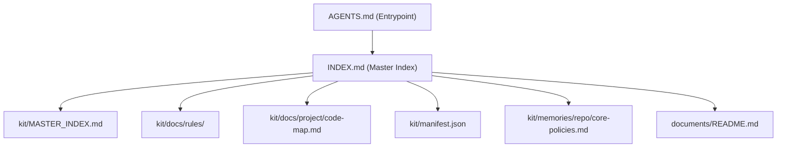

# Master Index

> Repo-level routing index for maintaining CoreZero itself.
> The shipped package lives under `kit/`. Maintainer docs live under `documents/`.

## Context Indexes (load on demand)

| File | Contents | When to load |
|------|----------|--------------|
| `kit/MASTER_INDEX.md` | Index of shipped package memories, rules, and domain-specific memories. | To locate kit constraints, heuristics, and routing rules. |
| `kit/docs/project/code-map.md` | Map of installed package locations. | Before changing shipped package structure. |
| `kit/docs/rules/` | Shipped coding and security rules. | When the active task touches language or security guidance. |
| `kit/manifest.json` | Installation manifest for the shipped package. | When auditing or changing what adopters receive. |
| `kit/memories/repo/core-policies.md` | Repo-wide normative rules, canonical commands, limits, and security policy. | Read at session start and before changing core policies or security rules. |
| `documents/README.md` | Maintainer docs entrypoint. | When changing maintainer-facing docs or repo architecture. |

## Structural Reference

