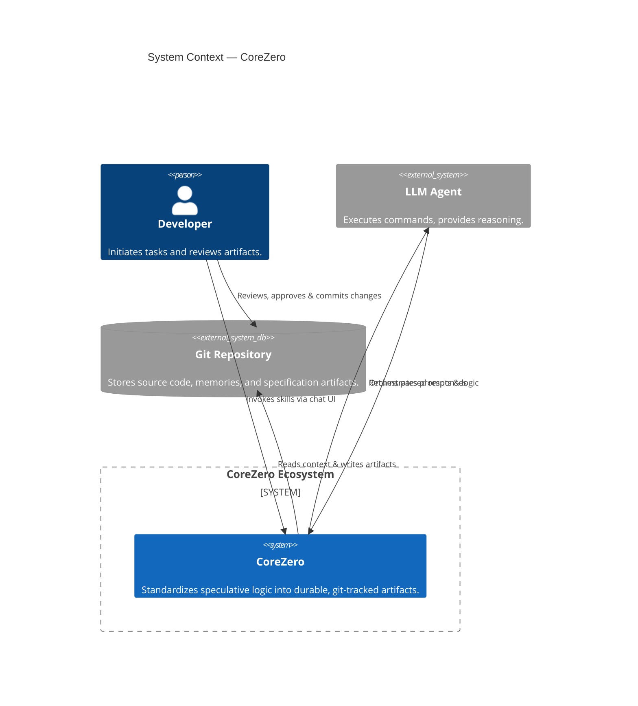

# Harness Engineering: Leveraging Structured Specifications in an Agent-First World

## 1. The Core Philosophy

AI coding agents are powerful but fundamentally unreliable without structure. When an agent hallucinates a solution, overwrites working code, or declares a task complete before it actually is, the root cause is rarely the LLM's intelligence. Instead, **agent failure is usually a harness failure.**

Harness Engineering shifts the burden of reliability from the *agent's cognitive capacity* to the *environment's mechanical constraints*. By designing strict boundaries and automated verification gates, we prevent catastrophic drift and ensure consistent delivery quality.



---

## 2. The ETCLOVG Taxonomy

The kit enforces environment control and architectural boundaries using the formal **ETCLOVG** taxonomy:

### A. Execution (Sandbox & Commands)
- **Definition**: The runtime environment, process orchestration, and scripting layers that isolate and manage the execution of agent actions.
- **Implementation**: Shipped payload includes `kit/scripts/harness/gate-runner.sh` which executes under strict, non-interactive execution constraints.

### B. Tools (Capabilities & Constraints)
- **Definition**: The specific schema-defined capabilities exposed to the agent (e.g. file writing, searching, commands) and their rate/frequency limits.
- **Implementation**: Tools are declared inside the core agent configuration and restricted by active rigor profiles to prevent infinite tool loops.

### C. Context (Budgeting & MVC)
- **Definition**: The progressive disclosure of information to keep the active token budget lean and high-signal.
- **Implementation**: The **Minimum Viable Context (MVC)** rule (CC-011) restricts loading raw file content, while **Context Eviction** rules force the summarization and deletion of raw terminal outputs.

### D. Logic (Skills & Decision Loops)
- **Definition**: The cognitive routing rules that dictate how agents make choices, navigate plans, and maintain state.
- **Implementation**: Structured using modular skill contracts (`skills/*/SKILL.md`) routing through the canonical 7-Phase Delivery Loop.

### E. Observability (Telemetry & Audit)
- **Definition**: The collection of execution paths, command histories, and failures for analysis and improvement.
- **Implementation**: System logs gate errors via `kit/scripts/harness/telemetry-collector.sh` to populate `memories/repo/harness-telemetry.md`, enabling self-improving Garbage Collection (GC) loops.

### F. Verification (Mechanical Gates)
- **Definition**: The objective proof systems that validate implementation correctness without agent excuses.
- **Implementation**: Strict **Backtesting pass^k** checks are run via `gate-runner.sh` to verify syntax, linting, and behavioral test outcomes.

### G. Governance (Policies & FinOps)
- **Definition**: Cost containment, security boundaries, and authorization levels that define agent permissions.
- **Implementation**: **FinOps guardrails** enforce **Cost-per-Accepted-Outcome (CAPO)** metrics (e.g. limiting command retries and total session budget), while `core-policies.md` (under `## Security Policy & Trust Boundaries`) establishes trusted boundaries.

---

## 3. The Garbage Collection Loop

The self-improving loop relies on a structured **Garbage Collection (GC) Loop** to learn from execution failures:

```
[Agent/Harness Failure] ──> [gate-runner.sh] ──> [telemetry-collector.sh] ──> [harness-telemetry.md] ──> [/harness-maintain (Improve)] ──> [Triage & Promoted to Memory]
```

1. **Capture**: When a task fails a verification gate or requires manual intervention, `gate-runner.sh` automatically captures the failure and pipes it into `telemetry-collector.sh`, which logs it in `harness-telemetry.md`.
2. **Classify**: `/harness-maintain` (or standard heuristics triage) categorizes the failure:
   - *Harness Problem*: The environment allowed or encouraged the mistake (e.g., missing template validation).
   - *Model Problem*: The environment was adequate, but LLM execution was poor (requires stricter core rules).
   - *Spec Problem*: The requirements or acceptance criteria were contradictory or vague.
3. **Upgrade**: If classified as a harness or model problem, a repair proposal is generated (e.g., updating lint rules or tool constraints).
4. **Persist**: The `/context-memory` flow triages the proposal and promotes the fix to `core-policies.md`, `project-knowledge-base.md`, or a new automated check.

---

## 4. Harness Assessment & Metrics

Harness readiness is evaluated on a 1-5 scale using `/harness-maintain assess`:

| Score | Status | Characteristics |
|---|---|---|
| **1 — Speculative** | Unstable | No specs; agent writes code directly; no automated testing gates. |
| **2 — Documented** | Vulnerable | Architecture/glossaries exist; requirements manual; tests exist but bypassable. |
| **3 — Standard** | Reliable | Features have locked specs, task lists, and mechanical verify gates. |
| **4 — Bounded** | Controlled | Strict task scopes; JIT context loading; security policies and FinOps limits enforced. |
| **5 — Optimized** | Self-Improving | Active GC loops; automated regression checks; failure-driven auto-upgrades. |

---

## 5. Harness Core Laws

These rules are checked during alignment audits and cannot be bypassed:

* **The Beyonce Rule**: *"If you liked it, you should have put a test on it."* Code is not verified unless a mechanical check proves it works.
* **Hyrum's Law**: All observable behaviors of a system are contracts. Existing behaviors must not be modified unless explicitly requested.
* **Artifact-First**: If a change or decision is not documented in a git-tracked artifact, it did not happen. Chat logs are volatile and temporary.
* **Micro-Task Rule**: Tasks must be mapped to 2-5 minute atomic blocks. Smaller scopes yield higher quality and easier rollbacks.
* **Anti-Rationalization**: Agents cannot skip verification by explaining why it's safe to bypass. Gates are binary and absolute.

---

## 6. Gaps & Blueprint Recommendations

During the system-wide evaluation (detailed in [evaluation-report.md](evaluation-report.md)), several gaps and corresponding recommendations were identified to optimize the harness for autonomous agents:

* **Script-Driven Stack Archaeology**: Currently, `/starter-init` relies on manual questionnaires to configure paths and commands in [core-policies.md](kit/memories/repo/core-policies.md). Future templates should use an auto-detection shell layer to locate build, lint, and test tools.
* **Standardized Error Parsing**: To make failure GC loops reliable, the system needs an error parser script to structuralize compilation and test-run failures before logging them in `harness-telemetry.md`.
* **Multi-Agent Branch-Mapped Claims**: The file-backed claim protocol is vulnerable to concurrency race conditions. Lock files should be explicitly mapped to Git branch states to prevent workspace collisions.
