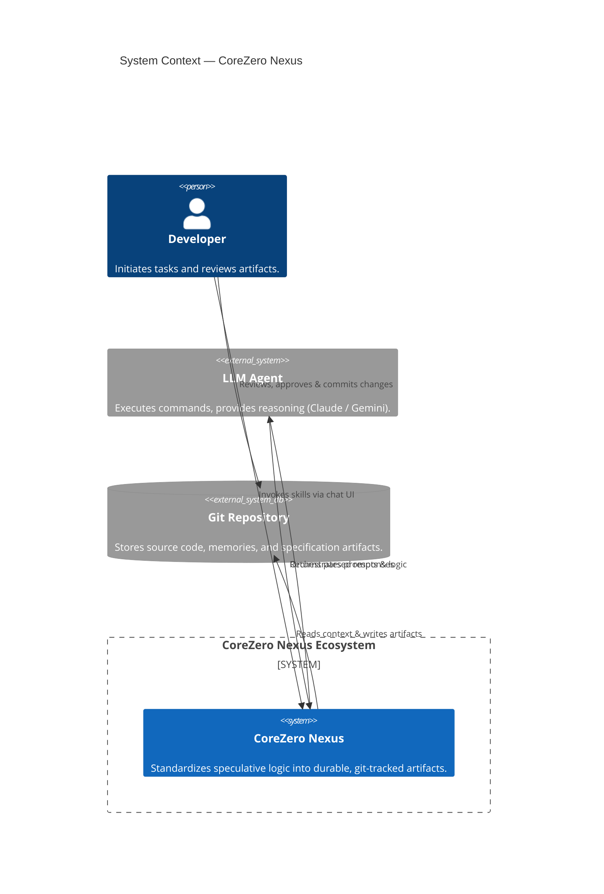

# Harness Engineering: Leveraging Structured Specifications in an Agent-First World

## 1. The Core Philosophy

AI coding agents are powerful but fundamentally unreliable without structure. When an agent hallucinates a solution, overwrites working code, or declares a task complete before it actually is, the root cause is rarely the LLM's intelligence. Instead, **agent failure is usually a harness failure.**

Harness Engineering shifts the burden of reliability from the *agent's cognitive capacity* to the *environment's mechanical constraints*. By designing strict boundaries and automated verification gates, we prevent catastrophic drift and ensure consistent delivery quality.



---

## 2. The 6 Harness Subsystems

The kit enforces environment control through six integrated subsystems:

### A. Instructions (Progressive Disclosure)
- **Problem**: Monolithic rule files (e.g. 500-line `RULES.md`) dilute LLM attention and waste context budget.
- **Solution**: A thin entrypoint (`AGENTS.md`) routes agents to modular skill contracts and references, loading context just-in-time (JIT).

### B. State (Externalized Memory)
- **Problem**: Context resets and transitions between planning and execution cause "agent amnesia."
- **Solution**: Durable trackers (`status.md`, `tasks.md`, `progress.md`) maintain state outside the volatile chat history. **Decision Provenance Records** inside `progress.md` strictly capture the "why" behind mid-flight execution deviations to ensure traceability back to the origin plan.

### C. Verification (Mechanical Gates)
- **Problem**: Agents "rationalize" failures, claiming tasks are complete when tests or lints are still failing.
- **Solution**: Verification is governed by non-negotiable terminal commands (linters, test suites). The gate cannot be bypassed by agent excuses.

### D. Scope (Surface Constraints)
- **Problem**: Agents naturally drift, introducing "ghost" features or performing refactors in adjacent files.
- **Solution**: The Micro-Task rule restricts file writes to specific task IDs and target files defined in `plan.md`.

### E. Lifecycle (Clean-State Guarantees)
- **Problem**: Compound errors build up when starting from an unclean or broken repository state.
- **Solution**: `starter-init` verifies pristine repository baselines, and `harness-verify` manages behavior-neutral fallow passes to groom tech debt.

### F. Security (Trust Boundaries)
- **Problem**: Unsupervised agents running arbitrary code will eventually leak secrets or execute destructive actions.
- **Solution**: `memories/repo/security-policy.md` enforces sandbox boundaries, command verification, and permission tiers.

---

## 3. The Garbage Collection Loop

The self-improving loop relies on a structured **Garbage Collection (GC) Loop** to learn from execution failures:

```
[Agent/Harness Failure] ──> [harness-telemetry.md] ──> [/harness-maintain (Improve)] ──> [Triage & Promoted to Memory]
```

1. **Capture**: When a task fails a verification gate or requires manual intervention, the event is logged in `harness-telemetry.md`.
2. **Classify**: `/harness-maintain` categorizes the failure:
   - *Harness Problem*: The environment allowed or encouraged the mistake (e.g., missing template validation).
   - *Model Problem*: The environment was adequate, but LLM execution was poor (requires stricter core rules).
   - *Spec Problem*: The requirements or acceptance criteria were contradictory or vague.
3. **Upgrade**: If classified as a harness or model problem, `/harness-maintain` generates a repair proposal.
4. **Persist**: `/context-memory` triages the proposal and promotes the fix to `core-policies.md`, `project-knowledge-base.md`, or a new automated check.

---

## 4. Subsystem Assessment & Metrics

Harness readiness is evaluated on a 1-5 scale using `/harness-maintain assess`:

| Score | Status | Characteristics |
|---|---|---|
| **1 — Speculative** | Unstable | No specs; agent writes code directly; no automated testing gates. |
| **2 — Documented** | Vulnerable | Architecture/glossaries exist; requirements manual; tests exist but bypassable. |
| **3 — Standard** | Reliable | Features have locked specs, task lists, and mechanical verify gates. |
| **4 — Bounded** | Controlled | Strict task scopes; JIT context loading; security policies enforced. |
| **5 — Optimized** | Self-Improving | Active GC loops; automated regression checks; failure-driven auto-upgrades. |

---

## 5. Harness Core Laws

These rules are checked during alignment audits and cannot be bypassed:

* **The Beyonce Rule**: *"If you liked it, you should have put a test on it."* Code is not verified unless a mechanical check proves it works.
* **Hyrum's Law**: All observable behaviors of a system are contracts. Existing behaviors must not be modified unless explicitly requested.
* **Artifact-First**: If a change or decision is not documented in a git-tracked artifact, it did not happen. Chat logs are volatile and temporary.
* **Micro-Task Rule**: Tasks must be mapped to 2-5 minute atomic blocks. Smaller scopes yield higher quality and easier rollbacks.
* **Anti-Rationalization**: Agents cannot skip verification by explaining why it's safe to bypass. Gates are binary and absolute.

---

## 6. Gaps & Blueprint Recommendations

During the system-wide evaluation (detailed in [evaluation-report.md](documents/evaluation-report.md)), several gaps and corresponding recommendations were identified to optimize the harness for autonomous agents:

* **Script-Driven Stack Archaeology**: Currently, `/starter-init` relies on manual questionnaires to configure paths and commands in [core-policies.md](kit/memories/repo/core-policies.md). Future templates should use an auto-detection shell layer to locate build, lint, and test tools.
* **Standardized Error Parsing**: To make failure GC loops reliable, the system needs an error parser script to structuralize compilation and test-run failures before logging them in `harness-telemetry.md`.
* **Multi-Agent Branch-Mapped Claims**: The file-backed claim protocol is vulnerable to concurrency race conditions. Lock files should be explicitly mapped to Git branch states to prevent workspace collisions.
