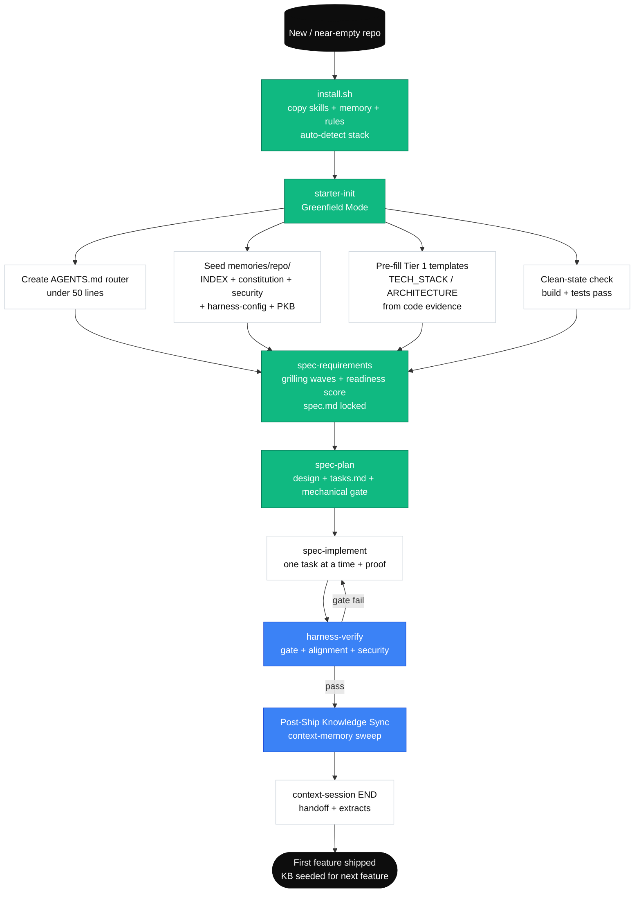
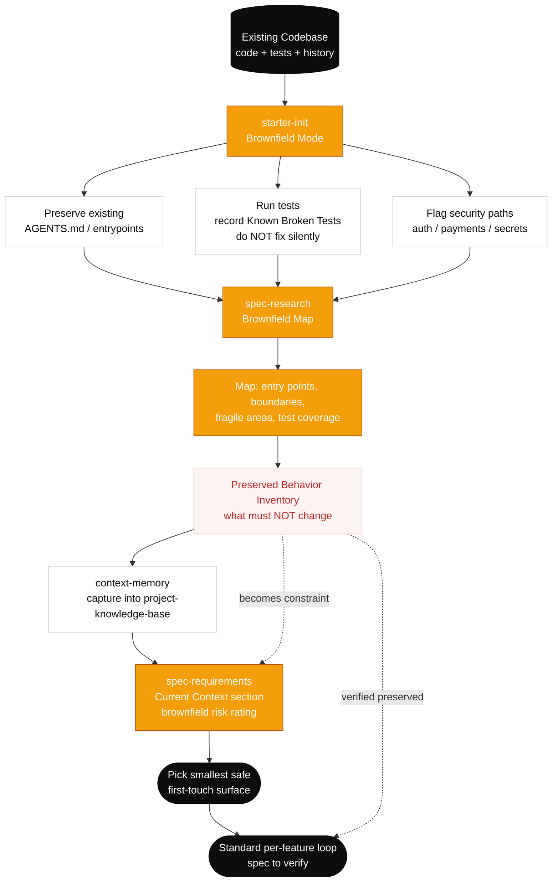

# Adoption Strategies

## Adoption Ladder

| Stage | Scope | Skills Used | Duration |
|-------|-------|-------------|----------|
| **Solo Pilot** | One developer, one feature | `starter-init`, `spec-requirements`, `spec-plan`, `spec-implement`, `harness-verify` | 1-2 weeks |
| **Team Trial** | Small team, 2-3 features | Guided pack flow across Starter, Context, Spec, and Harness | 2-4 weeks |
| **Full Adoption** | Entire team, all new features | Full pack workflow + harness assessment | Ongoing |
| **Advanced** | Governance, evaluation, multi-team | Advanced Pack templates + eval mode | Mature teams |

## Starting Small

Don't adopt everything at once. Start with:

1. **Week 1:** Bootstrap the kit, fill in `docs/PRODUCT_SENSE.md` and refine `docs/architecture.md`
2. **Week 2:** Use `/spec-requirements` + `/spec-plan` for one real feature
3. **Week 3:** Add `/spec-implement` + `/harness-verify` to close the loop
4. **Week 4:** Evaluate — did it help? What was friction?

## Brownfield Adoption

For existing projects with history:

1. **Don't backfill.** Don't try to create specs for existing features.
2. **Analysis first.** Use `/spec-research` to map existing behavior before changing it.
3. **Preserve behavior.** The kit's brownfield protection rules prevent accidental breakage.
4. **Grow memory gradually.** Let `constitution.md` and `project-knowledge-base.md` accumulate naturally.

## Ceremony Scaling

The kit adapts to work size:

| Work Size | Profile | Ceremony | What You Skip |
|-----------|---------|----------|---------------|
| Typo fix | None — just fix it | Everything |  |
| Small bug | Tiny | Compact spec, lean plan, mechanical-gate-only verify | Design doc, ADR, full grilling |
| Standard feature | Standard | Full spec, plan, task breakdown, gate + alignment + security lens | Nothing skipped, but kept lean |
| Complex/risky work | Complex | Grilling waves, design doc, ADR, detailed plan, full verify with traceability | Nothing — full ceremony |
| Repo-wide / harness change | Complex | System Spec Mode, adversarial review, phased rollout, `/harness-maintain` eval mode | Nothing |

The `/spec-requirements` skill triages automatically. You don't need to declare the profile upfront.

## Common Adoption Pitfalls

| Pitfall | Why It Happens | Fix |
|---------|---------------|-----|
| Over-ceremony for small work | Applying Complex profile to Tiny changes | Trust the triage — Tiny work gets lean treatment |
| Skipping verify | "I know it works" | The mechanical gate is the kit's core value — don't skip it |
| Not using handoffs | "I'll remember where I was" | Context resets are inevitable — always generate handoffs |
| Treating memory as a diary | Writing session notes to PKB | Memory is for durable, reusable knowledge only |
| Ignoring the grilling | "I already know what to build" | The grilling catches assumptions you don't know you're making |

## Multi-Agent Coordination

When multiple agents work on the same project simultaneously, the kit uses a **claim file protocol** — lightweight, git-tracked, no external infrastructure required.

### Core Rules

- Each feature slug is owned by at most one active agent at a time.
- Ownership is established by creating `artifacts/features/<slug>/claim.md` before starting work.
- Claims expire after 4 hours by default (configurable). Stale claims can be superseded.
- If an active claim exists, agents must stop and report `BLOCKED: feature <slug> is claimed`.
- Claims must be released (`status: Released`) when work is complete or the session ends.

### Status Codes for Multi-Agent Environments

Each agent ends its session summary with:

| Status | Meaning |
|---|---|
| `DONE` | Work complete, claim released, verify passed |
| `DONE_WITH_CONCERNS` | Complete but issues documented in `session-extracts.md` |
| `BLOCKED` | Cannot proceed — claim conflict, missing dependency, or spec conflict |
| `NEEDS_CONTEXT` | Cannot proceed without user or peer-agent input |
| `CHECKPOINT` | Paused, claim held, ready to resume |

### Isolation and Shared State

- Each agent works on its own feature slug — artifacts provide isolation.
- Memory files in `memories/repo/` are shared and read-only during feature work. Proposals to amend instruction-tier memory queue through `/context-memory` triage after the feature ships.
- `/context-status` scans all feature slugs and their claim files to give cross-agent visibility.
- Handoffs in `handoff.md` enable agent-to-agent continuity within a slug.

### Partial-Work Merge

If two agents worked different tasks within the same slug, a designated merge agent:
1. Declares `status: Merging` in `claim.md`.
2. Merges both `tasks.md` sets, preserving all evidence.
3. Surfaces any `spec.md` conflicts to the user.
4. Re-runs `/harness-verify` from scratch (partial evidence is not accepted).
5. Releases the merge claim after passing verify.

See the full protocol at [`skills/context-session/references/multi-agent-protocol.md`](../kit/skills/context-session/references/multi-agent-protocol.md).

## Measuring Success

After adopting the kit, look for:

- Fewer "it worked on my machine" moments (mechanical gates)
- Less rework from misunderstood requirements (grilling waves)
- Smoother session transitions (handoffs)
- Growing institutional knowledge (memory files)
- Consistent quality regardless of which agent runs (harness constraints)

## Greenfield Flow

New repo or near-empty project — install the kit, run init, ship the first feature.

## Brownfield Reverse Flow

For inherited codebases, understand before changing. Init in Brownfield Mode, map the codebase, capture findings to memory, then pick the smallest safe first feature.

