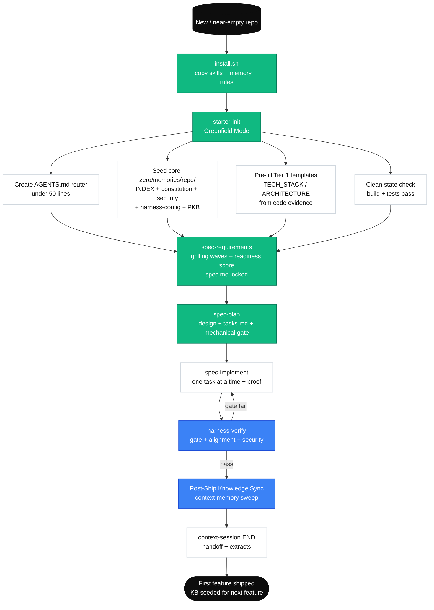
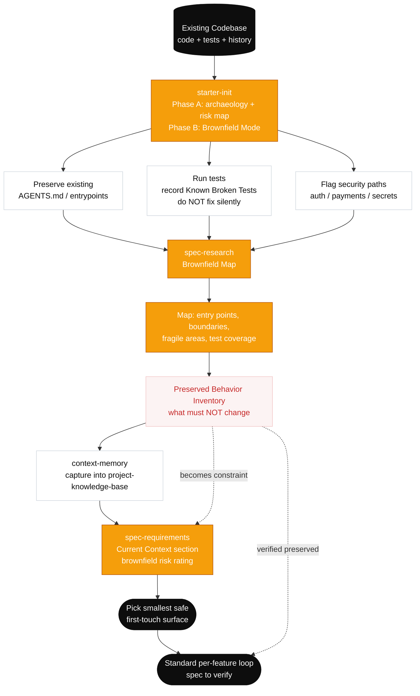

# Adoption Strategies

## Adoption Ladder

| Stage             | Scope                              | Skills Used                                                                          | Duration     |
| ----------------- | ---------------------------------- | ------------------------------------------------------------------------------------ | ------------ |
| **Solo Pilot**    | One developer, one feature         | `starter-init`, `spec-requirements`, `spec-plan`, `spec-implement`, `harness-verify` | 1-2 weeks    |
| **Team Trial**    | Small team, 2-3 features           | Guided pack flow across Starter, Context, Spec, and Harness                          | 2-4 weeks    |
| **Full Adoption** | Entire team, all new features      | Full pack workflow + harness assessment                                              | Ongoing      |
| **Advanced**      | Governance, evaluation, multi-team | Advanced Pack templates + eval mode + optional code intelligence provider            | Mature teams |

## Starting Small

Don't adopt everything at once. Start with:

1. **Week 1:** Bootstrap the kit, fill in `core-zero/project/product-sense.md` and refine `core-zero/project/architecture.md`
2. **Week 2:** Use `/spec-requirements` + `/spec-plan` for one real feature
3. **Week 3:** Add `/spec-implement` + `/harness-verify` to close the loop
4. **Week 4:** Evaluate — did it help? What was friction?

## Brownfield Adoption

For existing projects with history:

1. **Don't backfill.** Don't try to create specs for existing features.
2. **Analysis first.** Use `/spec-research` to map existing behavior before changing it.
3. **Preserve behavior.** The kit's brownfield protection rules prevent accidental breakage.
4. **Grow memory gradually.** Let `core-policies.md` (constitutional rules), `harness-config.md` (commands, paths, lifecycle), and `project-knowledge-base.md` accumulate naturally.

## Ceremony Scaling

The kit adapts to work size:

| Work Size                  | Profile            | Ceremony                                                                      | What You Skip                  |
| -------------------------- | ------------------ | ----------------------------------------------------------------------------- | ------------------------------ |
| Typo fix                   | None — just fix it | Everything                                                                    |                                |
| Small bug                  | Tiny               | Compact spec, lean plan, mechanical-gate-only verify                          | Design doc, ADR, full grilling |
| Standard feature           | Standard           | Full spec, plan, task breakdown, gate + alignment + security lens             | Nothing skipped, but kept lean |
| Complex/risky work         | Complex            | Grilling waves, design doc, ADR, detailed plan, full verify with traceability | Nothing — full ceremony        |
| Repo-wide / harness change | Complex            | adversarial review, phased rollout, `/harness-maintain` eval mode             | Nothing                        |

The `/spec-requirements` skill triages automatically. You don't need to declare the profile upfront.

## Optional: Code Intelligence Provider

For teams that want deeper code-aware AI context, install a code intelligence MCP provider. CoreZero skills use **capability intents** (explore, impact, symbol context, …) that resolve to the active provider's concrete tools via `core-zero/project/code-intelligence.md`.

Supported providers:
- **GitNexus** — full capability support. Setup: `npm install -g gitnexus && gitnexus analyze && gitnexus setup`
- **codebase-memory-mcp** — lightweight alternative (8 of 11 intents). See `documents/integrations.md` for setup.

After installing, set `active_provider` and `enabled: true` in `core-zero/project/code-intelligence.md`.

The kit works identically without it — code intelligence is additive, not required.

## Common Adoption Pitfalls

| Pitfall                      | Why It Happens                           | Fix                                                           |
| ---------------------------- | ---------------------------------------- | ------------------------------------------------------------- |
| Over-ceremony for small work | Applying Complex profile to Tiny changes | Trust the triage — Tiny work gets lean treatment              |
| Skipping verify              | "I know it works"                        | The mechanical gate is the kit's core value — don't skip it   |
| Not using handoffs           | "I'll remember where I was"              | Context resets are inevitable — always generate handoffs      |
| Treating memory as a diary   | Writing session notes to PKB             | Memory is for durable, reusable knowledge only                |
| Ignoring the grilling        | "I already know what to build"           | The grilling catches assumptions you don't know you're making |

## Measuring Success

After adopting the kit, look for:

- Fewer "it worked on my machine" moments (mechanical gates)
- Less rework from misunderstood requirements (grilling waves)
- Smoother session transitions (handoffs)
- Growing institutional knowledge (memory files)
- Consistent quality regardless of which agent runs (harness constraints)

## Greenfield Flow

New repo or near-empty project — install the kit, run init, ship the first feature.

## Brownfield Reverse Flow

For inherited codebases, understand before changing. Init in Brownfield Mode, map the codebase, capture findings to memory, then pick the smallest safe first feature.

