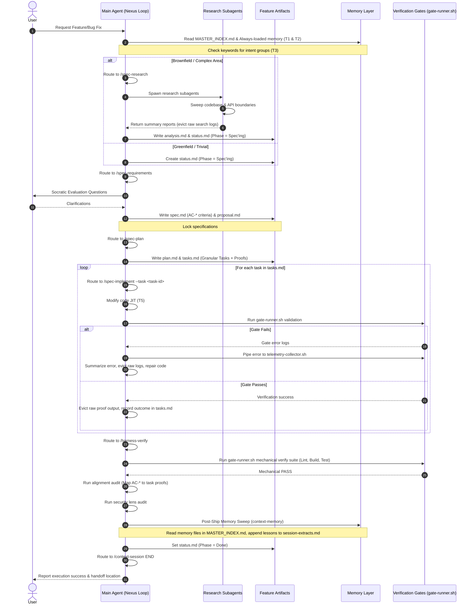
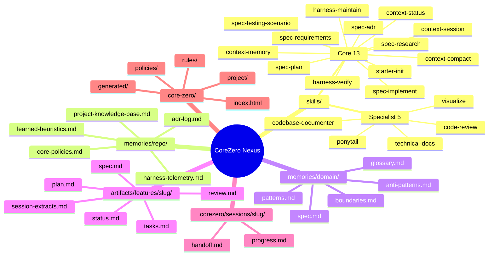
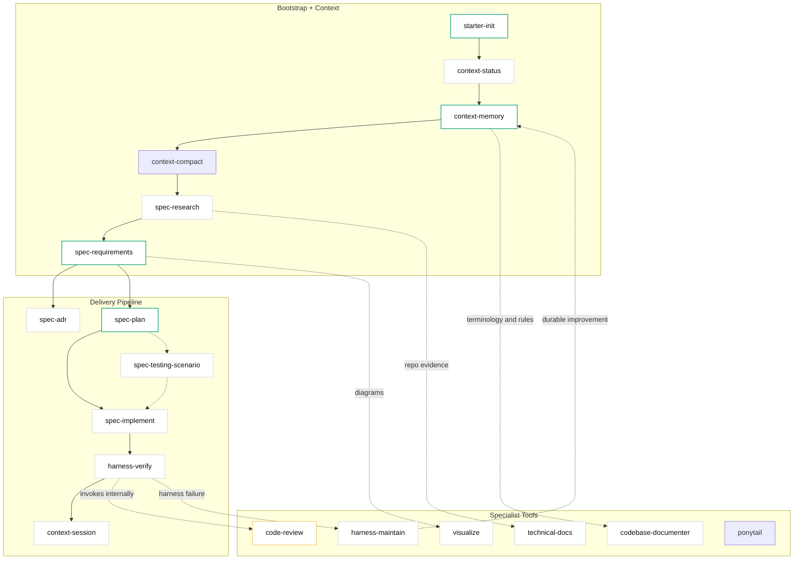

# Kit Architecture

## Overview

CoreZero implements **Harness Engineering** — the discipline of designing environments that make AI agents reliable. It provides a complete spec-anchored delivery framework through four pillars: Harness Engineering, Spec Development, Advanced Pack, and Starter Layout.

## Five-Layer Model

```
┌─────────────────────────────────────────────┐
│  1. Entrypoint Layer (AGENTS.md)            │  Thin router → skills
├─────────────────────────────────────────────┤
│  2. Skill Layer (skills/*/SKILL.md)         │  13 core delivery + 5 specialist (18 total)
├─────────────────────────────────────────────┤
│  3. Harness Layer (6 subsystems)            │  Environment control
├─────────────────────────────────────────────┤
│  4. Artifact Layer (artifacts/features/)    │  Per-feature durable state
├─────────────────────────────────────────────┤
│  5. Memory Layer (memories/repo/)           │  Durable cross-feature guidance
└─────────────────────────────────────────────┘
```

### Layer 1: Entrypoint

`AGENTS.md` is a concise router (< 50 lines) that points agents to deeper context. It sets priority rules and routes to skills. It does NOT contain full skill bodies — that would overwhelm the context window.

### Layer 2: Skills

Each skill is a self-contained contract in `skills/<name>/SKILL.md` with:
- Frontmatter (name, description, compatibility)
- Overview (what it owns)
- Read First (context to load)
- Workflow (numbered steps)
- Stop Conditions (when to halt)
- Core Rules (invariants)
- Rationalization vs Reality (anti-patterns)
- Red Flags (warning signs)
- Verification (checklist)
- Output Rules (what it can/cannot create)

Skills also have `references/` directories with templates and guidance documents.

### Layer 3: Harness (6 Subsystems)

| Subsystem | What It Controls | Key Mechanisms |
|-----------|-----------------|----------------|
| **Instructions** | What the agent knows | Progressive disclosure, JIT loading, router pattern |
| **State** | What's done/in-progress/blocked | status.md, tasks.md, progress.md |
| **Verification** | Proof that work is correct | Mechanical gates, alignment audit, security lens |
| **Scope** | What the agent can touch | Task IDs, bounded targets, proving commands |
| **Lifecycle** | Session continuity | Init → session → handoff, context assembly tiers |
| **Security** | What the agent is allowed to do | Permission tiers, trust boundaries, prompt-injection defense |

### Layer 4: Artifacts

Per-feature state lives in `artifacts/features/<slug>/`:
- `status.md` — Phase tracking
- `spec.md` — Locked requirements
- `plan.md` — Execution strategy + mechanical gate
- `tasks.md` — Micro-task breakdown with evidence
- `review.md` — Verification verdict
- `progress.md` — Session log
- `handoff.md` — Continuity artifact
- `session-extracts.md` — Extracted-tier memory candidates (written by session END and verify post-ship sync)

### Layer 5: Memory

Durable cross-feature guidance in `memories/repo/`:
- `core-policies.md` — Repo-wide normative rules (CC-*), security policy, memory promotion thresholds
- `harness-config.md` — Adopter-tailored config: repository identity, work tracking, artifact routing, verification commands, session defaults, lifecycle, known limits
- `learned-heuristics.md` — Evidence-backed execution patterns
- `project-knowledge-base.md` — Durable facts and conventions
- `harness-telemetry.md` — Auto-tier failure log and telemetry data
- `adr-log.md` — ADR index (lazy-created on first ADR)
- `archive/deprecated-heuristics.md` — Cold storage for decayed heuristics

And bounded-context guidance in `memories/domain/`:
- Domain packs containing: `glossary.md`, `patterns.md`, `anti-patterns.md`, `boundaries.md`

**3-Tier Memory Architecture:**
- **Instruction tier** (human-curated): core-policies.md, learned-heuristics.md, project-knowledge-base.md, memories/domain/*, core-zero/project/architecture.md
- **Auto tier** (agent-written): harness-telemetry.md (written by `harness-maintain` Improve Mode)
- **Extracted tier** (per-feature candidates): artifacts/features/<slug>/session-extracts.md (written by `context-session` end and `harness-verify` post-ship sync)

## Data Flow

The diagram below details the sequence of interactions across the 5 layers during feature development, from user request to post-ship knowledge sync:




## Failure Classification

When something goes wrong, the kit classifies the failure:

| Classification | Meaning | Fix Location |
|---------------|---------|--------------|
| **Harness Problem** | Environment allowed or encouraged the mistake | Improve the harness (gates, templates, rules), record in harness-telemetry.md |
| **Model Problem** | Environment was adequate but execution was poor | Add explicit guidance to skill Core Rules, record in harness-telemetry.md |
| **Spec Problem** | Artifact contract was underspecified or contradictory | Return to `/spec-requirements` |

Failures are classified by `harness-maintain` Improve Mode and recorded in `memories/repo/harness-telemetry.md` (auto tier). Extraction Triage later promotes durable lessons to the instruction tier.

## Repository Layouts

### Source Repository Layout
This is the structure of the CoreZero Nexus repository during development. All adopter-facing assets are grouped under `kit/` to isolate them from project-specific maintainer documents and scripts.

```
CoreZero/
├── README.md                    # Maintainer/Adopter orientation page
├── CHANGELOG.md                 # Project version history
├── kit/                         # Isolated surface shipped to adopter projects
│   ├── manifest.json            # Inventory mapping file copy/overwrite rules
│   │                           # (version in manifest.json)
│   ├── AGENTS.md                # Template entrypoint (seeded to root)
│   ├── MASTER_INDEX.md          # Master routing index for the repository
│   ├── core-zero/                    # Adopter-facing documentation surface
│   │   ├── index.html           # Documentation portal
│   │   ├── policies/            # Adopter-owned design policies
│   │   ├── project/             # Adopter-owned project docs (architecture, product sense, etc)
│   │   ├── rules/               # Shipped coding and security standards
│   │   └── generated/           # Codemap and reference index placeholders
│   ├── skills/                  # 18 core/utility skills for coding agents
│   │   ├── _shared/             # Shared resources across skills
│   │   └── <skill>/
│   │       ├── SKILL.md         # Compressed token-efficient skill card
│   │       └── references/      # Templates and checklist references
│   ├── memories/                # Scaffolding memory layer
│   │   ├── repo/                # Templates for the 3 memory tiers
│   │   └── domain/              # Seeded domain-pack schema + example pack
│   └── scripts/                 # Installer, context loader, template renderers, Python engine (core/), harness (gate runner, telemetry, phase gates)
├── documents/                   # Maintainer-only project documents (not shipped)
│   ├── architecture.md          # Maintainer architecture map (this file)
│   ├── diagrams/                # Mermaid source diagrams
│   └── *.md                     # Deep guides (releasing, evals, memory theory)
├── page-document/               # Project documents page layout and assets
└── scripts/                     # Local project scripts & redirect installer
```

### Installed Adopter Repository Layout
This is the layout created in a downstream project after running the installer script.

```
<your-project>/
├── AGENTS.md                    # Runtime instruction router (adopter-owned)
├── MASTER_INDEX.md              # Master routing index for the repository
├── .corezero-version            # Installed semver stamp
├── core-zero/                        # Installed documentation surface
│   ├── index.html               # Documentation portal
│   ├── generated/
│   │   └── dashboard.html       # Visual interactive dashboard
│   ├── policies/
│   │   └── code-design.md       # Cross-cutting design policies
│   ├── project/                 # Adopter-owned project docs + shipped config
│   │   ├── adr/                 # ADR registry
│   │   ├── agent-capabilities.md
│   │   ├── architecture.md
│   │   ├── code-map.md
│   │   ├── glossary.md
│   │   ├── harness-config.yaml
│   │   ├── product-sense.md
│   │   ├── project-constraints.md
│   │   ├── spec-schema.json
│   │   └── tech-stack.md
│   └── rules/                   # Shipped rules and standards (kit-managed)
│       ├── README.md
│       ├── ponytail.md
│       ├── python.md
│       └── security.md
├── skills/                      # 18 shipped skills (kit-managed)
├── scripts/
│   ├── context-loader.py        # MVC context loader
│   ├── generate-dashboard.py    # Dashboard generator
│   ├── render_template.py       # Template rendering CLI
│   ├── template_convert.py      # Template converter CLI
│   ├── core/                    # Python engine layer
│   │   ├── context_engine.py
│   │   ├── harness.py
│   │   ├── template_engine.py
│   │   └── _lib/
│   ├── harness/
│   │   ├── doctor.sh            # Kit self-diagnosis
│   │   ├── gate-runner.sh       # Mechanical gate runner
│   │   ├── phase-gate.sh        # Phase precondition validation
│   │   ├── telemetry-collector.sh
│   │   ├── telemetry-count.sh
│   │   ├── telemetry-update.sh
│   │   ├── telemetry-render.sh
│   │   └── harness-lifecycle.sh
│   └── install.sh               # Shipped installer script
├── memories/repo/               # Durable repository memory (3 tiers)
│   ├── archive/                 # Cold storage for decayed memory
│   │   └── deprecated-heuristics.md
│   ├── adr-log.md               # ADR index
│   ├── core-policies.md         # Core repository operating rules and security
│   ├── harness-telemetry.md     # Failure logs and telemetry
│   ├── learned-heuristics.md    # Discovered project insights
│   └── project-knowledge-base.md # Project continuity knowledge
├── memories/domain/             # Domain context packs
│   ├── README.md
│   └── example/                 # Example pack (adopter-owned)
│       ├── glossary.md
│       ├── patterns.md
│       ├── anti-patterns.md
│       └── boundaries.md
├── .corezero/                   # Ephemeral workspace state
│   └── sessions/<slug>/
│       ├── progress.md          # Session log
│       └── handoff.md           # Continuity artifact
└── artifacts/features/          # Per-feature specs, plans, tasks, and reviews
```

## Kit Layout (Mindmap)

Full file/folder structure the kit ships and the artifacts it produces during work.



## Skill Grouping

The 18 skills (13 core delivery + 5 specialist tools) cluster into three groups by purpose: bootstrap + context, delivery pipeline, and specialist tools.


