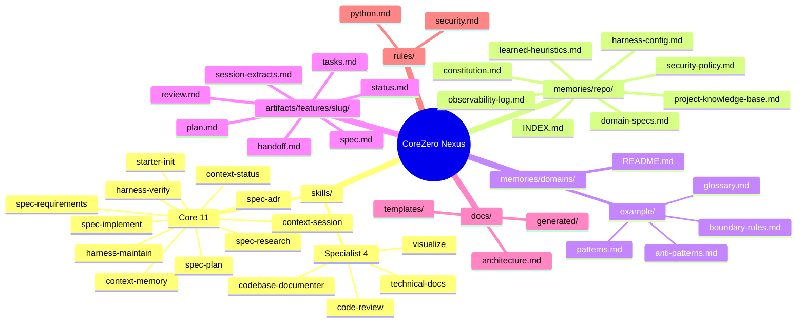
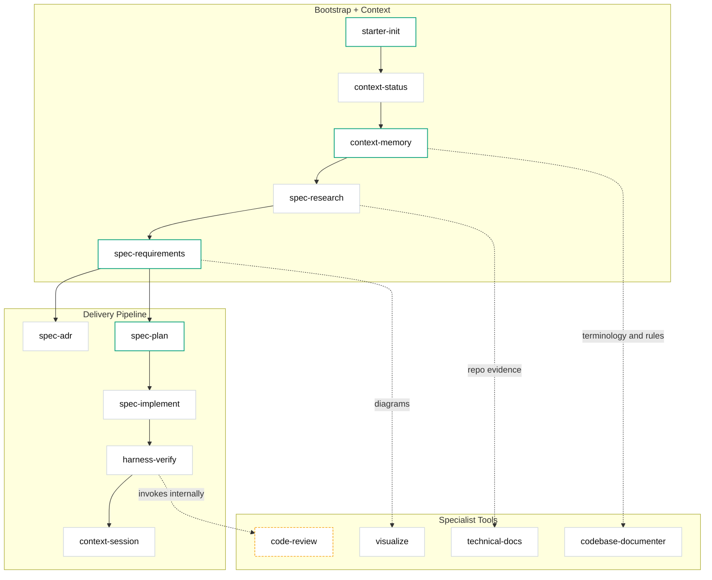

# Kit Architecture

## Overview

CoreZero Nexus implements **Harness Engineering** — the discipline of designing environments that make AI agents reliable. It provides a complete spec-anchored delivery framework through four pillars: Harness Engineering, Spec Development, Advanced Pack, and Starter Layout.

## Five-Layer Model

```
┌─────────────────────────────────────────────┐
│  1. Entrypoint Layer (AGENTS.md)            │  Thin router → skills
├─────────────────────────────────────────────┤
│  2. Skill Layer (skills/*/SKILL.md)         │  11 core delivery + 5 specialist (16 total)
├─────────────────────────────────────────────┤
│  3. Harness Layer (6 subsystems)            │  Environment control
├─────────────────────────────────────────────┤
│  4. Artifact Layer (artifacts/features/)    │  Per-feature durable state
├─────────────────────────────────────────────┤
│  5. Memory Layer (memories/repo/)           │  Durable cross-feature guidance
└─────────────────────────────────────────────┘
```

### Layer 1: Entrypoint

`AGENTS.md` is a concise router (< 50 lines) that points agents to deeper context. It sets priority rules and routes to skills. It does NOT contain full skill bodies — that would overwhelm the context window.

### Layer 2: Skills

Each skill is a self-contained contract in `skills/<name>/SKILL.md` with:
- Frontmatter (name, description, compatibility)
- Overview (what it owns)
- Read First (context to load)
- Workflow (numbered steps)
- Stop Conditions (when to halt)
- Core Rules (invariants)
- Rationalization vs Reality (anti-patterns)
- Red Flags (warning signs)
- Verification (checklist)
- Output Rules (what it can/cannot create)

Skills also have `references/` directories with templates and guidance documents.

### Layer 3: Harness (6 Subsystems)

| Subsystem | What It Controls | Key Mechanisms |
|-----------|-----------------|----------------|
| **Instructions** | What the agent knows | Progressive disclosure, JIT loading, router pattern |
| **State** | What's done/in-progress/blocked | status.md, tasks.md, progress.md |
| **Verification** | Proof that work is correct | Mechanical gates, alignment audit, security lens |
| **Scope** | What the agent can touch | Task IDs, bounded targets, proving commands |
| **Lifecycle** | Session continuity | Init → session → handoff, context assembly tiers |
| **Security** | What the agent is allowed to do | Permission tiers, trust boundaries, prompt-injection defense |

### Layer 4: Artifacts

Per-feature state lives in `artifacts/features/<slug>/`:
- `status.md` — Phase tracking
- `spec.md` — Locked requirements
- `plan.md` — Execution strategy + mechanical gate
- `tasks.md` — Micro-task breakdown with evidence
- `review.md` — Verification verdict
- `progress.md` — Session log
- `handoff.md` — Continuity artifact
- `session-extracts.md` — Extracted-tier memory candidates (written by session END and verify post-ship sync)

### Layer 5: Memory

Durable cross-feature guidance in `memories/repo/`:
- `INDEX.md` — Memory router; lists Always / By-Intent / By Domain Packs / By-Debug groups so sessions load only what the task needs
- `constitution.md` — Normative rules (CC-* identifiers)
- `security-policy.md` — Permission model and trust boundaries
- `learned-heuristics.md` — Evidence-backed execution patterns
- `project-knowledge-base.md` — Durable facts and conventions
- `domain-specs.md` — Bounded-context vocabulary and domain rules
- `harness-config.md` — Operational defaults (commands, paths, trackers)
- `observability-log.md` — Auto-tier failure log with structured YAML entries and trend summary
- `adr-log.md` — ADR index (lazy-created on first ADR)
- `memories/domains/<name>/` — Adopter-owned domain packs (glossary, patterns, anti-patterns, boundary rules)

**3-Tier Memory Architecture:**
- **Instruction tier** (human-curated): constitution, security-policy, learned-heuristics, project-knowledge-base, domain-specs, harness-config, docs/architecture.md
- **Auto tier** (agent-written): observability-log.md (written by `harness-maintain` Improve Mode)
- **Extracted tier** (per-feature candidates): artifacts/features/<slug>/session-extracts.md (written by `context-session` end and `harness-verify` post-ship sync)

## Data Flow

```
User Request
    │
    ▼
AGENTS.md (router) → loads skill
    │
    ▼
Skill reads: INDEX.md (memory router) → Always/By-Intent/By Domain Packs/By-Debug groups → feature artifacts → references/
    │
    ▼
Skill produces: feature artifacts (spec, plan, tasks, code, review)
    │
    ▼
Findings promoted: session-extracts.md (extracted tier) → extraction triage → memories/repo/ (instruction tier)
    │
    ▼
Session ends: handoff.md + session-extracts.md generated for continuity
```

## Failure Classification

When something goes wrong, the kit classifies the failure:

| Classification | Meaning | Fix Location |
|---------------|---------|--------------|
| **Harness Problem** | Environment allowed or encouraged the mistake | Improve the harness (gates, templates, rules), record in observability-log.md |
| **Model Problem** | Environment was adequate but execution was poor | Add explicit guidance to skill Core Rules, record in observability-log.md |
| **Spec Problem** | Artifact contract was underspecified or contradictory | Return to `/spec-requirements` |

Failures are classified by `harness-maintain` Improve Mode and recorded in `memories/repo/observability-log.md` (auto tier). Extraction Triage later promotes durable lessons to the instruction tier.

## Repository Layouts

### Source Repository Layout
This is the structure of the CoreZero Nexus repository during development. All adopter-facing assets are grouped under `kit/` to isolate them from project-specific maintainer documents and scripts.

```
CoreZero-Nexus/
├── README.md                    # Maintainer/Adopter orientation page
├── CHANGELOG.md                 # Project version history
├── kit/                         # Isolated surface shipped to adopter projects
│   ├── manifest.json            # Inventory mapping file copy/overwrite rules
│   ├── VERSION                  # Current kit semver
│   ├── AGENTS.md                # Template entrypoint (seeded to root)
│   ├── HARNESS_CARD.md          # Template harness card (seeded to root)
│   ├── docs/                    # Adopter-facing documentation surface
│   │   ├── README.md
│   │   ├── ADOPTION_GUIDE.md
│   │   ├── INSTALL.md
│   │   ├── architecture.md
│   │   ├── PRODUCT_SENSE.md     # Seeded adopter-owned project doc
│   │   ├── GLOSSARY.md          # Seeded adopter-owned glossary
│   │   ├── TECH_STACK_REFERENCE.md
│   │   ├── PROJECT_CONSTRAINTS.md
│   │   └── generated/           # Codemap and reference index placeholders
│   ├── skills/                  # 16 core/utility skills for coding agents
│   │   └── <skill>/
│   │       ├── SKILL.md         # Compressed token-efficient skill card
│   │       └── references/      # Templates and checklist references
│   ├── memories/                # Scaffolding memory layer
│   │   ├── repo/                # Templates for the 3 memory tiers
│   │   └── domains/             # Seeded domain-pack schema + example pack
│   ├── rules/                   # Shipped coding and security standards
│   └── scripts/                 # Shipped install, repair, eval, and truth-check helpers
├── documents/                   # Maintainer-only project documents (not shipped)
│   ├── architecture.md          # Maintainer architecture map (this file)
│   ├── diagrams/                # Mermaid source diagrams
│   └── *.md                     # Deep guides (releasing, evals, memory theory)
├── page-document/               # Project documents page layout and assets
└── scripts/                     # Local project scripts & redirect installer
```

### Installed Adopter Repository Layout
This is the layout created in a downstream project after running the installer script.

```
<your-project>/
├── AGENTS.md                    # Runtime instruction router (adopter-owned)
├── HARNESS_CARD.md              # One-page harness status card (adopter-owned)
├── .corezero-version               # Installed semver stamp
├── docs/                        # Installed documentation surface
│   ├── README.md, ADOPTION_GUIDE.md, INSTALL.md
│   ├── architecture.md          # Adopter-specific architecture map
│   ├── PRODUCT_SENSE.md, GLOSSARY.md, TECH_STACK_REFERENCE.md
│   ├── PROJECT_CONSTRAINTS.md, GOVERNANCE.md, QUALITY_POLICY.md
│   ├── RELIABILITY_POLICY.md, TECH_DEBT_REGISTER.md
│   └── generated/               # Project codemap and index (regenerated)
├── skills/                      # Shipped skills (kit-managed)
├── rules/                       # Shipped rules and standards (kit-managed)
├── scripts/
│   ├── install.sh               # Shipped installer script for easy upgrades
│   ├── doctor.sh                # Shipped repair and drift-check entrypoint
│   ├── check-surface-truth.py   # Shipped structural truth validator
│   └── evals/                   # Shipped structural eval suite
├── memories/repo/               # Durable repository memory (3 tiers)
│   ├── INDEX.md                 # Intent-based memory router
│   ├── constitution.md          # Core repository operating rules
│   ├── security-policy.md       # Target project security boundary
│   ├── learned-heuristics.md    # Discovered project insights
│   ├── project-knowledge-base.md # Project continuity knowledge
│   ├── domain-specs.md          # Ubiquitous language definition
│   ├── harness-config.md        # Commands, tools, and thresholds
│   └── observability-log.md     # Failure logs
├── memories/domains/            # Adopter-owned domain context packs
│   ├── README.md                # Domain-pack schema and trigger rules
│   └── example/                 # Seeded example pack
└── artifacts/features/          # Per-feature specs, plans, tasks, and reviews
```

## Kit Layout (Mindmap)

Full file/folder structure the kit ships and the artifacts it produces during work.



## Skill Grouping

The 16 skills (11 core delivery + 5 specialist tools) cluster into three groups by purpose: bootstrap + context, delivery pipeline, and specialist tools.


