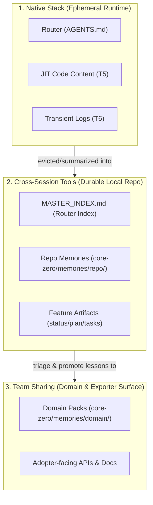
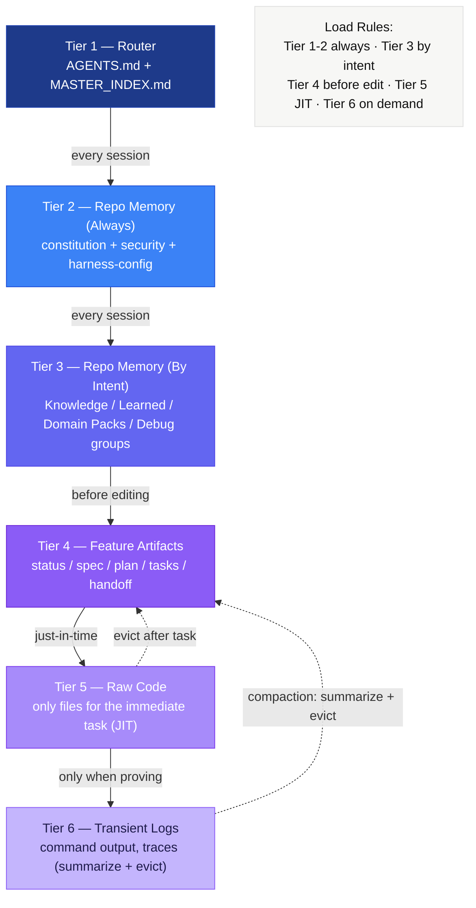
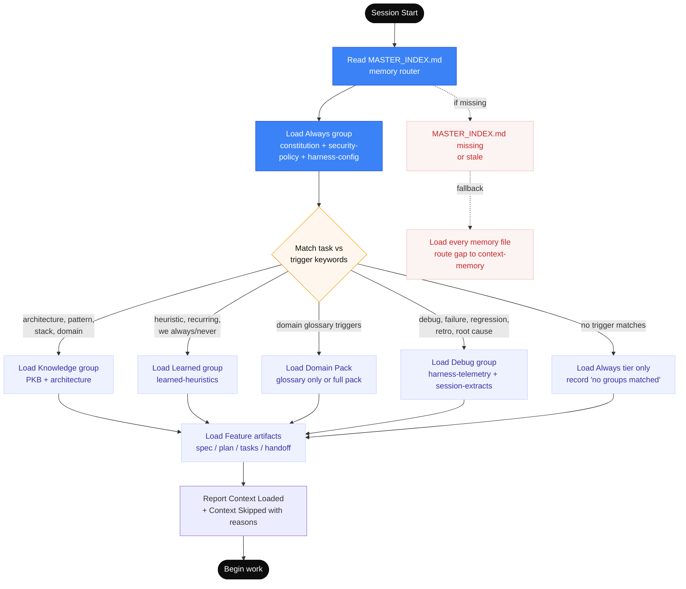
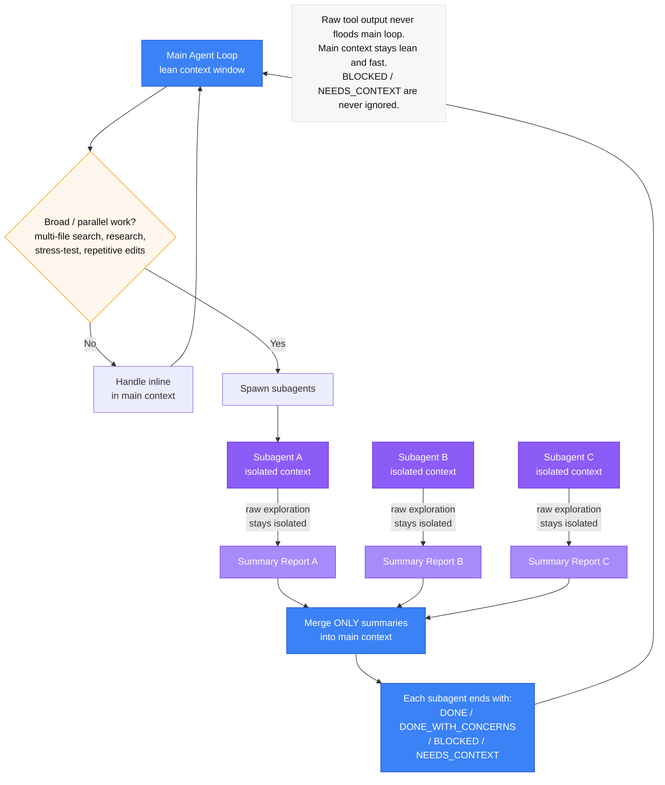
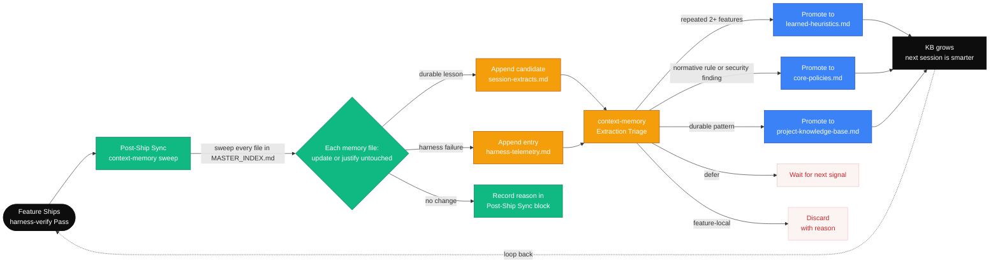
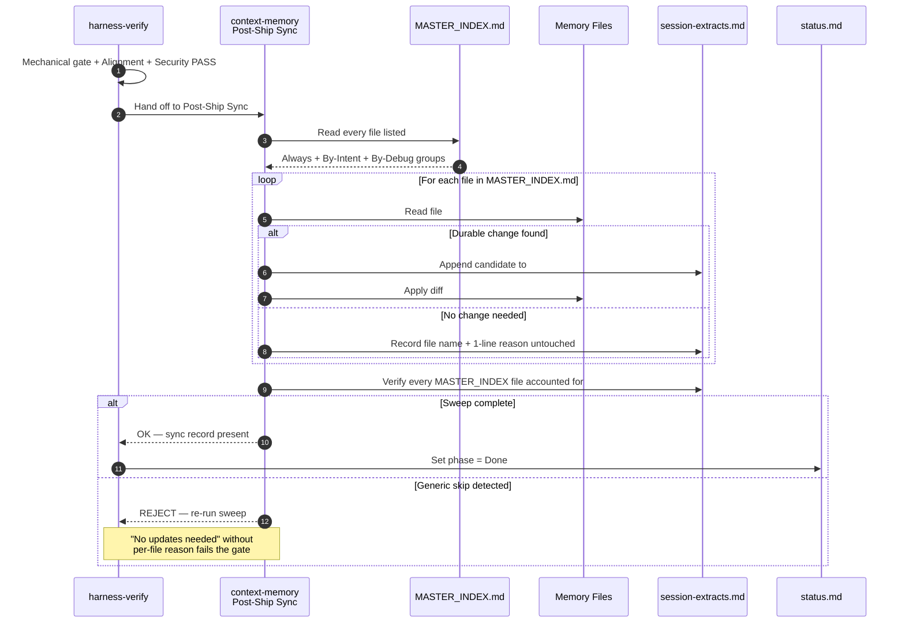

# Context Engineering

## Purpose

Defines how the kit assembles, budgets, compacts, and evicts context during long-running work. Context is the agent's working memory — too little and it forgets, too much and it loses focus.

---

## Progressive Disclosure

Progressive disclosure layers information so agents load only what they need, when they need it. Instead of dumping all context upfront, the harness reveals deeper detail as the agent moves through the workflow.

```
Layer 1: Router (AGENTS.md)          ~50 lines    Always loaded
    │
    ▼
Layer 2: Skill Contract (SKILL.md)   ~100-250 lines    Loaded when skill is invoked
    │
    ▼
Layer 3: References (references/)    Variable    Loaded JIT within the skill workflow
```

### Layer 1: Router
- **What**: `AGENTS.md` — priority rules, skill routing, and pointers to memory.
- **When loaded**: Every session start. Always in context.
- **Design rules**: Under 50 lines; no full skill bodies; points to deeper docs; sets behavioral constraints.

### Layer 2: Skill Contract
- **What**: `skills/<name>/SKILL.md` — full workflow, rules, stop conditions, and verification gates.
- **When loaded**: Only when the command is invoked.
- **Design rules**: Self-contained; references deeper docs but doesn't inline them; includes "Read First" and "Output Rules" sections.

### Layer 3: References
- **What**: Templates, rubrics, checklists, and examples in `skills/<name>/references/`.
- **When loaded**: During specific workflow steps that need them.
- **Design rules**: Each reference serves one purpose; named clearly; never loaded speculatively.

---

## The Minimum Viable Context (MVC) Principle (Rule CC-011)

To prevent cognitive drift, context window saturation, and high execution costs, the kit enforces the **Minimum Viable Context (MVC)** principle (**Rule CC-011**).

The core directive of MVC is: **Only load the minimal, high-signal context required to execute the active task.**

Never dump full files, large directories, or entire database schemas into the agent's context window. Instead, follow progressive JIT (Just-In-Time) loading and enforce strict, aggressive compaction and eviction of stale data.

---

## The Three-Track Memory Model

To structure workspace information efficiently, the kit divides memory into three distinct operational tracks:



1. **Native Stack (Ephemeral Runtime):**
   - **What**: The direct, live token context loaded into the LLM during the active session. This includes the entrypoint router (`AGENTS.md`), JIT-loaded target code files, and transient execution outputs (Tiers 1, 5, and 6).
   - **Lifespan**: Volatile. Evicted and summarized aggressively within the session.

2. **Cross-Session Tools (Durable Local Repository):**
   - **What**: Git-tracked markdown files that store local feature state and repository-wide memories (Tiers 2, 3, and 4). Includes feature plans, tasks, progress logs, `learned-heuristics.md`, and `harness-telemetry.md`.
   - **Lifespan**: Persistent across sessions, versioned via Git.

3. **Team Sharing (Domain & Exporter Surface):**
   - **What**: Shared knowledge domain templates, boundaries, glossaries (`core-zero/memories/domain/`), and system references that propagate to other developers and peer agent sessions.
   - **Lifespan**: Extremely durable, highly curated.

---

## Context Tiers

The kit assembles context across 6 tiers, from highest signal to lowest. Each tier has its own load rule.



### Tier Reference

| Tier | Content                                                           | Load Strategy                             |
| ---- | ----------------------------------------------------------------- | ----------------------------------------- |
| 1    | `AGENTS.md` + `MASTER_INDEX.md` (router)                          | Always — first thing loaded every session |
| 2    | Always group: `core-policies.md`                                  | Always — every session                    |
| 3    | By-Intent groups: Knowledge / Learned / Domain Packs / Debug      | Only when trigger keywords match the task |
| 4    | Feature artifacts: `spec.md`, `plan.md`, `tasks.md`, `handoff.md` | Before editing or verifying               |
| 5    | Raw code — only files for the immediate task                      | JIT — just-in-time per task               |
| 6    | Transient logs, grep output, stack traces                         | On demand — summarize and evict quickly   |

**Intent groups (Tier 3) — defined in `MASTER_INDEX.md`:**
- **Knowledge** — loads when task touches `architecture`, `pattern`, `stack`, `domain`, `convention`, `module`, `api surface`, `bootstrap`, `skill`, `template`, `adr`, `decision` (loads PKB, `adr-log.md`, `core-zero/project/architecture.md`, `core-zero/project/code-map.md`)
- **Learned** — loads when task echoes `heuristic`, `recurring`, `we always/never`, `last time`, `lesson` (loads `learned-heuristics.md`)
- **Domain Packs** — loads when domain-pack glossary triggers match the task (`core-zero/memories/domain/`). Low-confidence matches load `glossary.md` only; high-confidence matches load the full pack.
- **Debug** — loads on `debug`, `failure`, `regression`, `retro`, `root cause`, `flaky`, `why did`, `incident` (loads `harness-telemetry.md` and per-feature `session-extracts.md`)

### Memory Files by Tier

#### Instruction Tier — Human-Curated, Durable
| File                                | Content                                                                     | Update Frequency                    |
| ----------------------------------- | --------------------------------------------------------------------------- | ----------------------------------- |
| `core-policies.md`                  | Normative repo-wide rules (CC-*), security boundaries, promotion thresholds | Rare — when tooling/policies change |
| `project-knowledge-base.md`         | Durable facts, conventions, patterns                                        | As project evolves                  |
| `learned-heuristics.md`             | Evidence-backed execution patterns                                          | After repeated observations         |
| `core-zero/project/architecture.md` | System boundaries, components, integration seams                            | When architecture changes           |
| `adr-log.md`                        | ADR index                                                                   | Lazy-created on first ADR           |

#### Auto Tier — Failure-Driven, Append-Only
| File                   | Content                            | Written By                                                                    |
| ---------------------- | ---------------------------------- | ----------------------------------------------------------------------------- |
| `harness-telemetry.md` | Harness/Model/Spec failure entries | `/harness-maintain` Improve Mode, `/harness-verify`, `telemetry-collector.sh` |

#### Extracted Tier — Per-Feature Candidates
| File                                            | Content                                     | Written By                                               |
| ----------------------------------------------- | ------------------------------------------- | -------------------------------------------------------- |
| `artifacts/features/<slug>/session-extracts.md` | Session distillation — hypotheses not rules | `/context-session END`, `/harness-verify` post-ship sync |

#### Router
| File              | Purpose                                                                                                           |
| ----------------- | ----------------------------------------------------------------------------------------------------------------- |
| `MASTER_INDEX.md` | Always-loaded routing index. Declares Always / By-Intent / By-Debug / By-Domain groups. Sessions read this first. |

## Assembly Rules

- Load tiers in order (1 → 6)
- Never skip Tier 1-2
- Load Tier 3 only when the task crosses component boundaries
- Load Tier 4 scoped to the active feature slug
- Load Tier 5 minimally — only the files the current task touches
- Tier 6 is ephemeral — extract the signal, then evict the noise

---

## Smart Routing via MASTER_INDEX.md

Tier 3 (memory by intent) is no longer "load everything." `MASTER_INDEX.md` declares Always-loaded files plus by-intent groups whose trigger keywords decide what loads. Sessions report what they loaded and what they skipped — silent skipping is not allowed.

**Confidence-Scored Loading (Partial Loads):**
When loading by-intent groups, the harness evaluates a confidence score based on keyword matches:
- **Low Confidence (≤2 keywords):** Performs a **partial-load**. The session loads only the index or header file for that group, heavily conserving context budget while retaining situational awareness.
- **High Confidence (3+ keywords):** Performs a full load of all files in the group.



---

## Context Eviction & Telemetry Control

Raw console output, compiler errors, and test execution traces (Tier 6) are extremely token-dense and low-signal once analyzed. Retaining them in the active context window wastes token budget and accelerates model saturation, leading to hallucinations.

To prevent this, the `/spec-implement` workflow enforces **Mandatory Context Eviction**:
1. **Execute**: Run the mechanical validation gate via `gate-runner.sh`.
2. **Analyze**: Parse the success or failure output to identify the root cause or confirm completion.
3. **Summarize**: Record a 3-5 line high-level summary of the run in the active verification/task log (e.g. `tests passed` or `linter failed with syntax error in lines 12-14`).
4. **Evict**: Immediately remove the raw terminal stderr/stdout from the active context window. Do not keep the raw command dump in subsequent turns.
5. **Log Telemetry**: If the run failed, pipe the output to `telemetry-collector.sh` which appends it to `core-zero/memories/repo/harness-telemetry.md` (removing it from the active session runtime).

---

## Compaction Triggers

Compact context when:
- `harness-telemetry.md` exceeds 500 lines or the session is ending
- Raw grep/search output exceeds 50 lines
- Full file contents are loaded but only a section is needed
- Previous task's code context is no longer relevant
- Logs or error output has been analyzed and findings recorded
- The context window is approaching capacity

---

## Compaction Strategies

| Strategy         | When                                   | How                                         |
| ---------------- | -------------------------------------- | ------------------------------------------- |
| **Summarize**    | Large tool output analyzed             | Replace raw output with 3-5 line summary    |
| **Scope-narrow** | Full file loaded, only function needed | Drop to relevant section                    |
| **Evict**        | Previous task context no longer needed | Remove entirely                             |
| **Promote**      | Finding is durable                     | Write to memory/artifact, then evict source |

---

## Stale Context Rules

Context becomes stale when:
- The finding has been recorded in an artifact
- The task that needed it is marked Done
- A newer version of the information exists
- The raw data has been summarized

Stale context MUST be evicted — carrying it forward dilutes attention and wastes budget.

---

## Session Checkpoints

Checkpoint when:
- A task is completed (natural boundary)
- Context is getting large (approaching compaction triggers)
- Switching between skills (different context needs)
- Before a long-running operation

Checkpoint = update progress.md + apply compaction + verify context is lean.

---

## Anti-Patterns

| Anti-Pattern                               | Why It's Bad                            | Instead                              |
| ------------------------------------------ | --------------------------------------- | ------------------------------------ |
| Loading entire design.md for a single task | Wastes context budget                   | Load only the relevant section       |
| Keeping raw grep output after analysis     | Noise dilutes signal                    | Summarize findings, evict raw output |
| Loading all feature artifacts at once      | Most aren't needed for the current task | Load JIT based on task dependencies  |
| Never checkpointing                        | Context grows until quality degrades    | Checkpoint after each completed task |
| Relying on chat history for state          | Chat is volatile and gets truncated     | Use progress.md as system of record  |

---

## Subagent-Driven Development

Broad work (multi-file search, codebase mapping, stress-testing) is delegated to subagents whose raw exploration stays isolated. Only summary reports merge back into the main context — keeping the main loop lean.



---

## Promotion & Triage

Knowledge flows from local feature execution upward into instruction-tier memory via manual triage and automatic sweeps.

### Manual Promotion & Triage

When a finding is identified in a feature folder (`session-extracts.md` or `harness-telemetry.md`), run `/context-memory` to initiate Extraction Triage:

| Decision    | Condition                                              | Action                         |
| ----------- | ------------------------------------------------------ | ------------------------------ |
| **Promote** | Repeated across 2+ features, evidence-backed, reusable | Write to Instruction Tier      |
| **Defer**   | Promising but needs further confirmations              | Retain in candidate log        |
| **Discard** | Feature-specific, obsolete, or incorrect               | Discard with documented reason |

*Normative rules* (must/should) route to `core-policies.md`.
*Descriptive facts* (uses/prefers) route to `project-knowledge-base.md` or `learned-heuristics.md`.

### Promotion Watchlist Thresholds

To prevent file bloat, memory segments are audited against these boundaries (from `core-policies.md`):
- Memory file length $\ge$ 100 lines (early warning) / 200 lines (breach) / 3200 lines (hard cap).
- $\ge$ 3 distinct H2 subtopics covering separate concerns.
- $\ge$ 5 features referencing the same slice.

---

## Self-Improving Knowledge Loop

Each feature release triggers a feedback loop: verification yields failures that upgrade the harness; successful verify sweeps compile findings for promotion.



### Post-Ship Sync Sequence

The `Post-Ship Sync` is a mandatory sequence after a passing verification. Generic skips (e.g., "No updates needed") are rejected.



---

## Domain Packs

Domain packs extend the memory router with project-specific semantic context. Each pack captures the ubiquitous language, proven patterns, anti-patterns, and boundary rules for a specific business or technical domain.

### Where They Live

```
core-zero/memories/domain/
├── glossary.md      — ubiquitous language + trigger keywords
├── patterns.md      — proven domain patterns
├── anti-patterns.md — failure modes to avoid
├── boundaries.md    — domain ownership and integration contracts

```

### How Loading Works

Domain packs use confidence-scored loading (same principle as Tier 3 intent groups):
- **3+ keyword matches** → full pack load (all files)
- **1–2 keyword matches** → partial load (glossary.md only)
- **0 matches** → pack skipped

Trigger keywords are declared in each pack's `glossary.md` frontmatter:
```yaml
domain: payments
triggers: [billing, invoice, charge, stripe, subscription, refund, payment]
```

### Authoring a Pack

1. Create `core-zero/memories/domain/` with the required files.
2. Declare triggers in `glossary.md` frontmatter.
3. Register the pack in `MASTER_INDEX.md` under `## By Domain Packs`.
4. See `core-zero/memories/domain/README.md` for the full schema.

### Lifecycle

Domain packs are **adopter-owned** memory — the kit seeds the schema but not the content. During `/context-memory` Post-Ship Sync, promote durable patterns from `session-extracts.md` into the appropriate domain pack file.

Brownfield artifacts under `core-zero/memories/repo/project-knowledge-base.md ## Repository Overview` are separate from domain packs. As of the current kit revision, they are produced by `/starter-init` (Phase A) but are not yet auto-routed by `MASTER_INDEX.md`; sessions need to load them intentionally when relevant.

> **MVC Tool — `scripts/context-loader.py`**: Provides programmatic enforcement of the MVC rule. Run `python3 scripts/context-loader.py <file> --mode summary` to extract the `## Index` section plus ~60 content lines (or first 30 lines if no Index exists), preserving context budget without agent interpretation. Use `--section <H2 title>` to load a single named section.

---

## Context Engine Implementation: Three-Layer Architecture

The MVC principle is backed by three layers that work together to load only what's needed:

```
┌─────────────────────────────────────────────────────────────┐
│  1. MASTER_INDEX.md     — The Map (declarative table)      │
│     Phase × Guidance Matrix tells you what to load         │
│     per phase: Must / Should / Skip, with optional         │
│     section annotations {## Sec1, ## Sec2}                 │
├─────────────────────────────────────────────────────────────┤
│  2. context_engine.py   — The Brain (Python engine)        │
│     Reads the matrix, scores for relevance, tracks         │
│     token budget, evicts low-value files, compresses.      │
├─────────────────────────────────────────────────────────────┤
│  3. context-loader.py   — The CLI (thin entrypoint)        │
│     41 lines: parses args, instantiates ContextEngine,     │
│     calls process_file() or run_route().                   │
└─────────────────────────────────────────────────────────────┘
```

### Layer 1: MASTER_INDEX.md (the declarative map)

The `## 3. Phase × Guidance Matrix` section is a 5-column table. The first column is the source file (with glob support via `*`). Columns 2–5 are the four delivery-loop phases (Spec / Plan / Implement / Verify). Each cell is one of `Must`, `Should`, or `Skip`, with an optional brace annotation `{## Sec1, ## Sec2}` to load only specific H2 sections of a file.

| Source                              | Spec                                  | Plan                                                   | Implement                                              | Verify                                                    |
| ----------------------------------- | ------------------------------------- | ------------------------------------------------------ | ------------------------------------------------------ | --------------------------------------------------------- |  |
| `core-policies.md`                  | Must {## Purpose, ## Normative Rules} | Must {## Amendment Rules, ## Release Guardrails}       | Must {## Normative Rules, ## Security Policy}          | Must {## Memory Promotion Thresholds, ## Security Policy} |
| `harness-config.md`                 | Skip                                  | Should {## Artifact Routing, ## Verification Commands} | Should {## Verification Commands, ## Session Defaults} | Skip                                                      |
| `core-zero/project/architecture.md` | Should                                | Should                                                 | Skip                                                   | Should                                                    |
| `core-zero/rules/*.md`              | Skip                                  | Should                                                 | Must                                                   | Should                                                    |

Short names (e.g. `core-policies.md`) are resolved to paths under `core-zero/memories/repo/` by `_path_for_source()` in `context_engine.py`. Expressions with `*` are expanded as globs against the repo root. Entries with parenthetical suffixes like `(on language/domain match)` are parsed and the condition is dropped — the condition must be enforced by the caller.

### Layer 2: context_engine.py (the engine)

Located at `kit/scripts/core/context_engine.py`. Exposes class `ContextEngine`. Key internals:

**Route resolution** — `resolve_route(root, phase)` (line 194):
1. Opens `MASTER_INDEX.md` at the given root.
2. Scans for `## 3. Phase × Guidance Matrix` section header.
3. Parses every `| \`...\` | ... |` table row in that section.
4. Filters to the column matching the requested phase (`spec`/`plan`/`implement`/`verify`).
5. Drops `Skip` rows, keeps `Must` and `Should`.
6. Resolves short names via `_path_for_source()` (line 142): maps `core-policies.md` → `core-zero/memories/repo/core-policies.md`, `domain/glossary.md` → `core-zero/memories/domain/glossary.md`, `core-zero/rules/*.md` → expanded glob. Returns `None` for entries like `session-extracts.md` (not auto-loaded).
7. Returns list of `(resolved_path, tier, sections_or_none)` tuples — section lists from `{## Sec1, ## Sec2}` annotations are parsed via `parse_tier()`.

**Tier protection** — `TIER_BOOST` (line 137):
```python
TIER_BOOST = {"Must": 40, "Should": 20, "Skip": 0}
```
When scoring files for eviction, `Must` files start at 40 points (out of 100), `Should` at 20. This means Must files are almost never evicted — they need very few keyword matches to stay above the eviction threshold.

**Scoring** — `Scorer.score(filepath, base_score=0)` (line 47):
1. Reads the file contents.
2. For each single-word intent keyword: counts occurrences using word-boundary regex `\bword\b`, adds `min(count × 10, 30)`.
3. For each multi-word phrase: counts substring occurrences, adds `min(count × 15, 40)`.
4. Adds `base_score` (from tier boost).
5. Caps at 100.
6. If no intent keywords provided and base_score is 0, returns default 50 (neutral).

**Budget tracking** — `BudgetTracker` (line 66):
- Soft warn at 160K tokens, hard cap at 200K (both configurable).
- When a file would exceed hard cap, it's rejected outright.
- `evict_to_budget()`: sorts loaded files by score ascending, pops the lowest until under hard cap. Prints eviction notices.

**Compression** — `Compressor.compress(filepath)` (line 98):
- Deduplicates lines containing task IDs (pattern `[A-Z]{2,6}-\d+`). If a task ID was already seen, the line is dropped.
- Truncates lines longer than 200 characters.
- Aborts if savings < 10% (returns original text) — avoids pointless re-processing.

**`run_route()`** — the full pipeline (line 290):
1. Calls `resolve_route()` to get `[(path, tier, sections), ...]`.
2. Deduplicates by path (last tier wins).
3. For each file: calls `set_tier(path, tier)` to record its tier for base-score protection, then calls `process_file(path, sections=sections)`.
4. When `sections` is set (from matrix `{## Sec1}` annotations), `process_file()` loads only those H2 sections via `extract_section()`, ignoring the full-file mode.
5. Without sections, `process_file()` computes score, estimates tokens, checks budget, then outputs in the requested mode (`full`/`summary`/`partial`/`scored`/`compress`). Mode `summary` caps at 800 tokens; `partial` caps at 1200 tokens.
6. After all files, calls `evict_to_budget()` if a budget cap was set.

### Layer 3: context-loader.py (the CLI)

Thin wrapper at `kit/scripts/context-loader.py` (45 lines). Four usage patterns:

```bash
# Route-based: load what the matrix says for phase "plan"
python3 kit/scripts/context-loader.py --route plan --mode summary

# Direct file: load one file with compression
python3 kit/scripts/context-loader.py core-zero/rules/ponytail.md --mode compress

# Section extract: load a single H2 section
python3 kit/scripts/context-loader.py --section "Security Policy" core-zero/memories/repo/core-policies.md

# Bulk: load multiple files scored against intent, capped at 5000 tokens
python3 kit/scripts/context-loader.py --intent "api auth" --budget 5000 file1.md file2.md
```

### Full session flow

1. Agent reads `MASTER_INDEX.md` at session start — learns the matrix exists.
2. Current phase is **Implement**. Agent runs:
   ```
   python3 kit/scripts/context-loader.py --route implement --mode partial
   ```
3. `context-loader.py` instantiates `ContextEngine` and calls `run_route("implement")`.
4. `run_route()` calls `resolve_route(root, "implement")`:
   - Opens `MASTER_INDEX.md`, finds `## 3. Phase × Guidance Matrix`.
   - Reads column "Implement" with section annotations: `core-policies.md` `Must {## Normative Rules, ## Security Policy}` (section-loaded, ~500 tokens), `project-knowledge-base.md` (Should, full file), `tech-stack.md` (Should), `code-map.md` (Should), `code-design.md` (Should), `core-zero/rules/*.md` (Must) — expanded to all matching rule files, etc.
   - Returns ~12 resolved paths with tiers and optional section lists.
5. For each file, `run_route()`:
   - Sets tier → file gets base score 40 (Must) or 20 (Should).
   - If sections are specified (e.g. core-policies.md → Normative Rules + Security Policy), calls `process_file()` with section names, which extracts just those H2 sections.
   - Otherwise calls `process_file()` → scores content against `--intent` keywords (if any), estimates tokens, checks against budget.
   - Outputs in `partial` mode (up to 1200 tokens per file via `PARTIAL_BUDGET`).
6. After all files loaded, `evict_to_budget()` runs. If total tokens exceed cap, lowest-scored files are evicted. Must files (score ≥40) are rarely touched.
7. **Result**: agent has ~8–12 phase-relevant files (some section-loaded, some partially loaded) under token budget — no manual selection needed.
