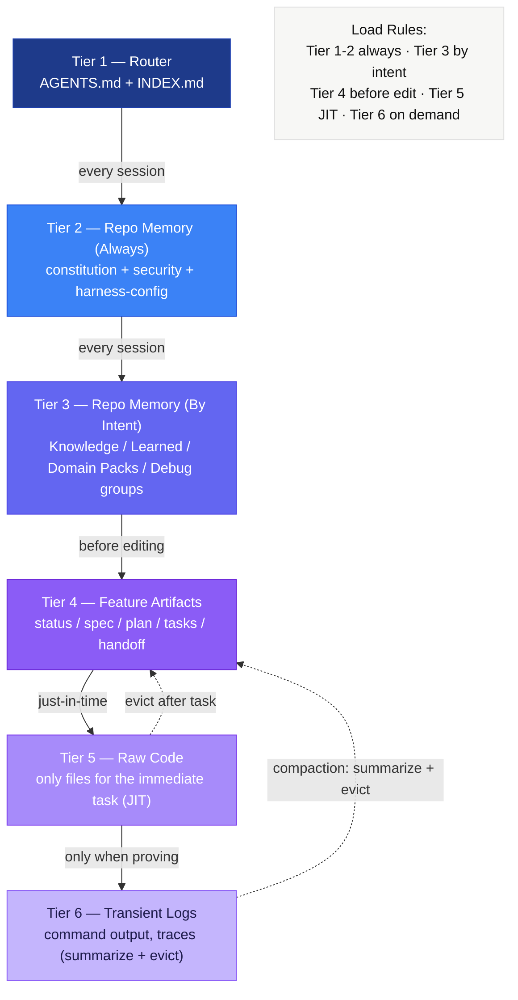
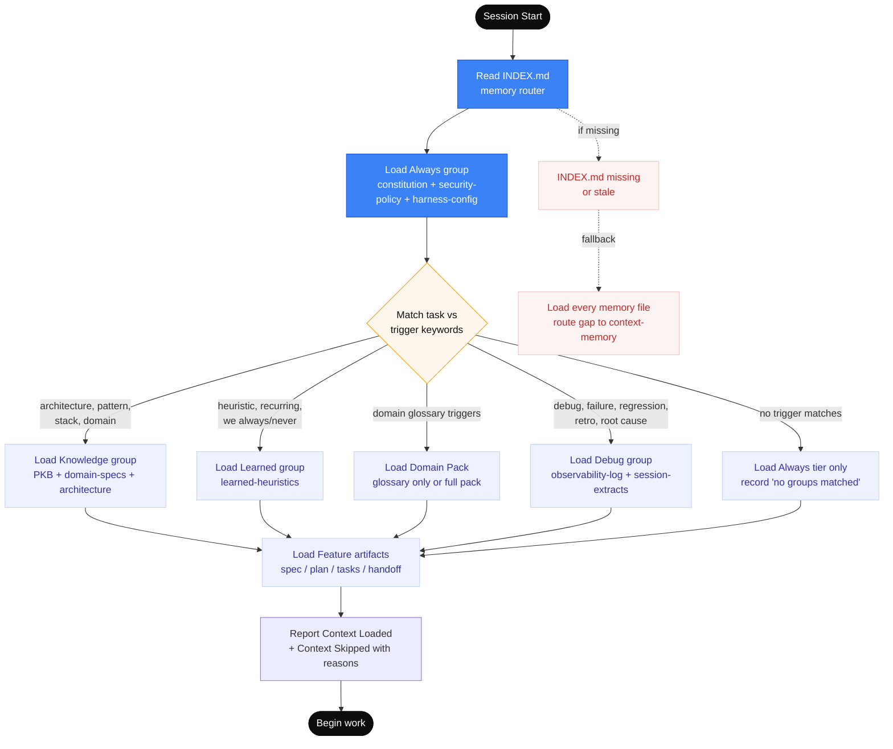
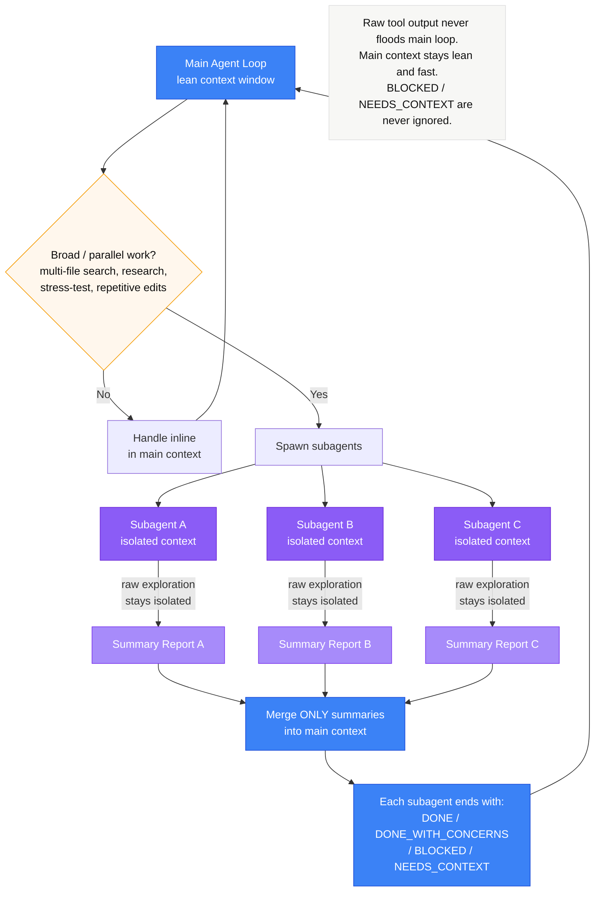

# Context Engineering

## Purpose

Defines how the kit assembles, budgets, compacts, and evicts context during long-running work. Context is the agent's working memory — too little and it forgets, too much and it loses focus.

## Context Tiers

The kit assembles context across 6 tiers, from highest signal to lowest. Each tier has its own load rule.



### Tier Reference

| Tier | Content | Load Strategy |
|------|---------|---------------|
| 1 | `AGENTS.md` + `INDEX.md` (router) | Always — first thing loaded every session |
| 2 | Always group: `constitution.md`, `harness-config.md`, `security-policy.md` | Always — every session |
| 3 | By-Intent groups: Knowledge / Learned / Domain Packs / Debug | Only when trigger keywords match the task |
| 4 | Feature artifacts: `spec.md`, `plan.md`, `tasks.md`, `handoff.md` | Before editing or verifying |
| 5 | Raw code — only files for the immediate task | JIT — just-in-time per task |
| 6 | Transient logs, grep output, stack traces | On demand — summarize and evict quickly |

**Intent groups (Tier 3) — defined in `memories/repo/INDEX.md`:**
- **Knowledge** — loads when task touches `architecture`, `pattern`, `stack`, `domain`, `convention`, `module`, `api surface`, `bootstrap`, `skill`, `template`, `adr`, `decision` (loads PKB, domain-specs, `adr-log.md`, `docs/architecture.md`, `docs/generated/codemap.md`, `docs/generated/references-index.md`)
- **Learned** — loads when task echoes `heuristic`, `recurring`, `we always/never`, `last time`, `lesson` (loads `learned-heuristics.md`)
- **Domain Packs** — loads when domain-pack glossary triggers match the task (`memories/domains/<name>/`). Low-confidence matches load `glossary.md` only; high-confidence matches load the full pack.
- **Debug** — loads on `debug`, `failure`, `regression`, `retro`, `root cause`, `flaky`, `why did`, `incident` (loads `observability-log.md` and per-feature `session-extracts.md`)

## Assembly Rules

- Load tiers in order (1 → 6)
- Never skip Tier 1-2
- Load Tier 3 only when the task crosses component boundaries
- Load Tier 4 scoped to the active feature slug
- Load Tier 5 minimally — only the files the current task touches
- Tier 6 is ephemeral — extract the signal, then evict the noise

## Smart Routing via INDEX.md

Tier 3 (memory by intent) is no longer "load everything." `memories/repo/INDEX.md` declares Always-loaded files plus by-intent groups whose trigger keywords decide what loads. Sessions report what they loaded and what they skipped — silent skipping is not allowed.

**Confidence-Scored Loading (Partial Loads):**
When loading by-intent groups, the harness evaluates a confidence score based on keyword matches:
- **Low Confidence (≤2 keywords):** Performs a **partial-load**. The session loads only the index or header file for that group, heavily conserving context budget while retaining situational awareness.
- **High Confidence (3+ keywords):** Performs a full load of all files in the group.



## Compaction Triggers

Compact context when:
- Raw grep/search output exceeds 50 lines
- Full file contents are loaded but only a section is needed
- Previous task's code context is no longer relevant
- Logs or error output has been analyzed and findings recorded
- The context window is approaching capacity

## Compaction Strategies

| Strategy | When | How |
|----------|------|-----|
| **Summarize** | Large tool output analyzed | Replace raw output with 3-5 line summary |
| **Scope-narrow** | Full file loaded, only function needed | Drop to relevant section |
| **Evict** | Previous task context no longer needed | Remove entirely |
| **Promote** | Finding is durable | Write to memory/artifact, then evict source |

## Stale Context Rules

Context becomes stale when:
- The finding has been recorded in an artifact
- The task that needed it is marked Done
- A newer version of the information exists
- The raw data has been summarized

Stale context MUST be evicted — carrying it forward dilutes attention and wastes budget.

## Session Checkpoints

Checkpoint when:
- A task is completed (natural boundary)
- Context is getting large (approaching compaction triggers)
- Switching between skills (different context needs)
- Before a long-running operation

Checkpoint = update progress.md + apply compaction + verify context is lean.

## Anti-Patterns

| Anti-Pattern | Why It's Bad | Instead |
|--------------|-------------|---------|
| Loading entire design.md for a single task | Wastes context budget | Load only the relevant section |
| Keeping raw grep output after analysis | Noise dilutes signal | Summarize findings, evict raw output |
| Loading all feature artifacts at once | Most aren't needed for the current task | Load JIT based on task dependencies |
| Never checkpointing | Context grows until quality degrades | Checkpoint after each completed task |
| Relying on chat history for state | Chat is volatile and gets truncated | Use progress.md as system of record |

## Subagent-Driven Development

Broad work (multi-file search, codebase mapping, stress-testing) is delegated to subagents whose raw exploration stays isolated. Only summary reports merge back into the main context — keeping the main loop lean.



## Domain Packs

Domain packs extend the memory router with project-specific semantic context. Each pack
captures the ubiquitous language, proven patterns, anti-patterns, and boundary rules for
a specific business or technical domain.

### Where They Live

```
memories/domains/<name>/
├── glossary.md       — ubiquitous language + trigger keywords
├── patterns.md       — proven domain patterns
├── anti-patterns.md  — failure modes to avoid
└── boundary-rules.md — domain ownership and integration contracts
```

### How Loading Works

Domain packs use confidence-scored loading (same principle as Tier 3 intent groups):
- **3+ keyword matches** → full pack load (all 4 files)
- **1–2 keyword matches** → partial load (glossary.md only)
- **0 matches** → pack skipped

Trigger keywords are declared in each pack's `glossary.md` frontmatter:
```yaml
domain: payments
triggers: [billing, invoice, charge, stripe, subscription, refund, payment]
```

### Authoring a Pack

1. Create `memories/domains/<name>/` with the 4 required files.
2. Declare triggers in `glossary.md` frontmatter.
3. Register the pack in `memories/repo/INDEX.md` under `## By Domain Packs`.
4. See `memories/domains/README.md` for the full schema.

### Lifecycle

Domain packs are **adopter-owned** memory — the kit seeds the schema but not the content.
During `/context-memory` Post-Ship Sync, promote durable patterns from
`session-extracts.md` into the appropriate domain pack file.

Brownfield artifacts under `memories/repo/brownfield/` are separate from domain packs.
As of the current kit revision, they are produced by `/starter-init` (Phase A) but are not yet
auto-routed by `INDEX.md`; sessions need to load them intentionally when relevant.

---

## Context Compaction & Claim Gaps

During the system-wide evaluation (detailed in [evaluation-report.md](file:///Users/thaihai-swe/Desktop/AI-agents-dev-kits/documents/evaluation-report.md)), several context-engineering gaps and corresponding recommendations were identified:

* **Workspace Claim Lock Contention**: The file-backed claim protocol manages multi-agent coordination but lacks automated collision resolution. To prevent distributed agent workspace blockages, claim files should be explicitly mapped to Git branch states rather than single absolute paths.

