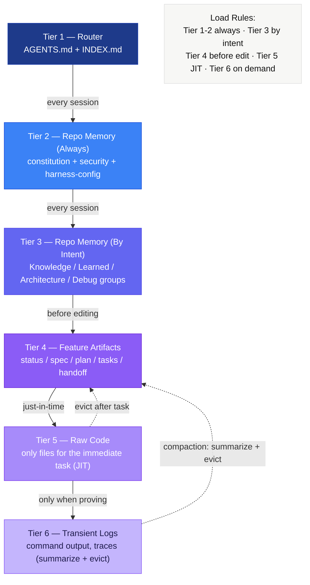
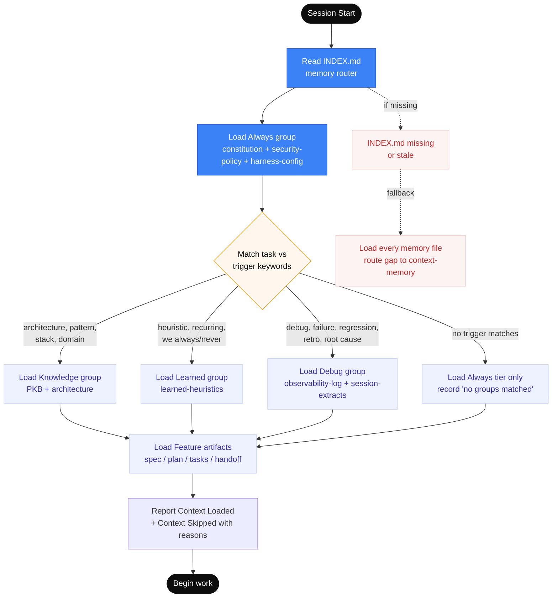
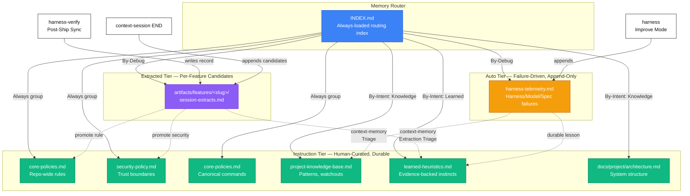
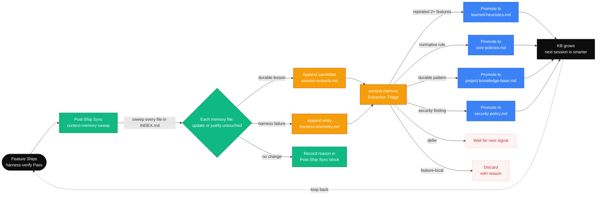
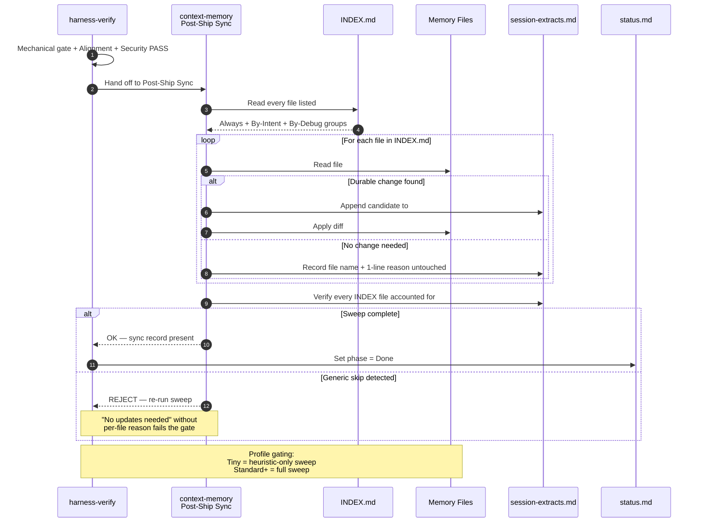
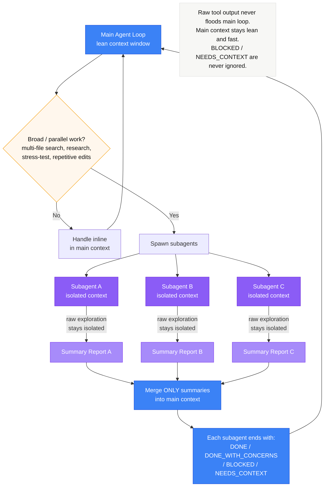
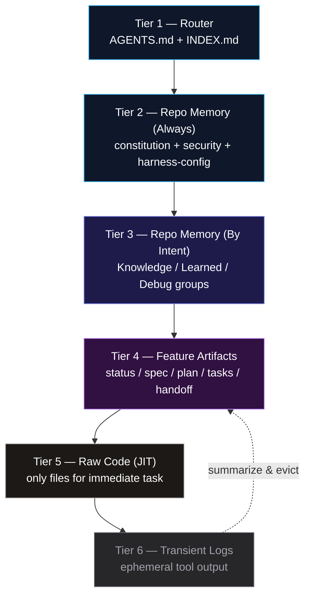

# Context Assembly & Memory Tiers

This guide defines how the CoreZero Nexus manages context and durable repository memory to prevent context dilution, agent amnesia, and command drift.

---

## 1. Progressive Disclosure

Progressive disclosure is the practice of layering information so that agents load only what they need, when they need it. Instead of dumping all context upfront, the harness reveals deeper detail as the agent moves through the workflow.

```text
Layer 1: Router (AGENTS.md)          ~50 lines    Always loaded
    │
    ▼
Layer 2: Skill Contract (SKILL.md)   ~100-250 lines    Loaded when skill is invoked
    │
    ▼
Layer 3: References (references/)    Variable    Loaded JIT within the skill workflow
```

### Layer 1: Router
* **What**: `AGENTS.md` — priority rules, skill routing, and pointers to memory.
* **When loaded**: Every session start. Always in context.
* **Design rules**:
  - Under 50 lines.
  - No full skill bodies — only names and one-line descriptions.
  - Points to deeper docs, never duplicates them.
  - Sets behavioral constraints (no fabrication, surgical changes, fail loud).

### Layer 2: Skill Contract
* **What**: `skills/<name>/SKILL.md` — full workflow, rules, stop conditions, and verification gates.
* **When loaded**: Only when the command is invoked (e.g., user says `/spec-requirements`).
* **Design rules**:
  - Self-contained — an agent can execute the skill from this file alone.
  - References deeper docs in `references/` but doesn't inline them.
  - Includes a "Read First" section listing what to load before starting.
  - Includes an "Output Rules" section constraining what the skill can create.

### Layer 3: References
* **What**: Templates, rubrics, checklists, and examples in `skills/<name>/references/`.
* **When loaded**: During specific workflow steps that need them.
* **Design rules**:
  - Each reference serves one purpose (template, rubric, checklist, example).
  - Named clearly so the skill can request them by name.
  - Never loaded speculatively — only when the workflow step requires them.
  - Can be skipped entirely for Tiny-profile work.

---

## 2. Context Engineering

Context is the agent's working memory. The kit assembles context across 6 tiers, from highest signal to lowest. Each tier has its own load rule.

### 6-Tier Context Assembly



### Tier Reference

| Tier | Content | Load Strategy |
|------|---------|---------------|
| 1 | `AGENTS.md` + `INDEX.md` (router) | Always — first thing loaded every session |
| 2 | Always group: `core-policies.md`, `core-policies.md`, `security-policy.md` | Always — every session |
| 3 | By-Intent groups: Knowledge / Learned / Debug | Only when trigger keywords match the task |
| 4 | Feature artifacts: `spec.md`, `plan.md`, `tasks.md`, `handoff.md` | Before editing or verifying |
| 5 | Raw code — only files for the immediate task | JIT — just-in-time per task |
| 6 | Transient logs, grep output, stack traces | On demand — summarize and evict quickly |

**Intent groups (Tier 3) — defined in `memories/repo/INDEX.md`:**
- **Knowledge** — loads when task touches `architecture`, `pattern`, `stack`, `domain`, `convention`, `module`, `api surface`, `bootstrap`, `skill`, `template`, `adr`, `decision` (loads PKB, `adr-log.md`, `docs/project/architecture.md`, `docs/generated/codemap.md`, `docs/generated/references-index.md`).
- **Learned** — loads when task echoes `heuristic`, `recurring`, `we always/never`, `last time`, `lesson` (loads `learned-heuristics.md`).
- **Debug** — loads on `debug`, `failure`, `regression`, `retro`, `root cause`, `flaky`, `why did`, `incident` (loads `harness-telemetry.md` and per-feature `session-extracts.md`).

### Smart Routing via INDEX.md

Tier 3 (memory by intent) is loaded dynamically. `memories/repo/INDEX.md` declares Always-loaded files plus by-intent groups whose trigger keywords decide what loads. Sessions report what they loaded and what they skipped — silent skipping is not allowed.

**Confidence-Scored Loading (Partial Loads):**
When loading by-intent groups, the harness evaluates a confidence score based on keyword matches:
- **Low Confidence (≤2 keywords):** Performs a **partial-load**. The session loads only the index or header file for that group, heavily conserving context budget while retaining situational awareness.
- **High Confidence (3+ keywords):** Performs a full load of all files in the group.



### Compaction & Eviction

To maintain focus and prevent memory saturation, the context must be compacted dynamically:

* **Compaction Triggers**:
  - Raw grep/search output exceeds 50 lines.
  - Full file contents are loaded but only a section is needed.
  - Previous task's code context is no longer relevant.
  - Logs or error output has been analyzed and findings recorded.
  - The context window is approaching capacity.

* **Strategies**:
  - **Summarize**: Replace raw log/grep outputs with a 3-5 line summary.
  - **Scope-narrow**: Evict full files and load only the relevant function/block.
  - **Evict**: Remove previous task contexts completely once a task is marked Done.
  - **Promote**: Write durable findings to feature artifacts or memories, then evict the source.

---

## 3. The Memory Layer

The memory layer stores durable cross-feature knowledge that agents need repeatedly. It stays compact, reusable, and clearly separate from feature-specific artifacts.

### 3-Tier Memory Architecture



### Memory Files

#### Router
* **`INDEX.md`**: Declares Always / By-Intent / By-Debug groups. Sessions read this first.

#### Instruction Tier — Human-Curated, Durable
* **`core-policies.md`**: Normative repository rules tagged with `CC-*` identifiers. Update frequency is rare.
* **`security-policy.md`**: Permission model, sandbox guidelines, trust boundaries.
* **`core-policies.md`**: Commands, paths, trackers, and promotion thresholds.
* **`project-knowledge-base.md`**: Durable facts, conventions, and patterns.
* **`learned-heuristics.md`**: Evidence-backed execution patterns.
* **`docs/project/architecture.md`**: Component boundaries, seams, and layouts.

#### Auto Tier — Failure-Driven, Append-Only
* **`harness-telemetry.md`**: Tracks Harness/Model/Spec failure classifications. Written by `/harness-maintain` Improve Mode.

#### Extracted Tier — Per-Feature Candidates
* **`artifacts/features/<slug>/session-extracts.md`**: Candidate findings and observations compiled during session boundaries.

---

## 4. Promotion & Triage

Knowledge flows from local feature execution upward into instruction-tier memory via manual triage and automatic sweeps.

### Manual Promotion & Triage

When a finding is identified in a feature folder (`session-extracts.md` or `harness-telemetry.md`), run `/context-memory` to initiate Extraction Triage:

| Decision | Condition | Action |
|----------|-----------|--------|
| **Promote** | Repeated across 2+ features, evidence-backed, reusable | Write to Instruction Tier |
| **Defer** | Promising but needs further confirmations | Retain in candidate log |
| **Discard** | Feature-specific, obsolete, or incorrect | Discard with documented reason |

*Normative rules* (must/should) route to `core-policies.md` or `security-policy.md`.
*Descriptive facts* (uses/prefers) route to `project-knowledge-base.md` or `learned-heuristics.md`.

### Promotion Watchlist Thresholds
To prevent file bloat, memory segments are audited against these boundaries (from `core-policies.md`):
- Memory file length $\ge$ 800 lines (warning) / 1200 lines (hard limit).
- $\ge$ 3 distinct H2 subtopics covering separate concerns.
- $\ge$ 5 features referencing the same slice.

---

## 5. Self-Improving Knowledge Loop

Each feature release triggers a feedback loop: verification yields failures that upgrade the harness; successful verify sweeps compile findings for promotion.



### Post-Ship Sync Sequence

The `Post-Ship Sync` is a mandatory sequence after a passing verification. Generic skips (e.g., "No updates needed") are rejected.



---

## 6. Subagent-Driven Development (SDD)

Broad operations (such as codebase crawling, regression checks, or bulk file search) are delegated to isolated subagents to keep the main context window thin.



### Context Engineering & Memory Routing
The kit utilizes a 6-tier context assembly framework guided by `INDEX.md`.



* **Smart Intent Routing:** Trigger keywords in `INDEX.md` successfully segment memory loading.
* **Confidence-Scored Loading:** High-confidence matches (3+ keywords) load full groups, while low-confidence (≤2 keywords) load only group headers. This partial load keeps context windows clean.
* **Compaction Gaps:** Compaction strategies (Summarize, Scope-narrow, Evict, Promote) are clearly documented but lack script-driven utilities.
