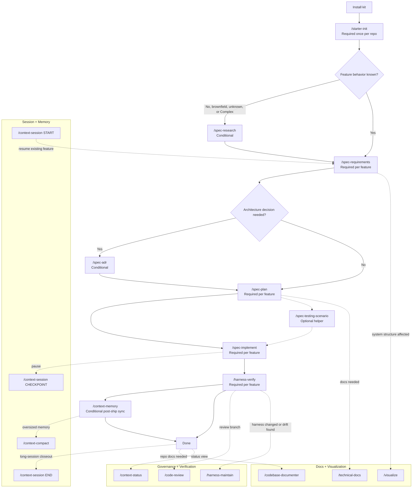

# End-to-End Tutorial

This tutorial explains the full CoreZero skill flow from install to closeout. It covers all 18 shipped skills, their modes, and whether each skill is required, conditional, optional, or maintenance-only.

CoreZero has one required feature-delivery spine. The other skills are supporting branches for session continuity, memory health, governance, documentation, diagrams, and harness repair.

---

## 1. Full Skill System

### Required-vs-Optional Legend

| Label | Meaning |
|---|---|
| Required once per repo | Run during initial adopter setup. |
| Required per feature | Run for every feature that moves through the delivery lifecycle. |
| Conditional | Run when the stated condition applies. |
| Optional helper | Use when it improves clarity, documentation, review depth, or operator visibility. |
| Maintenance-only | Use when maintaining or repairing the harness itself. |

### Five Skill Bands



### Required Feature Path

The normal delivery spine is:

```text
/starter-init
/spec-research      # required when behavior is unknown, brownfield, or Complex
/spec-requirements
/spec-plan
/spec-implement
/harness-verify
```

The support skills are real shipped skills, but they are not all mandatory for every feature. Their use depends on risk, feature profile, session length, documentation needs, and whether the harness itself is changing.

---

## 2. Command Matrix

| Skill | Required? | Modes | Use when | Primary artifacts |
|---|---|---|---|---|
| [`/starter-init`](../kit/skills/starter-init/SKILL.md) | Required once per repo | Greenfield path, brownfield path | First setup after installation | `core-zero/`, `memories/`, `.gitignore`, project memory seeds |
| [`/spec-research`](../kit/skills/spec-research/SKILL.md) | Conditional | Research analysis | Behavior is unknown, repo is brownfield, or root cause is unclear | `artifacts/features/<slug>/analysis.md`, `status.md` |
| [`/spec-requirements`](../kit/skills/spec-requirements/SKILL.md) | Required per feature | Requirements authoring | Define what must be built and how it will be accepted | `spec.md`, `status.md` |
| [`/spec-plan`](../kit/skills/spec-plan/SKILL.md) | Required per feature | Planning | Convert approved requirements into technical design and tasks | `plan.md`, `tasks.md`, `status.md` |
| [`/spec-implement`](../kit/skills/spec-implement/SKILL.md) | Required per feature | Task execution | Implement approved tasks one at a time | Source changes, `tasks.md`, `status.md`, telemetry on failures |
| [`/harness-verify`](../kit/skills/harness-verify/SKILL.md) | Required per feature | Verification | Prove implementation against tasks and spec | `status.md`, verification output, `harness-telemetry.md` |
| [`/context-session`](../kit/skills/context-session/SKILL.md) | Conditional | `START`, `CHECKPOINT`, `END` | Resume, pause, or close long feature sessions | `progress.md`, `handoff.md`, `session-extracts.md` |
| [`/context-memory`](../kit/skills/context-memory/SKILL.md) | Conditional | Regular update, `--audit` | Promote evidence-backed lessons or audit memory health | `memories/repo/*`, `memory-audit.md` |
| [`/context-compact`](../kit/skills/context-compact/SKILL.md) | Conditional | Target-file compaction | Memory files are oversized (thresholds: 100/200/3200 lines) | Compacted target under `memories/`, `artifacts/`, or `core-zero/generated/` |
| [`/context-status`](../kit/skills/context-status/SKILL.md) | Optional helper | Status/dashboard sync | Need project-wide feature visibility or next commands | Status report, `core-zero/generated/dashboard.html` |
| [`/harness-maintain`](../kit/skills/harness-maintain/SKILL.md) | Maintenance-only | `assess`, `create`, `improve`, `eval`, `doctor` | Harness indexes, generated references, or governance loops need repair | `core-zero/project/code-map.md`, eval reports |
| [`/spec-adr`](../kit/skills/spec-adr/SKILL.md) | Conditional | ADR capture | A non-obvious technical decision is locked | ADR entry, `core-zero/project/architecture.md`, `memories/repo/adr-log.md` where applicable |
| [`/code-review`](../kit/skills/code-review/SKILL.md) | Optional helper | Review | Manual review is requested or verification calls for deeper review | Review findings, usually feature-scoped |
| [`/ponytail`](../kit/skills/ponytail/SKILL.md) | Optional helper | `lite`, `full` (default), `ultra` | Simplicity check — enforce YAGNI, trim bloat, prefer platform-native features | Advisory — no artifacts |
| [`/technical-docs`](../kit/skills/technical-docs/SKILL.md) | Optional helper | `--mode api`, `--mode flow`, `--mode both` | Need grounded API docs or end-to-end flow docs | API docs, flow docs, technical narratives |
| [`/codebase-documenter`](../kit/skills/codebase-documenter/SKILL.md) | Optional helper | Codebase documentation | Need broader repo onboarding or architecture documentation | README-style guides, architecture docs, setup docs |
| [`/visualize`](../kit/skills/visualize/SKILL.md) | Optional helper, conditional for complex structure work | SVG, Mermaid, optional Mermaid render with `mmdc` | A diagram clarifies architecture, flow, sequence, state, ER, or agent/memory structure | `.svg`, `.mmd`, validated diagram artifacts |
| [`/spec-testing-scenario`](../kit/skills/spec-testing-scenario/SKILL.md) | Optional helper | Manual testing scenarios | Need structured manual test guides covering happy/edge paths | `testing-scenarios.md` |

---

## 3. Canonical Feature Phases

The canonical feature phases are defined in [`kit/skills/_shared/status-phases.md`](../kit/skills/_shared/status-phases.md). Core phases move forward through `Researching`, `Spec Approved`, `Plan Approved`, `Implementing`, `Verifying`, and `Done`. Optional states such as `ADR In Progress` and `Blocked` should not hide the underlying core phase.

---

## 4. Phase-By-Phase Tutorial

### Phase 0: Install

Install the kit into a target repository:

```bash
bash kit/scripts/install.sh /path/to/target-repo
```

The installer uses [`kit/manifest.json`](../kit/manifest.json) to decide which files are kit-managed, which files are adopter-owned seeds, and which state directories are preserved during upgrades.

After install, the adopter-facing entrypoints are:

- `AGENTS.md`
- `MASTER_INDEX.md`

### Phase 1: Bootstrap With `/starter-init`

Run:

```text
/starter-init
```

Required once per adopter repo. This prepares `core-zero/`, `memories/`, and baseline project memory. It has two practical paths:

- **Greenfield path:** bootstrap the harness and seed unknown project facts with `[UNKNOWN]`.
- **Brownfield path:** inspect existing code/tests/CI enough to record baseline proof surfaces and project-specific memory.

`/starter-init` does not implement product code. It prepares the repo so future feature work has stable instructions, memory, and verification commands.

### Phase 2: Feature Intake

Start a feature with either research or requirements:

```text
/spec-research
```

Use `/spec-research` when current behavior, root cause, or brownfield structure is unknown. It is strongly recommended when the agent cannot safely define requirements from the user request alone.

```text
/spec-requirements
```

Use `/spec-requirements` when the desired behavior can be specified. This is required per feature. It creates or updates the feature slug under `artifacts/features/<slug>/` and locks testable acceptance criteria in `spec.md`.

### Phase 3: Context Session

Use `/context-session` only after the feature slug and `status.md` exist. It is not the command that creates a new feature.

| Mode | Use when | Output |
|---|---|---|
| `START` | Starting a new day, switching branches, or opening a new chat window. | Readiness summary with loaded context, current phase, next task, blockers. |
| `CHECKPOINT` | Pausing before a break or after meaningful progress. | Updated `progress.md` with session notes. |
| `END` | Handoff to another developer/agent or closing a long session. | `handoff.md`, `progress.md` notes, and candidate `session-extracts.md` entries. |

`/context-session END` is emphasized because it protects handoff state when chat history disappears. It is not the only context-session mode.

### Phase 4: Spec

Run:

```text
/spec-requirements
```

The spec phase answers “what and why,” not “how.” It should produce deterministic acceptance criteria. Unknowns must remain explicit as `[UNKNOWN]` or `[NEEDS CLARIFICATION]` until resolved.

Route back to `/spec-research` if the requirements depend on behavior that has not been observed.

### Phase 5: Plan

Run:

```text
/spec-plan
```

Planning is required after the spec is approved. It creates `plan.md` (which includes both Technical Design and Delivery Strategy) and `tasks.md`, mapping acceptance criteria to implementation tasks, and defining proof commands for each task.

If a non-obvious architecture decision is locked during planning, branch to:

```text
/spec-adr
```

`/spec-adr` is conditional. It is required for each locked technical choice when establishing architectural boundaries.

### Phase 6: Implementation

Run:

```text
/spec-implement
```

Implementation is required per feature. It executes the approved tasks one at a time, keeps scope tied to `tasks.md`, flags candidate lessons for memory extraction, and runs the mechanical gate through `kit/scripts/harness/gate-runner.sh` when appropriate.

If implementation reveals missing requirements or an unsafe design, do not improvise. Route back to `/spec-requirements` or `/spec-plan` and record the reason in `status.md`.

Use `/context-session CHECKPOINT` when a long implementation wave reaches a natural pause.

### Phase 7: Verification

Run:

```text
/harness-verify
```

Verification is required per feature. It checks mechanical proof, spec alignment, architectural drift against `plan.md`, task evidence, and regressions.

`/code-review` can be run manually, and verification may also call for review when quality, security, or design concerns need a focused audit:

```text
/code-review
```

If verification fails repeatedly on the same task or approach, route back to `/spec-plan` rather than looping on implementation.

### Phase 8: Memory Sync

After verification passes, use memory sync when there are durable lessons:

```text
/context-memory
```

This is conditional, evidence-based memory promotion. It should promote only observations supported by actual feature artifacts or verification results.

Use audit mode when the memory system itself needs inspection:

```text
/context-memory --audit
```

Use compaction when memory files are too large:

```text
/context-compact --file memories/repo/project-knowledge-base.md
```

`/context-compact` reduces memory size while preserving active constraints. It should not delete live rules just to make a file shorter.

### Phase 9: Status And Dashboard

Run:

```text
/context-status
```

Use this when you need cross-feature visibility, blocker awareness, or next-command guidance. It is optional for a single small feature, but valuable when multiple feature slugs or multiple agents are active.

The status surface reads feature artifacts and can refresh `core-zero/generated/dashboard.html`.

### Phase 10: Docs And Diagrams

Use these helpers when the work needs durable explanation:

```text
/technical-docs --mode api
/technical-docs --mode flow
/technical-docs --mode both
```

Use `/technical-docs` for API contracts, event flows, workflow traces, or a combined technical narrative.

```text
/codebase-documenter
```

Use `/codebase-documenter` for broader onboarding, architecture, setup, and repository documentation.

```text
/visualize
```

Use `/visualize` when a diagram clarifies architecture, data flow, sequence, state, ER, or agent/memory structure. Supported outputs are SVG and Mermaid. Mermaid-to-SVG rendering is optional and only available when `mmdc` is installed. Do not claim PlantUML, draw.io, PNG export, or interactive HTML output unless those capabilities are later added.

### Phase 11: Harness Maintenance (`/harness-maintain`)

You don't need to run `/harness-maintain` while building normal features. Think of it like a "system tune-up" tool.

#### What exactly is the "Harness"?
The "Harness" refers to the entire invisible scaffolding that keeps your AI agent disciplined. It includes:
- **Memory files** (where the AI stores its learned rules)
- **Status dashboards** (like `dashboard.html` that tracks progress)
- **Review templates** (what the AI uses to grade its own work)
- **Directory structures** (like `artifacts/` or `memories/repo/`)

Over time, as an AI agent builds more code, this background harness can get messy, outdated, or corrupted. `/harness-maintain` is an administrative skill to help you clean it up and keep the agent working smoothly. This is also called **Harness Engineering**.

#### How to use the 5 maintenance modes:

Run `/harness-maintain [mode]` whenever you notice the AI getting confused or the system feeling stale:

- **`doctor` (Fix broken things)**: Use this when your workspace feels "broken". For example: if a markdown link goes nowhere, your generated dashboard stops updating, or you're missing important folders. The agent will scan everything and automatically repair the drift.
- **`improve` (Teach the AI a permanent lesson)**: Use this when the AI keeps making the exact same coding mistake over and over again. The agent will read its recent failure logs and write new *permanent rules* into its memory files so it never makes that mistake again.
- **`assess` (Get a health report)**: Use this to generate a "report card" on the health of your AI workspace. It tells you if you are missing any crucial memory files or if your system context is getting too chaotic.
- **`create` (Rebuild from scratch)**: Use this if `assess` tells you that you are missing core AI memory structures and need the agent to regenerate the scaffolding.
- **`eval` (Test the dev kit itself)**: You will almost never use this unless you are modifying the CoreZero dev kit rules themselves and need to rigorously test if your modifications broke the harness.

**Summary:** If you're just building a normal app feature, skip this phase! But if your AI is ignoring rules, your dashboard is broken, or your project feels disorganized, stop what you are doing and run `/harness-maintain doctor` or `/harness-maintain improve` to get things back on track.

---

## 5. Which Skill Do I Use?

| Situation | Use |
|---|---|
| First setup after install | `/starter-init` |
| Existing behavior is unclear | `/spec-research` |
| You can define desired behavior now | `/spec-requirements` |
| Requirements are approved | `/spec-plan` |
| A technical decision needs a durable record | `/spec-adr` |
| Tasks are approved and ready | `/spec-implement` |
| Work appears complete | `/harness-verify` |
| You are resuming an existing feature | `/context-session START` |
| You are pausing mid-feature | `/context-session CHECKPOINT` |
| You are ending a long session | `/context-session END` |
| There are durable lessons to promote | `/context-memory` |
| Memory health needs inspection | `/context-memory --audit` |
| Memory files are oversized | `/context-compact` |
| You need active feature status | `/context-status` |
| You need an implementation review | `/code-review` |
| You need API or flow docs | `/technical-docs --mode api`, `--mode flow`, or `--mode both` |
| You need repo onboarding docs | `/codebase-documenter` |
| You need a diagram | `/visualize` |
| The harness itself needs repair or evaluation | `/harness-maintain` |

---

## 6. Practical End-To-End Example

For a typical feature in a known codebase:

```text
/starter-init                         # once per repo
/spec-requirements                    # define ACs
/spec-plan                            # design and tasks
/spec-implement                       # execute tasks
/harness-verify                       # prove done
/context-memory                       # only if durable lessons exist
/context-session END                  # if the session was long or needs handoff
```

For a brownfield feature with unknown behavior:

```text
/starter-init                         # once per repo
/spec-research                        # required because behavior/risk is unknown
/spec-requirements                    # lock ACs
/spec-adr                             # required for locked technical choices
/visualize                            # required when system structure changes
/spec-plan                            # full design, plan, tasks
/context-session CHECKPOINT           # recommended during long work
/spec-implement                       # smaller verified slices
/harness-verify                       # deeper verification
/harness-maintain eval                # required if the harness itself changed
/context-memory                       # promote evidence-backed lessons
/context-session END                  # handoff and extracted candidates
```

For documentation-only support work:

```text
/technical-docs --mode flow
/codebase-documenter
/visualize
```

These documentation helpers are shipped by default, but they do not replace the core delivery path for behavior-changing feature work.

---

## 7. Ground Truth References

- Shipped skill index: [`kit/skills/README.md`](../kit/skills/README.md)
- Kit map: [`documents/kit-map.md`](kit-map.md)
- Status phases: [`kit/skills/_shared/status-phases.md`](../kit/skills/_shared/status-phases.md)
- Install manifest: [`kit/manifest.json`](../kit/manifest.json)
- Context loader script: [`kit/scripts/context-loader.py`](../kit/scripts/context-loader.py)

When this tutorial disagrees with a `SKILL.md` contract, the `SKILL.md` contract is the source of truth.
