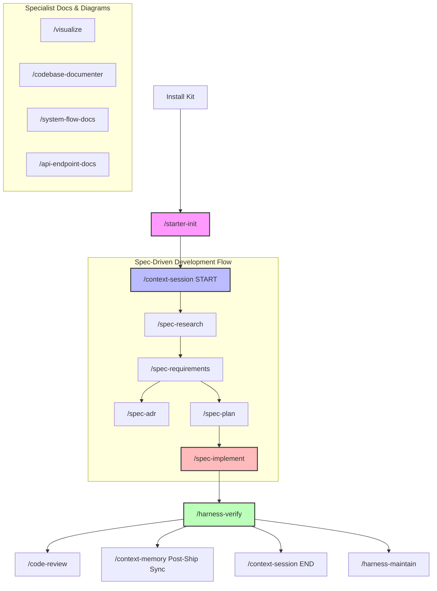

# End-to-End Tutorial

This tutorial provides a complete step-by-step guide for using the **CoreZero Nexus**. It covers all 16 public commands across the 4 core packs and 5 specialist tools, walking you through the entire lifecycle from installation to closeout.

---

## 1. Complete Command Taxonomy



---

## 2. Phase 0: Installation

Before executing any commands, you must bootstrap the CoreZero Nexus in your target repository.

### Requirements
Ensure your system has the following tools installed:
- `bash` (v4+)
- `python3`
- `git`
- Standard POSIX utilities (`cp`, `find`, `sed`)

### Run the Installer
Pipe the installer script into `bash`, specifying the path to your target project:

```bash
curl -fsSL https://raw.githubusercontent.com/thaihai-swe/CoreZero-Nexus/main/scripts/install.sh \
  | bash -s -- /path/to/your-project
```

---

## 3. Phase 1: Repository Bootstrapping (`/starter-init`)

Once installed, initialize your project's harness defaults and router rules.

### Step 1: Run Initialization
Run the initialization command:
```text
/starter-init
```

### Step 2: Verify Output Files
Ensure the following files have been created in your repository root:
- [`AGENTS.md`](AGENTS.md) — The agent router configuration.
- [`HARNESS_CARD.md`](HARNESS_CARD.md) — Active harness status and verification settings.
- [`memories/repo/harness-config.md`](memories/repo/harness-config.md) — Command and path configuration.
- [`docs/architecture.md`](docs/architecture.md) — System architecture baseline.
- [`docs/templates/`](docs/templates/), [`PRODUCT_SENSE.md`](docs/templates/PRODUCT_SENSE.md), etc.).

---

## 4. Phase 2: Session & Context Management

Manage active feature boundaries and keep context lean.

### Step 1: Start a Session (`/context-session`)
Before beginning work on any feature, boot the context window with the feature's unique slug:
```text
/context-session START --slug <feature-slug>
```
*Effect*: Loads the memory router [`INDEX.md`](memories/repo/INDEX.md), gathers memory tiers matching the task, and restores the latest checkpoint.

### Step 2: View Project Status (`/context-status`)
If working in a large repository with multiple active features, get a high-level summary of active work:
```text
/context-status
```
*Effect*: Scans all feature folders under [`artifacts/features/`](artifacts/features/) and produces a progress report matching current phases (e.g. `Spec'ing`, `Implementing`) and recommended next commands.

### Step 3: Checkpoint Session Progress
Save intermediate session states without ending the session:
```text
/context-session CHECKPOINT
```

### Step 4: Manage Durable Memory (`/context-memory`)
Manually triage, amend, or synthesize repo-wide memory (such as [`constitution.md`](memories/repo/constitution.md), [`security-policy.md`](memories/repo/security-policy.md), [`project-knowledge-base.md`](memories/repo/project-knowledge-base.md)):
```text
/context-memory
```
*Effect*: Promotes candidates from feature session extracts or observability logs into instruction-tier memory.

---

## 5. Phase 3: The SDD Workflow (Spec-Driven Development)

Deliver code changes incrementally using spec-anchored discipline.

### Step 1: Research & Discovery (`/spec-research`)
For brownfield codebases, bug investigations, or unknown behavior, run research before authoring specifications:
```text
/spec-research
```
*Effect*: Spawns parallel subagents to explore files, compacts context, and writes `artifacts/features/<slug>/analysis.md`.

### Step 2: Author Requirements (`/spec-requirements`)
Specify what the feature must do and lock the acceptance criteria:
```text
/spec-requirements
```
*Effect*: Conducts Socratic grilling waves, writes `proposal.md`, and generates the locked `spec.md` with explicit `AC-*` identifiers.

### Step 3: Record Architectural Choices (`/spec-adr`)
If requirements introduce structural changes or technical tradeoffs, document them formally:
```text
/spec-adr
```
*Effect*: Records alternatives in `artifacts/features/<slug>/adr-[number].md` and registers them in the central index [`memories/repo/adr-log.md`](memories/repo/adr-log.md).

### Step 4: Create an Engineering Plan (`/spec-plan`)
Design the solution and map out implementation steps:
```text
/spec-plan
```
*Effect*: Generates `design.md`, `plan.md`, and breaks the spec down into a granular task list in `tasks.md` with concrete proof commands.

### Step 5: Surgical Implementation (`/spec-implement`)
Write code task-by-task, ensuring every change is backed by verification evidence:
```text
/spec-implement --task <task-id>
```
*Effect*: Executes the selected task, runs its associated proof command, and records validation evidence in `tasks.md`.

---

## 6. Phase 4: Verification, Review, & Closeout

Verify correctness, audit alignment, sync knowledge, and end the session.

### Step 1: Run Verification Gates (`/harness-verify`)
Verify the entire feature against mechanical gates and specifications:
```text
/harness-verify
```
*Effect*:
- Runs mechanical verification tests (lints, builds, tests).
- Conducts the alignment audit (verifies all ACs map to task proofs).
- Sweeps and updates traceability links.

### Step 2: Code Review Audit (`/code-review`)
As part of the verification process, `harness-verify` invokes `/code-review` to inspect the code changes:
```text
/code-review
```
*Effect*: Evaluates code health, design complexity, naming, and style guide compliance against Google's Engineering Practices.

### Step 3: Post-Ship Sync (`/context-memory`)
If `harness-verify` passes, it triggers a Post-Ship Sync:
- Automatically sweeps all memory files listed in [`INDEX.md`](memories/repo/INDEX.md).
- Distills new heuristics or patterns into [`learned-heuristics.md`](memories/repo/learned-heuristics.md) or [`project-knowledge-base.md`](memories/repo/project-knowledge-base.md).
- Updates `artifacts/features/<slug>/session-extracts.md` with the sweep record.

### Step 4: Close the Session
Save the final feature state, extract lessons, and clear the active boundary:
```text
/context-session END
```

---

## 7. Phase 5: Harness Maintenance (`/harness-maintain`)

When the environment itself needs assessment, repair, or evaluator auditing, run:
```text
/harness-maintain [assess | create | improve | eval]
```
*Effect*:
- **assess**: Evaluates the repo harness against the 6 subsystems.
- **create**: Generates harness configuration from scratch.
- **improve**: Upgrades harness mechanisms based on observability failures.
- **eval**: Runs split-evaluator auditing passes.

---

## 8. Phase 6: Specialist Documentation & Diagram Tools

Use these specialist commands to document or visualize codebases outside the main delivery flow.

### Step 1: Technical Diagram Generation (`/visualize`)
Generate high-fidelity architecture, sequence, or flowchart diagrams:
```text
/visualize --format [svg | mermaid]
```
*Effect*: Generates clean diagrams using style-driven templates and runs validator scripts on output SVGs.

### Step 2: Codebase Onboarding (`/codebase-documenter`)
Generate complete, user-friendly onboarding guides for a new repository:
```text
/codebase-documenter
```
*Effect*: Creates structure maps, contributing rules, and developer setup documentation.

### Step 3: Narrative Workflow Documentation (`/system-flow-docs`)
Explain how multiple components interact to support complex end-to-end user workflows:
```text
/system-flow-docs
```
*Effect*: Traces execution flows, maps container boundaries, and writes workflow narratives.

### Step 4: HTTP API Reference Documentation (`/api-endpoint-docs`)
Generate exact, machine-readable HTTP contract specifications:
```text
/api-endpoint-docs
```
*Effect*: Compiles methods, path parameters, request payloads, status codes, and JSON response examples.

---

## 9. Quick Command Taxonomy Summary

| Command | Category | Purpose | Input / Target Artifact |
|---|---|---|---|
| `/starter-init` | Project Starter | Initial setup and router configuration | [`AGENTS.md`](AGENTS.md), [`HARNESS_CARD.md`](HARNESS_CARD.md) |
| `/context-session` | Context | Manage active session boundaries and checkpoints | `artifacts/features/<slug>/` |
| `/context-memory` | Context | Maintain durable memory files | [`memories/repo/constitution.md`](memories/repo/constitution.md), [`INDEX.md`](memories/repo/INDEX.md) |
| `/context-status` | Context | Multi-feature orchestration overview | Scans `artifacts/features/` |
| `/spec-research` | SDD | Investigate ambiguous/brownfield systems | `analysis.md` |
| `/spec-requirements`| SDD | Define and lock feature requirements | `spec.md`, `proposal.md` |
| `/spec-plan` | SDD | Create design and task lists | `plan.md`, `tasks.md`, `design.md` |
| `/spec-implement` | SDD | Surgical task execution and local proof | Touch source files, updates `tasks.md` |
| `/spec-adr` | SDD | Record architecture decision records | `adr-*.md`, [`memories/repo/adr-log.md`](memories/repo/adr-log.md) |
| `/harness-verify` | Harness | Perform verification and alignment audit | `review.md` |
| `/harness-maintain` | Harness | Assess and improve the agent harness | Harness configs, eval reports |
| `/code-review` | Specialist | Google-standard code review audit | Review output in `review.md` |
| `/visualize` | Specialist | Generate SVG/Mermaid diagrams | `.svg`, `.mermaid` files |
| `/codebase-documenter`| Specialist | Repository onboarding guides | READMEs, developer setups |
| `/system-flow-docs` | Specialist | End-to-end system workflow narrative | Flow docs with Mermaid |
| `/api-endpoint-docs` | Specialist | HTTP API reference contract documentation | API reference Markdown docs |
