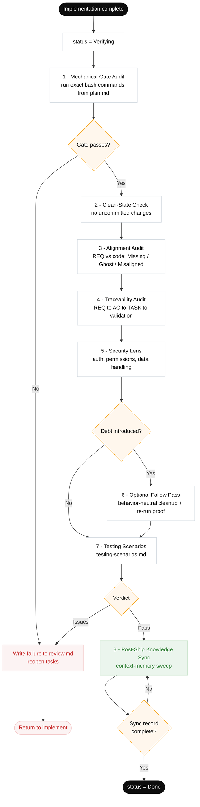

# Evaluator Architecture

## Purpose

The evaluation layer provides structured quality assessment beyond the normal verify closeout. It uses split evaluator passes — each targeting a different failure class — rather than one generic "review."

## Split Evaluator Modes

### 1. Mechanical Gate Audit

**What it checks:** Do the exact verification commands pass?

- Runs the bash commands defined in `plan.md` Mechanical Verification Gate
- Checks exit codes (must be 0)
- Verifies evidence is fresh (from current session)
- No subjective judgment — purely mechanical

**Failure class:** Code doesn't compile, tests fail, lint errors

### Verification Gate Flow

### 2. Alignment Audit

**What it checks:** Does the code match the spec?

- Compares every REQ-* from spec.md against delivered code
- Detects: Missing behavior, Excess (ghost) behavior, Misaligned behavior
- Checks traceability: REQ → AC → TASK → validation
- Uses spec quality scoring (30-point rubric)

**Failure class:** Drift, scope creep, missed requirements

### 3. Adversarial & Security Review

**What it checks:** Is the implementation safe?

- Auth and authorization enforcement
- Input validation on external boundaries
- Secret handling (no hardcoded credentials)
- Trust boundary violations
- Prompt-injection defense (for AI-facing code)
- Data handling and privacy compliance

**Failure class:** Security vulnerabilities, permission gaps

### 4. Continuity & Context Audit

**What it checks:** Can the next session resume cleanly?

- Handoff artifact is complete and accurate
- Progress log reflects actual state
- No orphaned tasks (in-progress with no owner)
- Context assembly would load the right tiers
- Stale context was evicted properly

**Failure class:** Amnesia, context corruption, lost state

## Advanced Evaluation Features

### Spec Quality Scoring

Automated 30-point rubric across Structure (10), Quality (10), Completeness (10). See `skills/harness-maintain/references/spec-quality-scoring.md`.

### Hallucination Detection

Patterns for catching fabricated claims: file paths, test results, API names, verification evidence, git state. See `skills/harness-maintain/references/hallucination-checks.md`.

### Regression Testing

Three levels: Feature regression (code broke), Harness regression (kit degraded), Agent behavior regression (quality dropped). See `skills/harness-maintain/references/regression-testing.md`.

### Production Readiness

8-category checklist for high-risk deployments: Functional, Observability, Security, Performance, Data, Rollback, Operational, Documentation. See `skills/harness-verify/references/production-readiness-checklist.md`.

## When to Use Eval Mode

- After a difficult feature with multiple iterations
- When agent quality seems to be degrading
- For periodic harness health checks
- Before promoting findings to durable memory
- When onboarding a new team to the kit
