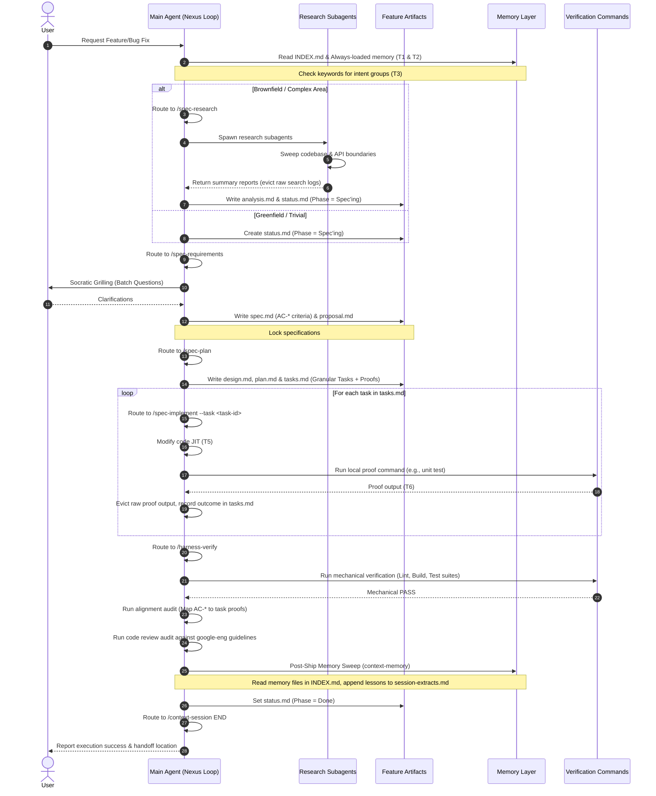

# CoreZero Nexus: End-to-End Development Kit Evaluation

This report evaluates the CoreZero Nexus framework's capabilities, mechanics, and design patterns, establishing a blueprint for architecting a unified greenfield/brownfield starter template optimized for autonomous coding agents.

---

## 1. Executive Summary

Autonomous coding agents are highly capable but prone to hallucination, context drift, code bloat, and regression if left unconstrained. CoreZero Nexus addresses these vulnerabilities by shifting the burden of correctness from the agent's internal reasoning loop to the environment's mechanical constraints.

### Core Strengths of the Current Kit
* **State Preservation outside Chat History**: Volatile chat history is superseded by durable, git-tracked status and progress logs, eliminating "agent amnesia" across context resets.
* **Progressive Disclosure & JIT Context**: The split between a thin entrypoint [AGENTS.md](file:///Users/thaihai-swe/Desktop/AI-agents-dev-kits/AGENTS.md), modular skill contracts, and references prevents context-window saturation and keeps the agent focused.
* **Binary Verification Gates**: Non-negotiable mechanical checks (linters, test runners, builder hooks) prevent anti-rationalization and make release gates absolute.
* **Comprehensive Greenfield & Brownfield Routing**: Clear demarcation of initialization workflows ensures that legacy architecture mapping (archaeology sweeps) runs only when needed, while greenfield bootstrap stays lean.
* **Dynamic Memory Promotion**: The automated post-ship memory sweep and extraction triage guarantee that learned heuristics compound over time.

### Core Gaps & Recommended Enhancements
* **Lack of Automated Compaction Scripts**: The compaction/eviction policies (summarizing grep output, evicting stale file contents) are currently guidelines in skill files rather than script-supported automated tools.
* **Complex Tech-Stack Auto-Configuration**: The `starter-init` questionnaire is highly conversational and manual. A script-driven detection layer for common runtimes (Node, Python, Go, Rust) would improve reliability.
* **Multi-Agent Workspace Lock Contention**: The file-backed claim protocol is effective but prone to race conditions if agents write concurrently without a lock manager.

---

## 2. End-to-End Architectural Decomposition

CoreZero Nexus is structured around a **Five-Layer Model** designed to enforce separation of concerns, progress visibility, and knowledge persistence.

```
┌────────────────────────────────────────────────────────┐
│  1. Entrypoint Layer (AGENTS.md)                       │  Thin router → JIT skill loading
├────────────────────────────────────────────────────────┤
│  2. Skill Layer (skills/*/SKILL.md)                    │  11 core delivery + 4 specialist contracts
├────────────────────────────────────────────────────────┤
│  3. Harness Layer (6 subsystems & configs)              │  Environment constraints & verification command loops
├────────────────────────────────────────────────────────┤
│  4. Artifact Layer (artifacts/features/<slug>/)        │  Per-feature git-tracked planning & task state
├────────────────────────────────────────────────────────┤
│  5. Memory Layer (memories/repo/)                      │  Durable repo-wide guidelines, glossary, & heuristics
└────────────────────────────────────────────────────────┘
```

### End-to-End Lifecycle Sequence

The sequence below illustrates the lifecycle of a feature request, showing the interaction between the User, Main Agent, Subagents, and the Harness/Memory files.



---

## 3. Evaluation of the 6 Harness Subsystems

The kit enforces control over the agent's operating environment through six integrated subsystems:

### A. Instructions (Progressive Disclosure)
* **Mechanics**: Instead of loading a monolithic `RULES.md` file, the agent reads a minimal, (< 50 lines) [AGENTS.md](file:///Users/thaihai-swe/Desktop/AI-agents-dev-kits/AGENTS.md) router. This files routes commands to the corresponding `skills/<name>/SKILL.md` (e.g., [SKILL.md](file:///Users/thaihai-swe/Desktop/AI-agents-dev-kits/kit/skills/starter-init/SKILL.md)). References and templates (e.g., `progress-template.md`) are loaded dynamically as needed.
* **Evaluation**: Exceptional token efficiency. By partitioning instructions, the agent maintains maximum attention budget for the actual task context.

### B. State (Externalized Memory)
* **Mechanics**: Trackers like `status.md` (metadata & phase tracking), `tasks.md` (atomic task steps & proof runs), `progress.md` (intermediate session logs), and `handoff.md` (cross-session status) persist state.
* **Evaluation**: Robust. The use of **Decision Provenance Records** inside `progress.md` ensures that mid-flight changes to execution design are documented and traceable back to the plan, preventing chaotic ad-hoc modifications.

### C. Verification (Mechanical Gates)
* **Mechanics**: Verification is governed by non-negotiable terminal commands in [harness-config.md](file:///Users/thaihai-swe/Desktop/AI-agents-dev-kits/kit/memories/repo/harness-config.md).
* **Evaluation**: Very strong constraint mapping. The **Anti-Rationalization** rule prevents agents from claiming success based on code readability alone; they must run mechanical validation commands and capture real terminal outputs.

### D. Scope (Surface Constraints)
* **Mechanics**: The **Micro-Task Rule** restricts file write operations to specific file targets defined in `plan.md` under the active `task-id`.
* **Evaluation**: Bounded and safe. Restricting the agent's edit surface to only target files eliminates unrelated refactors and random changes.

### E. Lifecycle (Clean-State Guarantees)
* **Mechanics**: [starter-init](file:///Users/thaihai-swe/Desktop/AI-agents-dev-kits/kit/skills/starter-init/SKILL.md) audits baseline test/build states. [check-surface-truth.py](file:///Users/thaihai-swe/Desktop/AI-agents-dev-kits/kit/scripts/check-surface-truth.py) runs structural validation of the harness layout. [doctor.sh](file:///Users/thaihai-swe/Desktop/AI-agents-dev-kits/kit/scripts/doctor.sh) runs repair routines.
* **Evaluation**: Complete. The division of [starter-init](file:///Users/thaihai-swe/Desktop/AI-agents-dev-kits/kit/skills/starter-init/SKILL.md) into **Phase A (Archaeology)** for brownfield repositories and **Phase B (Bootstrap)** ensures that legacy code boundary rules are captured prior to harness setup.

### F. Security (Trust Boundaries)
* **Mechanics**: [security-policy.md](file:///Users/thaihai-swe/Desktop/AI-agents-dev-kits/kit/memories/repo/security-policy.md) enforces sandbox parameters, credential exclusions, and validation constraints.
* **Evaluation**: Highly prescriptive. Establishes clear rules on forbidden tools (e.g., executing unverified downloaded scripts) and flags active credentials in git-tracked code during archaeology sweeps.

---

## 4. Structural Context Management Analysis

Context is managed as a scarce resource to ensure high attention density:

| Tier | Content | Load Rule |
|---|---|---|
| **Tier 1 — Router** | `AGENTS.md` + `INDEX.md` | Always loaded first |
| **Tier 2 — Always Repo Memory** | `constitution.md` + `security-policy.md` + `harness-config.md` | Always loaded |
| **Tier 3 — By Intent Repo Memory** | Knowledge, Learned, Domain Packs, Debug | Load JIT based on keyword triggers |
| **Tier 4 — Feature Artifacts** | `status.md`, `spec.md`, `plan.md`, `tasks.md`, `handoff.md` | Loaded before editing or verifying |
| **Tier 5 — Raw Code** | Bounded file targets | Loaded JIT per active task |
| **Tier 6 — Transient Logs** | Ephemeral tool output | Summarize and evict immediately |

### Intent-Based Memory Routing & Confidence-Scoring
Memory files listed in [INDEX.md](file:///Users/thaihai-swe/Desktop/AI-agents-dev-kits/kit/memories/repo/INDEX.md) are classified into groups. When matching a task, the harness computes a confidence score:
* **High Confidence (3+ matching keywords)**: Loads the full memory group.
* **Low Confidence (≤ 2 matching keywords)**: Performs a **partial-load**, reading only the header or index file of the memory group. This keeps situational awareness high while keeping context windows lean.

### Subagent Isolation Pattern
To prevent the main agent's context from being flooded with raw log outputs, broad search operations are delegated to subagents.
* The main loop remains clean and focused.
* Only distilled summary reports from subagents are merged into the main context window.
* Subagents must exit with a standardized state: `DONE`, `DONE_WITH_CONCERNS`, `BLOCKED`, or `NEEDS_CONTEXT`.

---

## 5. Specification-Driven Development (SDD) Protocols

SDD enforces absolute discipline before code changes are made.

```
[Request] ──> [/spec-research] ──> [/spec-requirements] ──> [/spec-plan] ──> [/spec-implement]
                  (Analysis)            (Spec / AC-*)         (Tasks / Proofs)       (Code / Proofs)
```

1. **Socratic Grilling**: Under `/spec-requirements`, the agent is forced to interview the user Socrates-style to clarify assumptions, logging answers in `proposal.md` before generating the final `spec.md`.
2. **Acceptance Criteria (`AC-*`)**: All specifications must contain explicit, verifiable criteria identifiers (`AC-1`, `AC-2`).
3. **Traceability Index**: In `/spec-plan`, each task in `tasks.md` must link directly to the target `AC-*` it implements, and declare a specific command to prove correctness.
4. **Architectural Trade-offs**: Significant technical choices are documented via `/spec-adr`, outputting to feature-scoped ADR records (`adr-*.md`) and indexing them in `adr-log.md`.

---

## 6. Self-Improving Loops & Garbage Collection

CoreZero Nexus is designed as a **self-improving system** where the harness learns from its own execution failures:

```
[Harness/Agent Failure] ──> [observability-log.md] ──> [/harness-maintain (Improve)] ──> [Memory Promotion Triage]
```

### The Garbage Collection (GC) Loop
* **Capture**: Failures at mechanical gates, model logic breakdowns, and spec contradictions are appended to `observability-log.md`.
* **Classify**: Failures are classified into three types:
  - *Harness Problem*: Missing template constraints or weak scripts.
  - *Model Problem*: Execution errors requiring tighter core rules.
  - *Spec Problem*: Vagueness requiring requirements refactoring.
* **Upgrade**: Stated improvements are designed and applied during `/harness-maintain --mode improve`.
* **Triage & Promote**: Candidates from `session-extracts.md` and `observability-log.md` are triaged during `/context-memory` Post-Ship Sync and promoted into [constitution.md](file:///Users/thaihai-swe/Desktop/AI-agents-dev-kits/kit/memories/repo/constitution.md) (rules) or `project-knowledge-base.md` (patterns) when threshold counts are exceeded.

---

## 7. Blueprint for a Unified Greenfield/Brownfield Starter Template

To build a template compatible with both greenfield and brownfield initiatives that explicitly caters to autonomous agents, the following architecture should be implemented:

### A. Directory Structure Layout

```
<project-root>/
├── AGENTS.md                      # Entrypoint router (keep under 50 lines)
├── HARNESS_CARD.md                # Real-time state summary card
├── .corezero-version              # Version tracking file
├── docs/                          # Human-readable & agent-readable documentation
│   ├── README.md                  # Project overview & command list
│   ├── ADOPTION_GUIDE.md          # Greenfield/Brownfield workflow steps
│   ├── INSTALL.md                 # Setup guidelines
│   ├── architecture.md            # Structural diagrams & descriptions
│   ├── GLOSSARY.md                # Project-specific glossary
│   ├── PRODUCT_SENSE.md           # Product constraints & target metrics
│   └── generated/                 # Generated files (codemap.md, references-index.md)
├── memories/
│   ├── repo/                      # Durable 3-Tier Repo-wide Memory
│   │   ├── INDEX.md               # Memory intent router
│   │   ├── constitution.md        # Normative rules (CC-* tags)
│   │   ├── security-policy.md     # Permission boundaries
│   │   ├── harness-config.md      # Paths, test/lint commands, promotion thresholds
│   │   ├── project-knowledge-base.md # continuity patterns
│   │   ├── learned-heuristics.md  # Discovered code instincts
│   │   └── observability-log.md   # Append-only failure ledger
│   └── domains/                   # Bounded-context glossary & boundaries
│       └── example/               # Seeded domain-pack templates
├── skills/                        # Shipped agent capability definitions (SKILL.md)
├── rules/                         # Shipped syntax/lint coding standards
└── scripts/                       # Harness validation & repair utilities
    ├── install.sh                 # Bootstrap and upgrade script
    ├── doctor.sh                  # Checks surface health & repairs missing templates
    └── check-surface-truth.py     # Structural routing validator
```

### B. Standardized Workflow for Greenfield vs. Brownfield

```
                  ┌──────────────────────┐
                  │   Run install.sh     │
                  └──────────┬───────────┘
                             │
                             ▼
                  ┌──────────────────────┐
                  │  Run /starter-init   │
                  └──────────┬───────────┘
                             │
                     Is Brownfield Repo?
                    /                  \
                  Yes                  No
                  /                      \
      ┌──────────────────────┐   ┌──────────────────────┐
      │  Archaeology Sweep   │   │  Bootstrap Settings  │
      │   (Sweep, Map,      │   │   (Interview &       │
      │   Dependency Graph)  │   │    Template Pre-fill)│
      └──────────┬───────────┘   └──────────┬───────────┘
                 │                          │
                 └───────────┬──────────────┘
                             │
                             ▼
                  ┌──────────────────────┐
                  │ Start Feature Scope  │
                  │ (spec-requirements)  │
                  └──────────────────────┘
```

### C. Priority Implementation Checklist for Agent-Optimized Templates

> [!IMPORTANT]
> **1. Script-Driven Stack Archaeology**: Auto-detect package managers, test runners, and build commands during `/starter-init` instead of relying entirely on user text inputs.
>
> **2. Automated Compaction Hook**: Introduce a CLI-backed script (`scripts/compact-context.py`) that agents can invoke (or that runs automatically after `/spec-implement` tasks) to prune transient outputs and collapse files into summaries.
>
> **3. Standardized Error Parsing**: Build an error classification helper (`scripts/parse-observability.py`) to categorize compiler and test outputs, ensuring they are formatted correctly before being written to `observability-log.md`.
>
> **4. Active Workspace Claims**: Support multi-agent environments by mapping claim files to git branches, preventing lockouts and race conditions across distributed agent runs.
