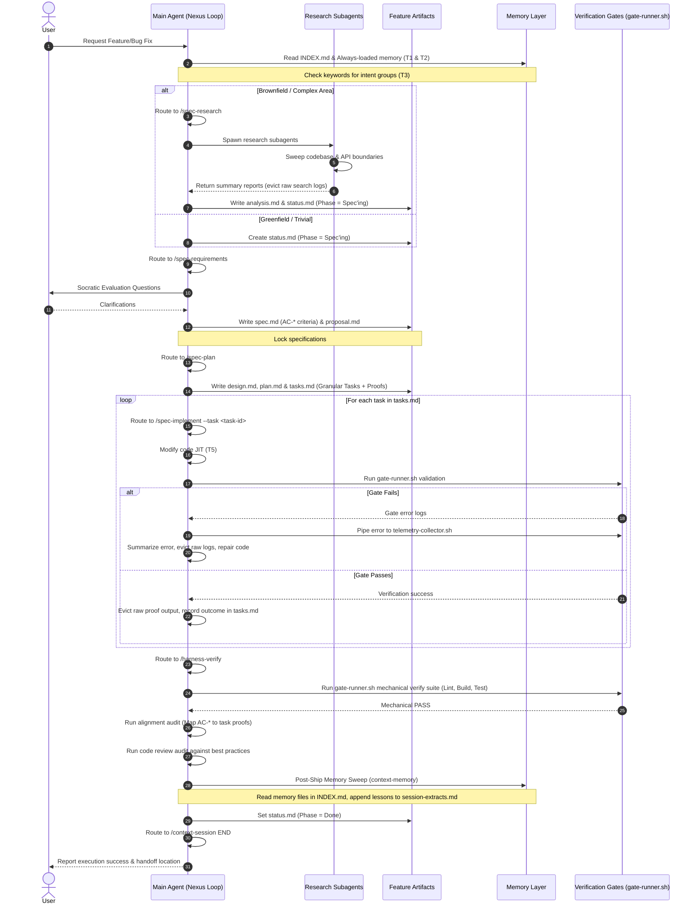

# CoreZero: End-to-End Development Kit Evaluation

This report evaluates the CoreZero framework's capabilities, mechanics, and design patterns, establishing a blueprint for architecting a unified greenfield/brownfield starter template optimized for autonomous coding agents.

---

## 1. Executive Summary

Autonomous coding agents are highly capable but prone to hallucination, context drift, code bloat, and regression if left unconstrained. CoreZero addresses these vulnerabilities by shifting the burden of correctness from the agent's internal reasoning loop to the environment's mechanical constraints.

### Core Strengths of the Current Kit
* **State Preservation outside Chat History**: Volatile chat history is superseded by durable, git-tracked status and progress logs, eliminating "agent amnesia" across context resets.
* **Progressive Disclosure & JIT Context**: The split between a thin entrypoint [AGENTS.md](AGENTS.md), modular skill contracts, and references prevents context-window saturation and keeps the agent focused.
* **Binary Verification Gates**: Non-negotiable mechanical checks (linters, test runners, builder hooks) run via `gate-runner.sh` prevent anti-rationalization and make release gates absolute.
* **Comprehensive Greenfield & Brownfield Routing**: Clear demarcation of initialization workflows ensures that legacy architecture mapping (archaeology sweeps) runs only when needed, while greenfield bootstrap stays lean.
* **Dynamic Memory Promotion**: The automated post-ship memory sweep and extraction triage guarantee that learned heuristics compound over time.

### Core Gaps & Recommended Enhancements
* **Complex Tech-Stack Auto-Configuration**: The `starter-init` questionnaire is highly conversational and manual. A script-driven detection layer for common runtimes (Node, Python, Go, Rust) would improve reliability.
* **Multi-Agent Workspace Lock Contention**: The file-backed claim protocol is effective but prone to race conditions if agents write concurrently without a lock manager.

---

## 2. End-to-End Architectural Decomposition

CoreZero is structured around a **Five-Layer Model** designed to enforce separation of concerns, progress visibility, and knowledge persistence.

```
┌────────────────────────────────────────────────────────┐
│  1. Entrypoint Layer (AGENTS.md)                       │  Thin router → JIT skill loading
├────────────────────────────────────────────────────────┤
│  2. Skill Layer (skills/*/SKILL.md)                    │  16 skills across 4 groups
├────────────────────────────────────────────────────────┤
│  3. Harness Layer (ETCLOVG Taxonomy & Scripts)         │  Environment constraints & gate-runner.sh validation
├────────────────────────────────────────────────────────┤
│  4. Artifact Layer (artifacts/features/<slug>/)        │  Per-feature git-tracked planning & task state
├────────────────────────────────────────────────────────┤
│  5. Memory Layer (memories/repo/ & domain/)            │  Durable memory tracks: repo & domain constraints
└────────────────────────────────────────────────────────┘
```

### End-to-End Lifecycle Sequence

The sequence below illustrates the lifecycle of a feature request, showing the interaction between the User, Main Agent, Subagents, and the Harness/Memory files.



---

## 3. Evaluation of the ETCLOVG Taxonomy

The kit enforces control over the agent's operating environment through the seven pillars of the **ETCLOVG** taxonomy:

### A. Execution (Sandbox & Commands)
- **Mechanics**: Runs under non-interactive, strict terminal parameters via `kit/scripts/harness/gate-runner.sh`.
- **Evaluation**: Prevents loose execution and ensures commands are locked down.

### B. Tools (Capabilities & Constraints)
- **Mechanics**: Exposed agent capabilities are bounded by the normative rules in `core-policies.md` and the agent's active permission tiers.
- **Evaluation**: Highly effective for containing costs and minimizing redundant file writes.

### C. Context (Budgeting & MVC)
- **Mechanics**: The entrypoint [AGENTS.md](AGENTS.md) acts as a JIT router. The **Minimum Viable Context (MVC)** rule (CC-011) prevents loading unnecessary files, while mandatory **Context Eviction** evicts raw logs immediately.
- **Evaluation**: Exceptional token efficiency. By partitioning instructions and evicting transient noise, the agent maintains maximum attention budget for the actual task context.

### D. Logic (Skills & Decision Loops)
- **Mechanics**: Structured via compressed skill contracts (`SKILL.md`) mapped to the canonical 7-Phase Delivery Loop.
- **Evaluation**: Prevents logic deviation and guides the agent step-by-step.

### E. Observability (Telemetry & Audit)
- **Mechanics**: Gate runner failures are caught by `telemetry-collector.sh` and appended to `memories/repo/harness-telemetry.md`.
- **Evaluation**: Excellent. The failure ledger provides a clear audit trail for `/harness-maintain` to self-improve the environment.

### F. Verification (Mechanical Gates)
- **Mechanics**: Governed by binary gates executing via `gate-runner.sh`.
- **Evaluation**: Absolute. The **Anti-Rationalization** rule prevents agents from claiming success based on code readability alone; they must run mechanical validation commands and capture real terminal outputs.

### G. Governance (Policies & FinOps)
- **Mechanics**: [core-policies.md](kit/memories/repo/core-policies.md) (under `## Security Policy & Trust Boundaries`) enforces sandbox parameters, while **FinOps guardrails** enforce **Cost-per-Accepted-Outcome (CAPO)** metrics.
- **Evaluation**: Prescriptive and cost-controlled. Establishes clear trust boundaries.

---

## 4. Structural Context Management Analysis

Context is managed as a scarce resource to ensure high attention density:

| Tier | Content | Load Rule |
|---|---|---|
| **Tier 1 — Router** | `AGENTS.md` + `INDEX.md` | Always loaded first |
| **Tier 2 — Always Repo Memory** | `core-policies.md` | Always loaded |
| **Tier 3 — By Intent Repo Memory** | Knowledge, Learned, Domain Packs, Debug | Load JIT based on keyword triggers |
| **Tier 4 — Feature Artifacts** | `status.md`, `spec.md`, `plan.md`, `tasks.md`, `handoff.md` | Loaded before editing or verifying |
| **Tier 5 — Raw Code** | Bounded file targets | Loaded JIT per active task |
| **Tier 6 — Transient Logs** | Ephemeral tool output | Summarize and evict immediately |

### Intent-Based Memory Routing & Confidence-Scoring
Memory files listed in [INDEX.md](kit/memories/repo/INDEX.md) are classified into groups. When matching a task, the harness computes a confidence score:
* **High Confidence (3+ matching keywords)**: Loads the full memory group.
* **Low Confidence (≤ 2 matching keywords)**: Performs a **partial-load**, reading only the header or index file of the memory group. This keeps situational awareness high while keeping context windows lean.

### Subagent Isolation Pattern
To prevent the main agent's context from being flooded with raw log outputs, broad search operations are delegated to subagents.
* The main loop remains clean and focused.
* Only distilled summary reports from subagents are merged into the main context window.
* Subagents must exit with a standardized state: `DONE`, `DONE_WITH_CONCERNS`, `BLOCKED`, or `NEEDS_CONTEXT`.

---

## 5. Specification-Driven Development (SDD) Protocols

SDD enforces absolute discipline before code changes are made.

```
[Request] ──> [/spec-research] ──> [/spec-requirements] ──> [/spec-plan] ──> [/spec-implement]
                  (Analysis)            (Spec / AC-*)         (Tasks / Proofs)       (Code / Proofs)
```

1. **Socratic Evaluation**: Under `/spec-requirements`, the agent interviews the user to clarify assumptions, logging answers in `proposal.md` before generating the final `spec.md`.
2. **Acceptance Criteria (`AC-*`)**: All specifications must contain explicit, verifiable criteria identifiers (`AC-1`, `AC-2`).
3. **Traceability Index**: In `/spec-plan`, each task in `tasks.md` must link directly to the target `AC-*` it implements, and declare a specific command to prove correctness.
4. **Architectural Trade-offs**: Significant technical choices are documented via `/spec-adr`, outputting to feature-scoped ADR records (`adr-*.md`) and indexing them in `adr-log.md`.

---

## 6. Self-Improving Loops & Garbage Collection

CoreZero is designed as a **self-improving system** where the harness learns from its own execution failures:

```
[Harness/Agent Failure] ──> [gate-runner.sh] ──> [telemetry-collector.sh] ──> [harness-telemetry.md] ──> [/harness-maintain (Improve)] ──> [Memory Promotion Triage]
```

### The Garbage Collection (GC) Loop
* **Capture**: Failures at mechanical gates run via `gate-runner.sh` are captured by `telemetry-collector.sh` and appended to `harness-telemetry.md`.
* **Classify**: Failures are classified into three types:
  - *Harness Problem*: Missing template constraints or weak scripts.
  - *Model Problem*: Execution errors requiring tighter core rules.
  - *Spec Problem*: Vagueness requiring requirements refactoring.
* **Upgrade**: Stated improvements are designed and applied during `/harness-maintain --mode improve`.
* **Triage & Promote**: Candidates from `session-extracts.md` and `harness-telemetry.md` are triaged during `/context-memory` Post-Ship Sync and promoted into [core-policies.md](kit/memories/repo/core-policies.md) (rules) or `project-knowledge-base.md` (patterns) when threshold counts are exceeded.

---

## 7. Blueprint for a Unified Greenfield/Brownfield Starter Template

To build a template compatible with both greenfield and brownfield initiatives that explicitly caters to autonomous agents, the following architecture should be implemented:

### A. Directory Structure Layout

```
<project-root>/
├── AGENTS.md                      # Canonical agent-agnostic entrypoint router
├── docs/                          # Human-readable & agent-readable documentation
│   ├── README.md                  # Project overview & command list
│   ├── project/                   # Structural docs and project-specific context
│   ├── policies/                  # Kit-managed coding policy guidance (e.g. code-design.md)
│   └── generated/                 # Generated files (code-map.md, references-index.md)
├── memories/
│   ├── repo/                      # Durable Repo-wide Memory Track
│   │   ├── INDEX.md               # Memory intent router
│   │   ├── core-policies.md       # Normative rules & harness config
│   │   ├── project-knowledge-base.md # Continuity patterns
│   │   ├── learned-heuristics.md  # Discovered code instincts
│   │   └── harness-telemetry.md   # Append-only failure ledger
│   └── domain/                    # Bounded-context glossary & boundaries (Team Sharing Track)
│       ├── README.md              # Domain-pack schema and trigger rules
│       ├── glossary.md            # Domain glossary template
│       ├── patterns.md            # Domain patterns template
│       ├── anti-patterns.md       # Domain anti-patterns template
│       ├── boundaries.md          # Domain boundaries template

├── skills/                        # Shipped agent capability definitions (SKILL.md)
├── docs/rules/                    # Shipped syntax/lint coding standards
└── scripts/                       # Harness validation & repair utilities
    ├── install.sh                 # Bootstrap and upgrade script
    ├── context-loader.py          # MVC-enforcing partial context loader (--mode summary)
    └── harness/                   # Mechanical verification gates
        ├── gate-runner.sh         # Run linter/build/tests
        └── telemetry-collector.sh # Log gate failures to harness-telemetry.md
```

### B. Standardized Workflow for Greenfield vs. Brownfield

```
                  ┌──────────────────────┐
                  │   Run install.sh     │
                  └──────────┬───────────┘
                             │
                             ▼
                  ┌──────────────────────┐
                  │  Run /starter-init   │
                  └──────────┬───────────┘
                             │
                     Is Brownfield Repo?
                    /                  \
                  Yes                  No
                  /                      \
      ┌──────────────────────┐   ┌──────────────────────┐
      │  Archaeology Sweep   │   │  Bootstrap Settings  │
      │   (Sweep, Map,      │   │   (Interview &       │
      │   Dependency Graph)  │   │    Template Pre-fill)│
      └──────────┬───────────┘   └──────────┬───────────┘
                 │                          │
                 └───────────┬──────────────┘
                             │
                             ▼
                  ┌──────────────────────┐
                  │ Start Feature Scope  │
                  │ (spec-requirements)  │
                  └──────────────────────┘
```

### C. Priority Implementation Checklist for Agent-Optimized Templates

> [!IMPORTANT]
> **1. Script-Driven Stack Archaeology**: Auto-detect package managers, test runners, and build commands during `/starter-init` instead of relying entirely on user text inputs.
>
> **2. Active Workspace Claims**: Support multi-agent environments by mapping claim files to git branches, preventing lockouts and race conditions across distributed agent runs.
