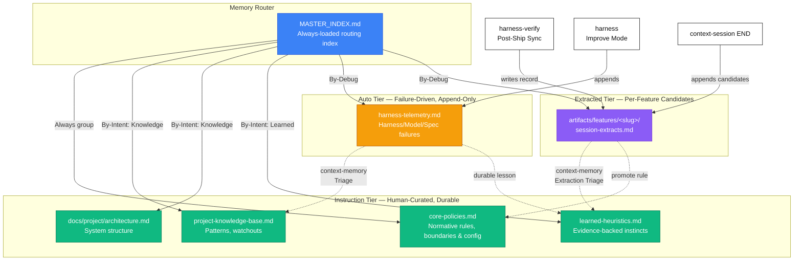
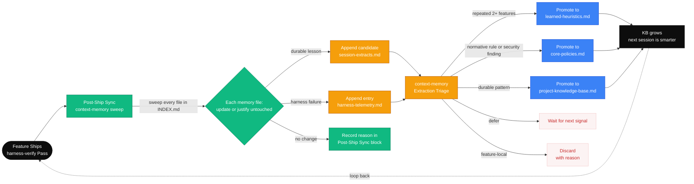
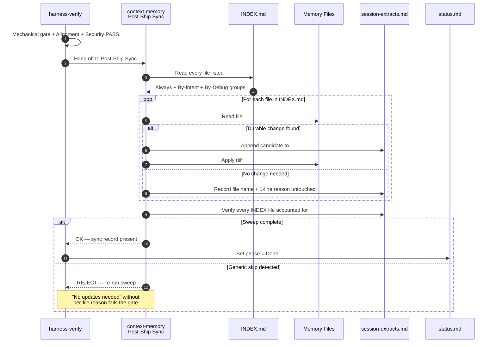

# Memory Layer

## Purpose

The memory layer stores durable cross-feature knowledge that agents need repeatedly. It stays compact, reusable, and clearly separate from feature-specific artifacts.

## Memory Architecture

The kit organizes memory into three tiers with a routing index. Sessions read `MASTER_INDEX.md` first, then load only the groups that match the task.

## Memory Files

### Memory Router

| File | Purpose |
|------|---------|
| `MASTER_INDEX.md` | Always-loaded routing index. Declares Always / By-Intent / By-Debug groups. Sessions read this first. |

### Instruction Tier — Human-Curated, Durable

| File | Type | Content | Update Frequency |
|------|------|---------|-----------------|
| `core-policies.md` | Normative & Operational | Repo-wide rules, security boundaries, commands, paths, and defaults | Rare — during init or when tooling/policies change |
| `project-knowledge-base.md` | Descriptive | Durable facts, patterns, conventions | As project evolves |
| `learned-heuristics.md` | Descriptive | Evidence-backed execution patterns | After repeated observations |
| `docs/project/architecture.md` | Structural | System boundaries, components, integration seams | When architecture changes |

### Auto Tier — Failure-Driven, Append-Only

| File | Type | Content | Written By |
|------|------|---------|-----------|
| `harness-telemetry.md` | Auto | Harness/Model/Spec failure entries | `/harness-maintain` Improve Mode, `/harness-verify` |

### Extracted Tier — Per-Feature Candidates

| File | Type | Content | Written By |
|------|------|---------|-----------|
| `artifacts/features/<slug>/session-extracts.md` | Candidate | Session distillation — hypotheses, not rules | `/context-session END`, `/harness-verify` post-ship sync |

## Normative vs Descriptive

| Type | Meaning | Language | Example |
|------|---------|----------|---------|
| **Normative** | Rules that MUST be followed | "must", "must not", "requires" | "Tests must pass before marking done" |
| **Descriptive** | Facts that ARE true | "uses", "follows", "prefers" | "The API uses JWT with 24h expiry" |

Normative rules go in `core-policies.md`.
Descriptive facts go in `project-knowledge-base.md` or `learned-heuristics.md`.

## Promotion Rules

The kit has two promotion paths: **manual** (via `/context-memory`) and **automatic** (via post-ship sync after every passing verify).

### Manual Promotion

When a finding emerges from analysis, implementation, or review:

1. **Check durability:** Is it evidence-based, stable, and useful beyond this feature?
2. **Classify:** Normative rule? Descriptive pattern? Still feature-local?
3. **Route:**
   - Repo-wide or security/permission rule → `core-policies.md`
   - Repeated execution pattern (2+ features) → `learned-heuristics.md`
   - Durable fact or convention → `project-knowledge-base.md`
   - Structural map → `docs/project/architecture.md`
   - Still local → Keep in `artifacts/features/<slug>/`

### Extraction Triage

`/context-session END` appends candidates to `session-extracts.md`. `/context-memory` Extraction Triage processes each candidate:

| Decision | Condition |
|---|---|
| **Promote** | Evidence-based, seen in 2+ features, durable beyond this feature |
| **Defer** | Promising but needs one more confirming signal |
| **Discard** | Feature-local, not generalizable — record reason, don't delete |

Security candidates always escalate immediately regardless of repetition count.

### Promotion Thresholds (from `core-policies.md`)

A memory file approaching these thresholds is added to `INDEX.md ## Promotion Watchlist`:
- File length ≥ 800 lines (warn) / 1200 lines (hard)
- 3+ distinct H2 subtopics covering separable concerns
- 5+ feature artifacts citing the same slice

Threshold breach opens a proposal in `artifacts/features/<slug>/promotions.md` — it does not auto-split.

## Context Assembly Tiers

Sessions read `MASTER_INDEX.md` first, then load only the groups that match the task. The 6-tier context model — load order, intent groups, compaction triggers, and eviction rules — is canonical in [`context-engineering.md`](context-engineering.md). Read that file for the full assembly contract.

A short reference for memory authors:
- `MASTER_INDEX.md` is the router. Always-loaded files belong to the Always group.
- By-Intent groups (Knowledge / Learned / Domain Packs / Debug) load only when their trigger keywords match the task.
- When no intent group matches, sessions load Always-tier only and record "no by-intent groups matched" in the session opener.

## Learned Heuristics Format

Each heuristic has:
- **Trigger:** When does this pattern apply?
- **Heuristic:** What to do
- **Evidence:** What proved this works
- **Recurrence count:** Tracks how many times a heuristic has been repeatedly observed.
- **Semantic links:** Standard markdown links forming a **Semantic Knowledge Graph** tying the heuristic to `docs/project/architecture.md` or domain specs.
- **Confidence:** High / Medium / Low
- **Review date:** When to re-evaluate

Heuristics are promoted only when:
- The pattern has helped more than once
- It is evidenced by repository work
- It is not merely a one-off workaround
- **Auto-Promotion:** If the `recurrence-count` reaches 3, the agent automatically drafts a CC-* proposal to promote it to the constitution.

## Memory Hygiene

- Keep files concise — merge overlaps, store summaries not raw notes
- Use stable identifiers (CC-* for constitution rules)
- Version the constitution with semantic versioning
- Route descriptive knowledge to PKB, not constitution
- Evict stale context from sessions — raw logs are transient, not durable

## Self-Improving Loop

The knowledge base compounds as features ship. Each passing verification triggers a post-ship sweep that distills lessons into candidates, which `/context-memory` triages and promotes.

### Post-Ship Sync Sequence

The sweep is mandatory after a passing verdict. Verify cannot finalize until every file in `INDEX.md` is accounted for — generic "no updates needed" fails the gate.

## Skill Write Access

Under the `kit/memories` directory, files are primarily updated by three major categories of skills: Initialization, Ongoing Context Maintenance, and Execution Telemetry.

### 1. Initialization (`/starter-init`)

This skill is responsible for creating the initial scaffolding and performing the first-pass customization of all core memory files:

- `memories/repo/core-policies.md`
- `memories/repo/security-policy.md`
- `memories/repo/project-knowledge-base.md`
- `memories/repo/learned-heuristics.md`
- `memories/repo/harness-config.md`
- `memories/repo/domain-specs.md`
- `memories/repo/brownfield/brownfield-map.md` (Created only if analyzing a legacy codebase)
- `memories/domain/<name>/glossary.md`

### 2. Ongoing Knowledge Promotion (`/context-memory`)

After `starter-init` finishes the bootstrap, `/context-memory` takes over permanent ownership of the knowledge base. At the end of every feature, it reads `session-extracts.md` and surgically updates:

- `memories/repo/project-knowledge-base.md` (Promotes newly discovered domain jargon and project boundaries)
- `memories/repo/learned-heuristics.md` (Promotes newly learned "rules of thumb" or recurring traps to avoid)
- `memories/repo/security-policy.md` (Updates trust boundaries if they changed)
- `memories/repo/core-policies.md`
- `memories/repo/domain-specs.md`

### 3. Harness Telemetry & Diagnostics

The `memories/repo/harness-telemetry.md` file tracks failure states and dashboard metrics. It is actively updated by three active execution skills:

- `/harness-verify`: Increments failure counters if a mechanical gate fails.
- `/spec-implement`: Logs failures when the test suite or mechanical gates break during implementation.
- `/context-status`: Overwrites the `# Current State` section of the telemetry file so the dashboard stays up to date.

### 4. Harness Upgrades (`/harness-maintain`)

- `/harness-maintain`: Periodically updates `memories/repo/learned-heuristics.md` when running structural audits of the kit itself.
