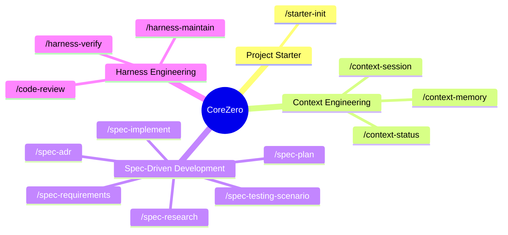

# Harness Packs

This guide documents the four core packs that organize CoreZero commands and files for adopter repositories.

---

## The 4 Core Packs

CoreZero organizes its capabilities into **4 Core Packs** containing **18 shipped skills** (with the core 13 shown in the taxonomy map below):

### 📦 Pack 1: Project Starter (Onboarding & Baselines)
Prepares the codebase for AI-agent delivery.
- **`/starter-init`**: Bootstraps the harness defaults, active card, operating configs, and runs legacy archaeology (Phase A) automatically on brownfield repositories.

### 📦 Pack 2: Context Engineering (Session Management)
Keeps the agent oriented and context windows lean.
- **`/context-session`**: Starts, checkpoints, and cleanly exits feature boundaries (START/CHECKPOINT/END).
- **`/context-status`**: Orchestrates multiple concurrent features, gives a high-level progress report, and performs feature-completion garbage collection (GC) of ephemeral session logs.
- **`/context-memory`**: Triages and promotes candidate heuristics into durable instruction-tier memory.

### 📦 Pack 3: Spec-Driven Development (The Delivery Engine)
Translates feature requests into surgical code modifications.
- **`/spec-research`**: Spawns subagents to study unknown codebase behavior.
- **`/spec-requirements`**: Batches Socratic grilling questions to clarify user intent, locking requirements into `spec.md`.
- **`/spec-adr`**: Records formal Architectural Decision Records for technical trade-offs.
- **`/spec-plan`**: Designs the solution and breaks it down into granular, 2-to-5 minute tasks (`tasks.md`).
- **`/spec-implement`**: Surgical task-by-task code implementation with mandatory pre-change proofs.
- **`/spec-testing-scenario`**: Drafts manual testing scenarios guide (optional) covering happy paths and edge cases.

### 📦 Pack 4: Harness Engineering (Verification & Reviews)
Guarantees delivery quality and continuously improves the harness.
- **`/harness-verify`**: Audits implementation code against mechanical gates and alignment matrices.
- **`/harness-maintain`**: Triages observability logs and improves the harness based on agent failures.
- **`/code-review`**: Audits changes against Google's Engineering Practices.

---

## 1. Project Starter

### What This Pack Solves
The `Project Starter` pack bootstraps a repository for AI-assisted development by setting up the entrypoint router, baseline memory configuration, system architecture guides, and project templates.

### When To Use It
- Installing CoreZero in a project for the first time.
- Re-initializing operating configurations after a major workflow change.
- Aligning template files with the actual project structure and code evidence.

### Public Commands
* `/starter-init` — Boots the harness configuration and runs archaeology if existing code is present.

### Key Files Touched
- `AGENTS.md` (router entrypoint)
- `core-zero/memories/repo/*` (memory router and seed instruction files)
- `core-zero/memories/repo/project-knowledge-base.md` (high-risk area notes from archaeology sweep recorded here under `## Repository Overview`)
- `core-zero/project/architecture.md` (durable architecture baseline)
- `core-zero/project/*.md` adopter-owned docs seeded for refinement
- `core-zero/generated/*` (dashboard artifacts)

Starter-init archaeology (Phase A) is now the documented first step for established repositories. Its
artifacts live in the memory layer, but they are not yet auto-routed by `MASTER_INDEX.md`; later
sessions need to load them deliberately when a feature touches brownfield risk areas.

---

## 2. Context Engineering

### What This Pack Solves
`Context Engineering` preserves session continuity across tool and context window resets, maintains durable repository knowledge, and manages orchestration views to prevent amnesia and redundancy.

### When To Use It
- Starting or resuming a task boundary.
- Documenting, amending, or promoting repository knowledge to memory.
- Reviewing status and progress across multiple active features.

### Public Commands
* `/context-session` — Begins, checkpoints, or ends a working session.
* `/context-memory` — Sweeps, triages, and promotes durable repository memory.
* `/context-status` — Provides project-wide views of active features.

### Key Files Touched
- `MASTER_INDEX.md`
- `core-zero/memories/repo/core-policies.md`
- `core-zero/memories/repo/learned-heuristics.md`
- `core-zero/memories/repo/project-knowledge-base.md`
- `core-zero/memories/repo/harness-telemetry.md` (failure ledger with structured YAML trend summary)
- `core-zero/memories/domain/*` (domain-specific glossary trigger, patterns, boundaries, and spec)
- `.corezero/sessions/<slug>/progress.md`
- `.corezero/sessions/<slug>/handoff.md`
- `artifacts/features/<slug>/session-extracts.md`
- `core-zero/project/architecture.md`
- `core-zero/project/code-map.md`

---

## 3. Spec-Driven Development

### What This Pack Solves
`Spec-Driven Development` (SDD) translates user requirements into structured analysis, Socratic grilling, locked specifications, design breakdowns, and micro-task implementations.

### When To Use It
- Investigating system behavior or mapping complex brownfield codebases.
- Drafting, grilling, and locking requirement scopes.
- Designing execution plans and executing micro-tasks.
- Recording technology tradeoffs and architectural decisions.

### Public Commands
* `/spec-research` — Crawls the codebase and maps behaviors.
* `/spec-requirements` — Defines specifications and locks acceptance criteria.
* `/spec-plan` — Sets plans, design files, and micro-task lists.
* `/spec-implement` — Executes task-by-task implementations with local proofs.
* `/spec-adr` — Records and indexes Architectural Decision Records (ADRs).
* `/spec-testing-scenario` — Drafts manual testing scenarios guide (optional).

### Key Files Touched
- `artifacts/features/<slug>/analysis.md`
- `artifacts/features/<slug>/proposal.md` (optional)
- `artifacts/features/<slug>/spec.md`
- `artifacts/features/<slug>/requirements-review.md` (optional)
- `artifacts/features/<slug>/plan.md`
- `artifacts/features/<slug>/tasks.md`
- `artifacts/features/<slug>/adr-*.md`
- `artifacts/features/<slug>/testing-scenarios.md` (optional)
- `core-zero/memories/repo/adr-log.md`
- [`core-zero/project/product-sense.md`](../kit/core-zero/project/product-sense.md)
- [`core-zero/project/glossary.md`](../kit/core-zero/project/glossary.md)
- [`core-zero/project/tech-stack.md`](../kit/core-zero/project/tech-stack.md)
- [`core-zero/project/project-constraints.md`](../kit/core-zero/project/project-constraints.md)
- [`core-zero/project/code-intelligence.md`](../kit/core-zero/project/code-intelligence.md)

---

## 4. Harness Engineering

### What This Pack Solves
`Harness Engineering` enforces mechanical proofs, quality standards, alignment metrics, and security policies to make AI actions reliable and prevent structural regressions.

### When To Use It
- Verifying code correctness and requirement alignment before shipping.
- Running codebase health checks and evaluator checks.
- Repairing or upgrading the harness environment itself.

### Public Commands
* `/harness-verify` — Runs verification gates, alignment audits, and security reviews.
* `/harness-maintain` — Assesses, configures, or evaluates the harness systems.

### Key Files Touched
- `core-zero/policies/code-design.md`
- `artifacts/features/<slug>/review.md`
- `artifacts/features/<slug>/testing-scenarios.md`
- `artifacts/features/<slug>/harness-assessment.md`
- `artifacts/features/<slug>/eval-report.md`
