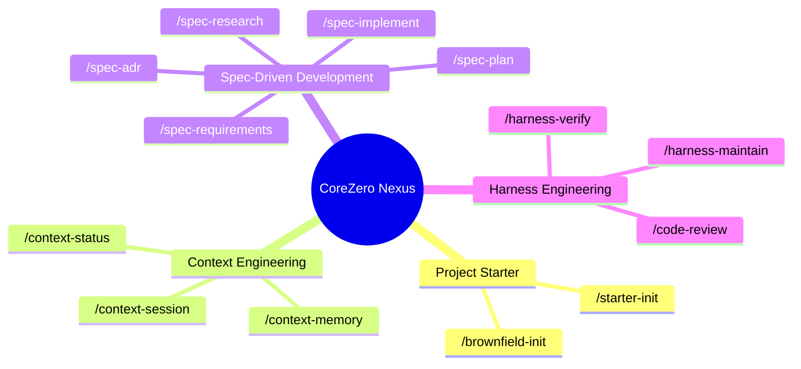

# Harness Packs

This guide documents the four core packs that organize CoreZero Nexus commands and files for adopter repositories.

---

## The 4 Core Packs

CoreZero Nexus organizes its capabilities into **4 Core Packs** containing **17 public commands** (with the core 13 shown in the taxonomy map below):

### 📦 Pack 1: Project Starter (Onboarding & Baselines)
Prepares the codebase for AI-agent delivery.
- **`/brownfield-init`**: Analyzes existing legacy repositories. Generates a module dependency graph and tech debt map to identify high-blast-radius risk zones.
- **`/starter-init`**: Bootstraps the harness defaults, active card, and operating configs.

### 📦 Pack 2: Context Engineering (Session Management)
Keeps the agent oriented and context windows lean.
- **`/context-session`**: Starts, checkpoints, and cleanly exits feature boundaries (START/CHECKPOINT/END).
- **`/context-status`**: Orchestrates multiple concurrent features and gives a high-level progress report.
- **`/context-memory`**: Triages and promotes candidate heuristics into durable instruction-tier memory.

### 📦 Pack 3: Spec-Driven Development (The Delivery Engine)
Translates feature requests into surgical code modifications.
- **`/spec-research`**: Spawns subagents to study unknown codebase behavior.
- **`/spec-requirements`**: Batches Socratic grilling questions to clarify user intent, locking requirements into `spec.md`.
- **`/spec-adr`**: Records formal Architectural Decision Records for technical trade-offs.
- **`/spec-plan`**: Designs the solution and breaks it down into granular, 2-to-5 minute tasks (`tasks.md`).
- **`/spec-implement`**: Surgical task-by-task code implementation with mandatory pre-change proofs.

### 📦 Pack 4: Harness Engineering (Verification & Reviews)
Guarantees delivery quality and continuously improves the harness.
- **`/harness-verify`**: Audits implementation code against mechanical gates and alignment matrices.
- **`/harness-maintain`**: Triages observability logs and improves the harness based on agent failures.
- **`/code-review`**: Audits changes against Google's Engineering Practices.

---

## 1. Project Starter

### What This Pack Solves
The `Project Starter` pack bootstraps a repository for AI-assisted development by setting up the entrypoint router, baseline memory configuration, system architecture guides, and project templates.

### When To Use It
- Installing CoreZero Nexus in a project for the first time.
- Re-initializing operating configurations after a major workflow change.
- Aligning template files with the actual project structure and code evidence.

### Public Commands
* `/brownfield-init` — Run before starter-init on repositories with existing code to map debt and dependency risks.
* `/starter-init` — Boots the harness configuration.

### Key Files Touched
- `AGENTS.md` (router entrypoint)
- `HARNESS_CARD.md` (harness summary card)
- `memories/repo/*` (memory router and seed instruction files)
- `memories/repo/brownfield/*` (brownfield map, dependency graph; created by `/brownfield-init`)
- `docs/architecture.md` (durable architecture baseline)
- `docs/*.md` project-policy docs seeded for the adopter to refine
- `docs/generated/*` (index & codemap artifacts)

`/brownfield-init` is now the documented first step for established repositories. Its
artifacts live in the memory layer, but they are not yet auto-routed by `INDEX.md`; later
sessions need to load them deliberately when a feature touches brownfield risk areas.

---

## 2. Context Engineering

### What This Pack Solves
`Context Engineering` preserves session continuity across tool and context window resets, maintains durable repository knowledge, and manages orchestration views to prevent amnesia and redundancy.

### When To Use It
- Starting or resuming a task boundary.
- Documenting, amending, or promoting repository knowledge to memory.
- Reviewing status and progress across multiple active features.

### Public Commands
* `/context-session` — Begins, checkpoints, or ends a working session.
* `/context-memory` — Sweeps, triages, and promotes durable repository memory.
* `/context-status` — Provides project-wide views of active features.

### Key Files Touched
- `memories/repo/INDEX.md`
- `memories/repo/constitution.md`
- `memories/repo/security-policy.md`
- `memories/repo/learned-heuristics.md`
- `memories/repo/project-knowledge-base.md`
- `memories/repo/observability-log.md` (failure ledger with structured YAML trend summary)
- `memories/domains/*` (domain-specific glossary trigger, patterns, and boundaries)
- `artifacts/features/<slug>/progress.md`
- `artifacts/features/<slug>/handoff.md`
- `artifacts/features/<slug>/session-extracts.md`
- `docs/architecture.md`
- `docs/generated/codemap.md`
- `docs/generated/references-index.md`

---

## 3. Spec-Driven Development

### What This Pack Solves
`Spec-Driven Development` (SDD) translates user requirements into structured analysis, Socratic grilling, locked specifications, design breakdowns, and micro-task implementations.

### When To Use It
- Investigating system behavior or mapping complex brownfield codebases.
- Drafting, grilling, and locking requirement scopes.
- Designing execution plans and executing micro-tasks.
- Recording technology tradeoffs and architectural decisions.

### Public Commands
* `/spec-research` — Crawls the codebase and maps behaviors.
* `/spec-requirements` — Defines specifications and locks acceptance criteria.
* `/spec-plan` — Sets plans, design files, and micro-task lists.
* `/spec-implement` — Executes task-by-task implementations with local proofs.
* `/spec-adr` — Records and indexes Architectural Decision Records (ADRs).

### Key Files Touched
- `artifacts/features/<slug>/analysis.md`
- `artifacts/features/<slug>/proposal.md`
- `artifacts/features/<slug>/spec.md`
- `artifacts/features/<slug>/requirements-review.md`
- `artifacts/features/<slug>/design.md`
- `artifacts/features/<slug>/plan.md`
- `artifacts/features/<slug>/tasks.md`
- `artifacts/features/<slug>/adr-*.md`
- `memories/repo/adr-log.md`
- [`docs/PRODUCT_SENSE.md`](../kit/docs/PRODUCT_SENSE.md)
- [`docs/GLOSSARY.md`](../kit/docs/GLOSSARY.md)
- [`docs/TECH_STACK_REFERENCE.md`](../kit/docs/TECH_STACK_REFERENCE.md)
- [`docs/PROJECT_CONSTRAINTS.md`](../kit/docs/PROJECT_CONSTRAINTS.md)

---

## 4. Harness Engineering

### What This Pack Solves
`Harness Engineering` enforces mechanical proofs, quality standards, alignment metrics, and security policies to make AI actions reliable and prevent structural regressions.

### When To Use It
- Verifying code correctness and requirement alignment before shipping.
- Running codebase health checks and evaluator checks.
- Repairing or upgrading the harness environment itself.

### Public Commands
* `/harness-verify` — Runs verification gates, alignment audits, and security reviews.
* `/harness-maintain` — Assesses, configures, or evaluates the harness systems.

### Key Files Touched
- `docs/code-design.md`
- [`docs/GOVERNANCE.md`](../kit/docs/GOVERNANCE.md)
- [`docs/QUALITY_POLICY.md`](../kit/docs/QUALITY_POLICY.md)
- [`docs/RELIABILITY_POLICY.md`](../kit/docs/RELIABILITY_POLICY.md)
- [`docs/TECH_DEBT_REGISTER.md`](../kit/docs/TECH_DEBT_REGISTER.md)
- `artifacts/features/<slug>/review.md`
- `artifacts/features/<slug>/testing-scenarios.md`
- `artifacts/features/<slug>/harness-assessment.md`
- `artifacts/features/<slug>/eval-report.md`
