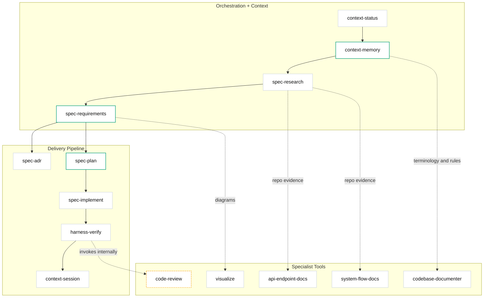

# Workflow & Skills Guide

This guide details the public command taxonomy, guided workflows, and internal skill mapping for the CoreZero Nexus.

---

## 1. Guided Learning Workflow

Adopters follow a canonical path when executing software changes. Start with the core workflow and use additional commands only when the task requires them.

### Canonical Workflow

```text
starter-init
  ──> spec-research (brownfield / unknown behavior)
  ──> spec-requirements
        ──> spec-plan
              ──> spec-implement
                    ──> harness-verify
                          ──> context-session END
```

### Contextual Commands (Invoke as needed)
- `/spec-research`: Prior to specifying requirements for brownfield or complex changes.
- `/context-memory`: To promote, amend, or synthesize repo-wide memory.
- `/context-status`: For multi-feature orchestration reports.
- `/spec-adr`: When a technical choice or design tradeoff needs a formal record.
- `/harness-maintain`: For evaluating, improving, or configuring the harness.

---

## 2. Skill Grouping & Architecture

The 16 skills (11 core delivery + 5 specialist tools) cluster into three groups: Orchestration + Context, Delivery Pipeline, and Specialist Tools.



---

## 3. Command Taxonomy Reference

### Project Starter Pack

#### `/starter-init`
Bootstraps a repository for agent-assisted delivery.
- Reconciles only the installer-seeded harness surface.
- Prepares seeded docs and memory for downstream use.
- Audits baseline project test and build states.

### Context Engineering Pack

#### `/context-session`
Manages session starts, checkpoints, and ends for an existing feature slug to restore state cleanly across context window resets.
- RESTORE: Loads latest progress logs and updates context.
- CHECKPOINT: Saves progress to `progress.md`.
- END: Distills extracts and writes `handoff.md`.
- It is not the first-feature bootstrap step; `/spec-requirements` or `/spec-research` creates the feature slug first.

#### `/context-memory`
Maintains instruction-tier repository memories and triages new findings.
- Resolves candidates from `session-extracts.md`.
- Cleans and refactors rules files.

#### `/context-status`
Scans all features under `artifacts/features/` to report feature phases and recommended next actions.

### Spec-Driven Development Pack

#### `/spec-research`
Investigates system behaviors, maps boundaries, and resolves unknowns in brownfield repositories.

#### `/spec-requirements`
Grills assumptions Socrates-style and locks requirements in `spec.md` with explicit criteria.

#### `/spec-plan`
Converts locked specs into technical architectures, execution designs, and task trackers in `tasks.md`.

#### `/spec-implement`
Executes individual tasks under strict task constraints and registers local validation proofs.

#### `/spec-adr`
Drafts and registers formal Architectural Decision Records (ADRs).

### Harness Engineering Pack

#### `/harness-verify`
Enforces mechanical, alignment, and security gates before releasing feature scopes.

#### `/harness-maintain`
Audits, configures, and maintains the harness itself through evaluation passes.

---

## 4. Specialist Tools

These five commands provide specialized review, visualization, and documentation capabilities outside the standard feature delivery pipeline. They can be invoked directly by users or called internally by core skills.

> [!NOTE]
> All specialist documentation tools follow the shared formatting, notation, and structural guidelines defined in [`skills/_shared/doc-conventions.md`](../kit/skills/_shared/doc-conventions.md) to ensure design system consistency.

* **`/code-review`**: Audits code quality against Google's Engineering Practices. **Dual-mode**: invokable directly for standalone PR reviews, and automatically invoked internally by `/harness-verify` during the Gated Integration Mode closeout pass. In Gated Integration Mode it writes its findings directly to `review.md` in a single pass.
* **`/visualize`**: Generates high-fidelity SVG/Mermaid sequence or architectural diagrams.
* **`/codebase-documenter`**: Compiles comprehensive onboarding guides for new repositories.
* **`/system-flow-docs`**: Traces container interactions and designs narrative workflow logs.
* **`/api-endpoint-docs`**: Compiles contract specifications for API endpoints.

---

## 5. Internal Lineage Mapping

The public command taxonomy is implemented via underlying skill files. Commands marked `[internal]` are invoked by the harness automatically and may also be used directly.

| Command | Mode | Skill File |
|---------|------|------------|
| `/starter-init` | Public | [`skills/starter-init/SKILL.md`](../kit/skills/starter-init/SKILL.md) |
| `/context-session` | Public | [`skills/context-session/SKILL.md`](../kit/skills/context-session/SKILL.md) |
| `/context-memory` | Public | [`skills/context-memory/SKILL.md`](../kit/skills/context-memory/SKILL.md) |
| `/context-status` | Public | [`skills/context-status/SKILL.md`](../kit/skills/context-status/SKILL.md) |
| `/spec-research` | Public | [`skills/spec-research/SKILL.md`](../kit/skills/spec-research/SKILL.md) |
| `/spec-requirements` | Public | [`skills/spec-requirements/SKILL.md`](../kit/skills/spec-requirements/SKILL.md) |
| `/spec-plan` | Public | [`skills/spec-plan/SKILL.md`](../kit/skills/spec-plan/SKILL.md) |
| `/spec-implement` | Public | [`skills/spec-implement/SKILL.md`](../kit/skills/spec-implement/SKILL.md) |
| `/spec-adr` | Public | [`skills/spec-adr/SKILL.md`](../kit/skills/spec-adr/SKILL.md) |
| `/harness-verify` | Public | [`skills/harness-verify/SKILL.md`](../kit/skills/harness-verify/SKILL.md) |
| `/harness-maintain` | Public | [`skills/harness-maintain/SKILL.md`](../kit/skills/harness-maintain/SKILL.md) |
| `/code-review` | Public + `[internal]` via `/harness-verify` | [`skills/code-review/SKILL.md`](../kit/skills/code-review/SKILL.md) |
| `/visualize` | Public | [`skills/visualize/SKILL.md`](../kit/skills/visualize/SKILL.md) |
| `/codebase-documenter` | Public | [`skills/codebase-documenter/SKILL.md`](../kit/skills/codebase-documenter/SKILL.md) |
| `/system-flow-docs` | Public | [`skills/system-flow-docs/SKILL.md`](../kit/skills/system-flow-docs/SKILL.md) |
| `/api-endpoint-docs` | Public | [`skills/api-endpoint-docs/SKILL.md`](../kit/skills/api-endpoint-docs/SKILL.md) |
