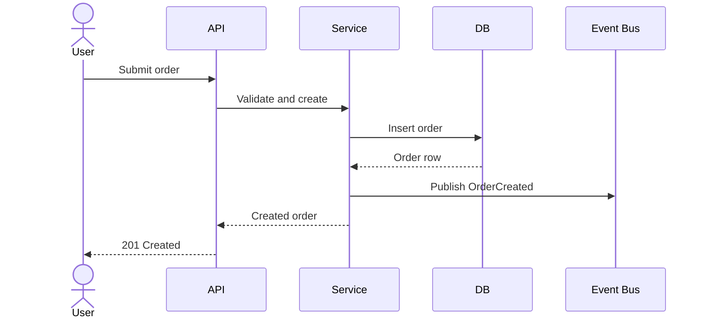
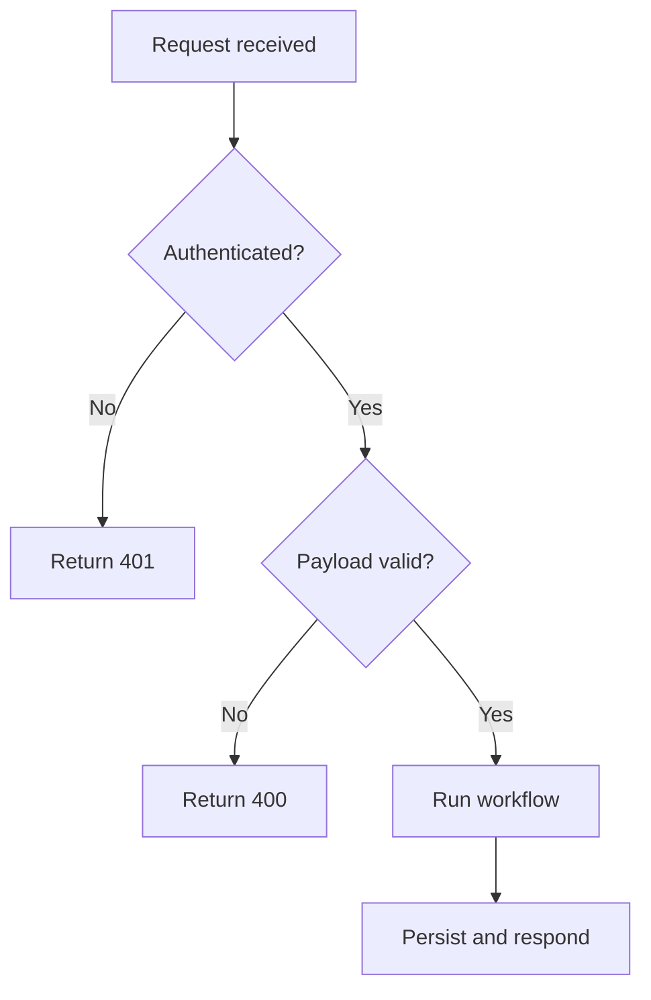
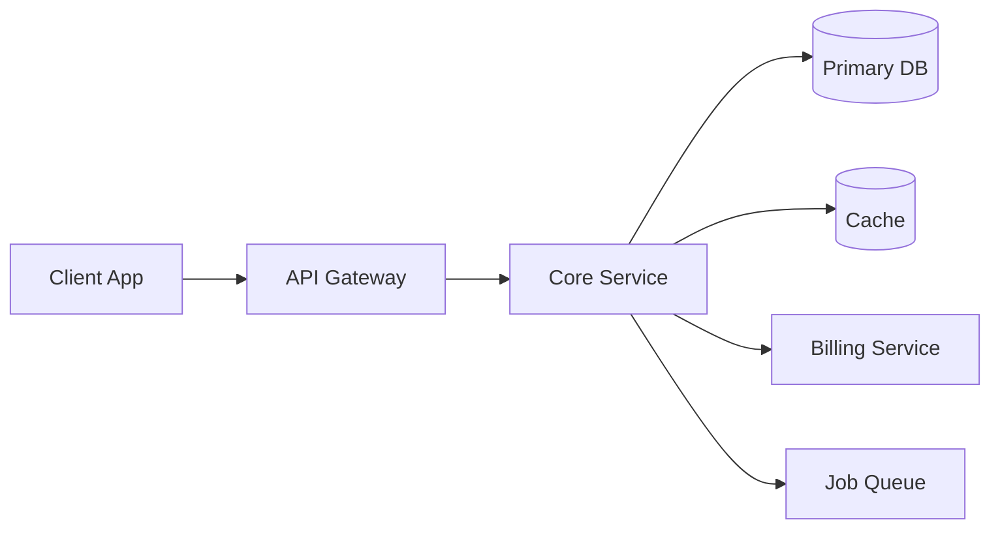
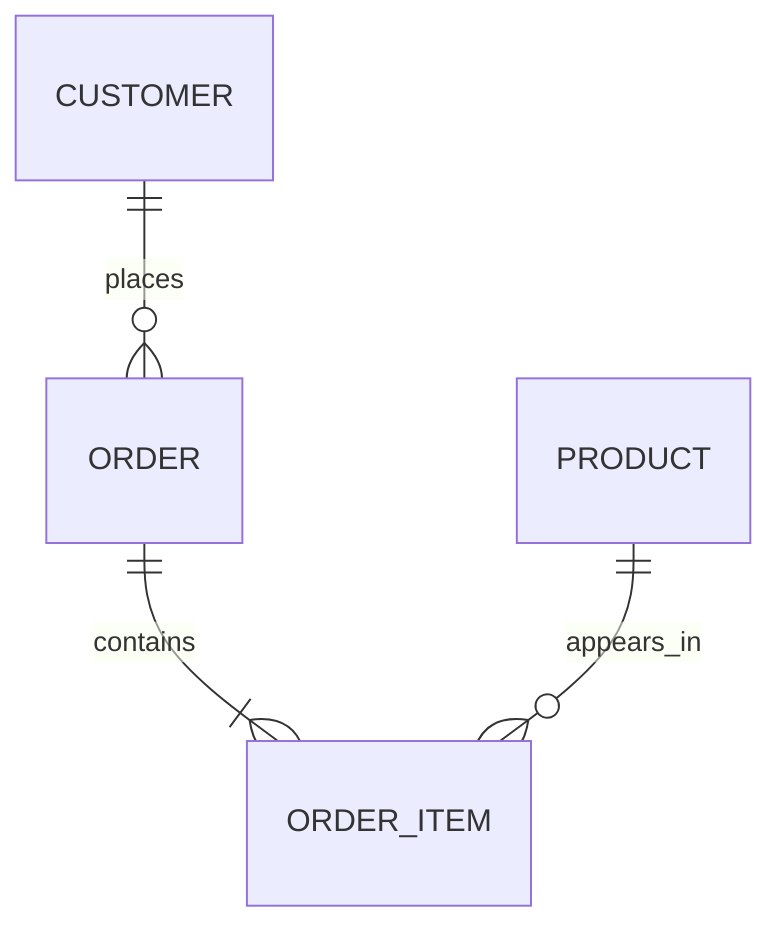
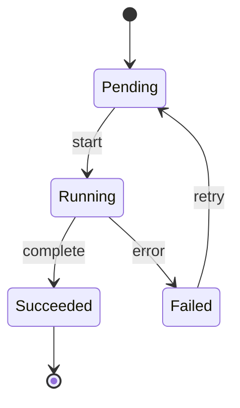
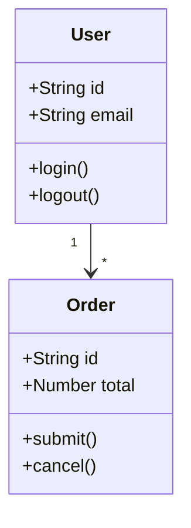
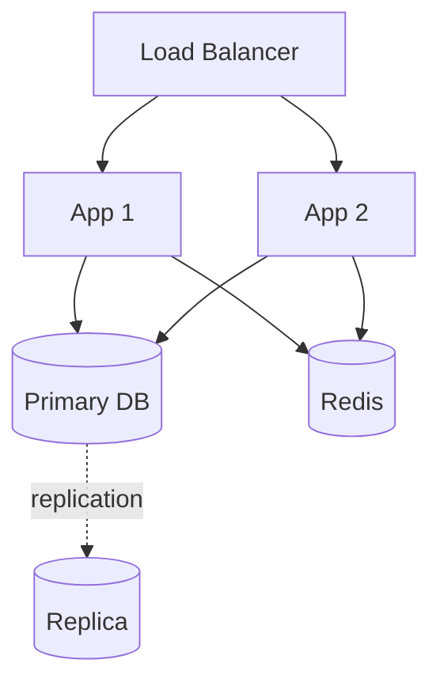

# Diagram Catalog

Mermaid diagram patterns shared across the documentation skills. Each skill picks from this catalog and adds its own preferences (which diagram is "primary," which supporting diagrams are common) in its SKILL.md.

## Selection Rules

- One diagram answers one question: flow, structure, data shape, or lifecycle.
- Pick the smallest diagram that makes the subject understandable.
- Split when one chart becomes crowded or mixes concerns.
- Replace a second diagram with a compact structured section (table, matrix) when it would otherwise add noise.
- Match diagrams to the written sections. If they disagree, fix the document.
- Show only the branches that materially help the reader. Add error or auth branches only when they change understanding.

## Sequence diagram — order of interactions

Use when the order of handoffs matters, a workflow crosses layers or services, or you need to show request/response/event handoffs.

## Flowchart — branching logic

Use when decisions matter more than timing, validation or policy checks short-circuit processing, or alternate error paths are central.

## System context / container view — boundaries

Use when readers need to understand component ownership, the system talks to multiple downstream services, or architectural complexity is the main risk.

## ERD — data shape

Use when shared entities shape the workflows, readers need to understand relationships, or payload/persistence design is central.

## State diagram — lifecycle

Use when a resource moves through explicit phases, behavior changes by state, or jobs/sessions/orders have meaningful transitions.

## Class / domain model — entity behavior

Use when methods on entities matter, inheritance or composition shapes the design, or readers need a typed contract.

## Deployment / infrastructure view — runtime topology

Use when readers need to understand how the system is deployed, replication or load balancing is central, or the docs cover ops handoff.

