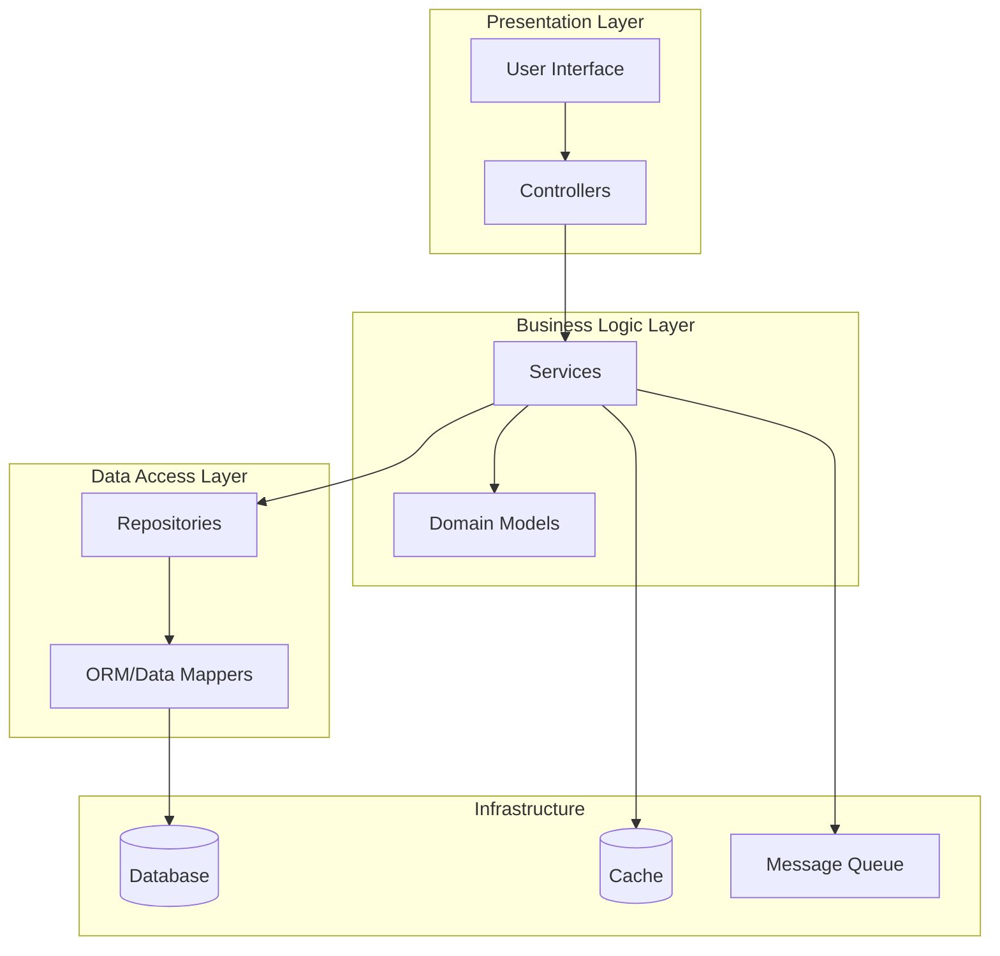
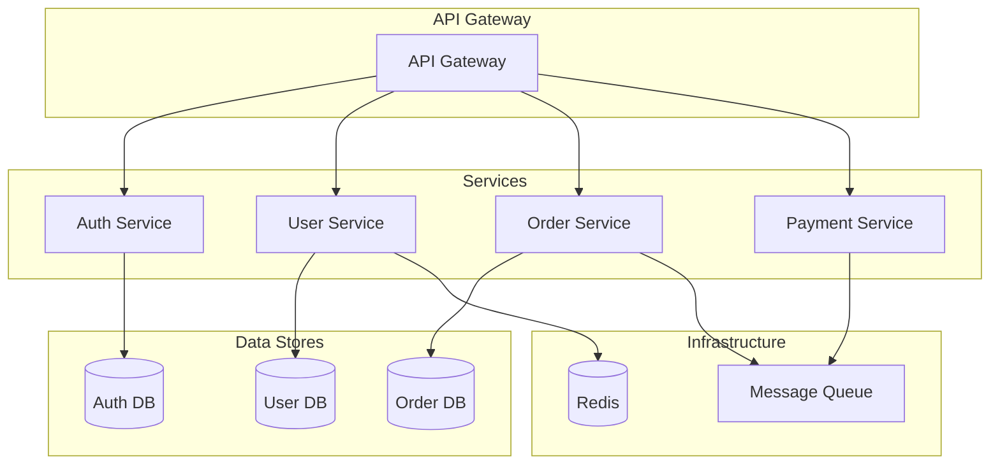
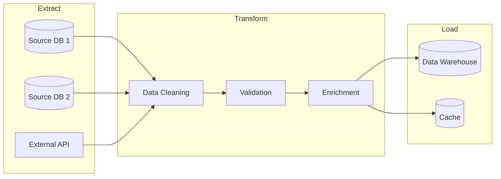
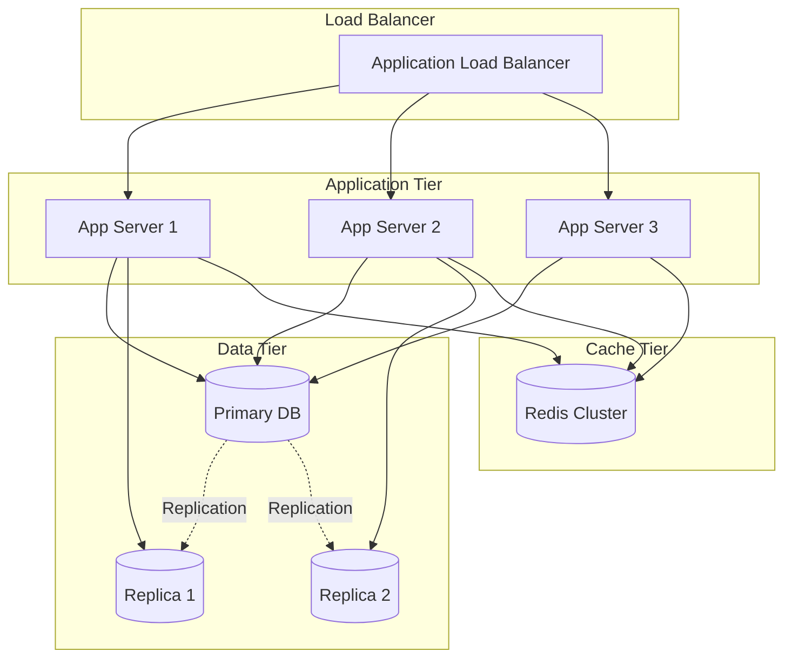

# Diagram Patterns

Composite Mermaid patterns specific to codebase documentation. For base patterns (sequence, flowchart, ERD, state, container view) and selection rules, see [../../_shared/diagram-catalog.md](../../_shared/diagram-catalog.md).

These are larger, project-shaped patterns that combine multiple base diagrams.

## Layered Architecture

Use for monolithic apps with clear presentation/business/data layers.

## Microservices Topology

Use when documenting service boundaries, gateways, and per-service data stores.

## ETL Pipeline

Use for data pipeline projects with extract/transform/load stages.

## Cloud Deployment Topology

Use for DEPLOYMENT.md when documenting load balancers, app tiers, and replicated data.

## Tips for Codebase Diagrams

1. **Match the actual structure.** Use the names and groupings that exist in the codebase, not generic placeholders.
2. **Subgraph by responsibility.** Group services, layers, or tiers — not files.
3. **Show the main paths.** Highlight golden-path flows; leave edge cases for prose.
4. **Label arrows with intent.** "Replication," "publishes event," "reads from cache" — not just lines.
5. **Test rendering.** Verify diagrams render in the target viewer (GitHub, docs site).
