# Multi-Format Output Reference

This reference is broader than the currently implemented repo scope.

Implemented in `skills/visualize`:
- SVG
- Mermaid

Deferred in this repo:
- PlantUML
- draw.io XML
- DOT / Graphviz

## Format Selection Guide

| Goal | Use Format |
|------|-----------|
| Polished visual for presentation / README / docs | SVG |
| Embed in GitHub markdown, Notion, Obsidian | Mermaid |
| UML diagrams with full notation (sequence, class, activity) | PlantUML |
| Graphical editing in diagrams.net (free browser tool) | draw.io XML |
| Dependency graphs, DAGs | DOT / Graphviz |

**Default behavior:** emit SVG. Add Mermaid when the diagram type is supported and the user wants an editable text format.
Mermaid-unsupported types (Agent Architecture, Memory Architecture, Comparison Matrix, Network Topology, Timeline) → SVG only.

---

## Mermaid Syntax by Diagram Type

### Flowchart / Process Flow

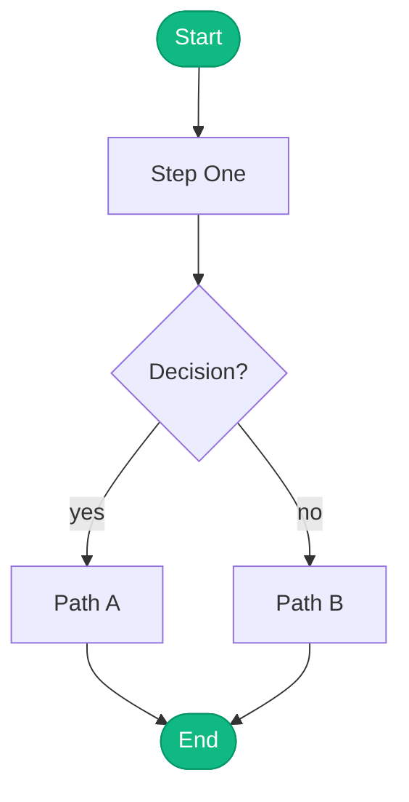

**Shapes:**
- `([text])` — stadium/pill → start/end
- `[text]` — rectangle → process
- `{text}` — diamond → decision
- `[(text)]` — cylinder → database
- `[[text]]` — double-bordered → subprocess
- `>text]` — flag → document

**Direction options:** `TD` (top-down), `LR` (left-right), `BT`, `RL`

---

### Sequence Diagram

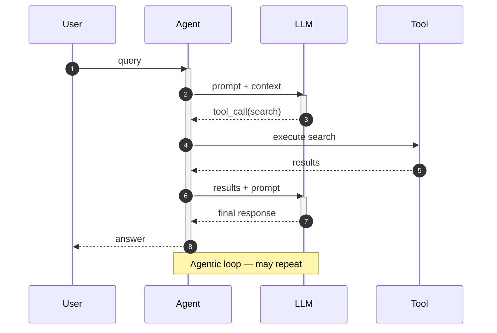

**Arrow types:**
- `->>` solid arrow with filled head
- `-->>` dashed arrow with filled head
- `-x` solid arrow with X head (async)
- `--x` dashed arrow with X head

---

### Architecture Diagram (C4 — System Context)

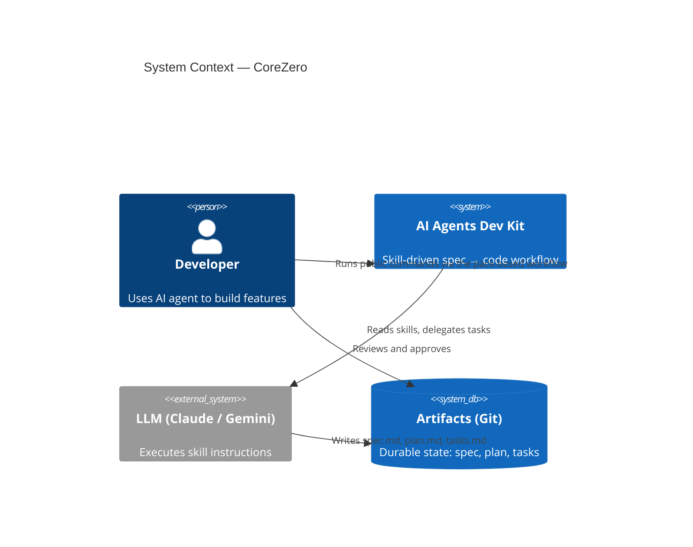

**C4 element types:**
- `Person(alias, label, desc)` — user/actor
- `System(alias, label, desc)` — internal system
- `System_Ext(alias, label, desc)` — external system
- `SystemDb(alias, label, desc)` — data store
- `Container(alias, label, tech, desc)` — container
- `Component(alias, label, tech, desc)` — component

---

### State Machine

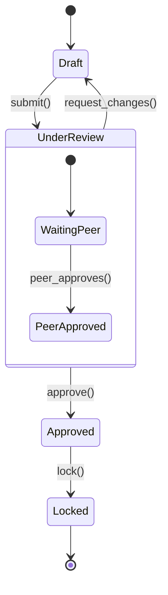

---

### ER Diagram

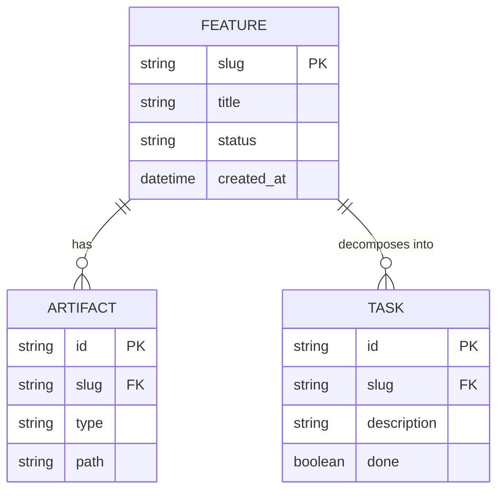

**Cardinality:**
- `||--||` exactly one to exactly one
- `||--o{` exactly one to zero or many
- `}o--o{` zero or many to zero or many
- `|{--||` one or many to exactly one

---

### Class Diagram

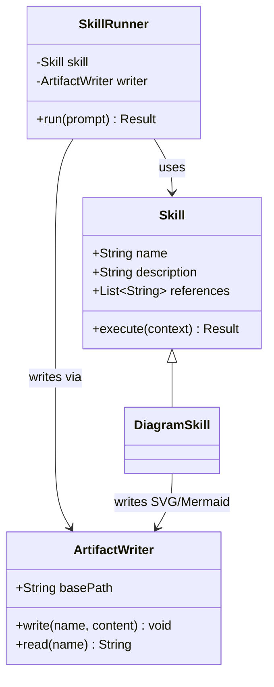

---

### Mind Map

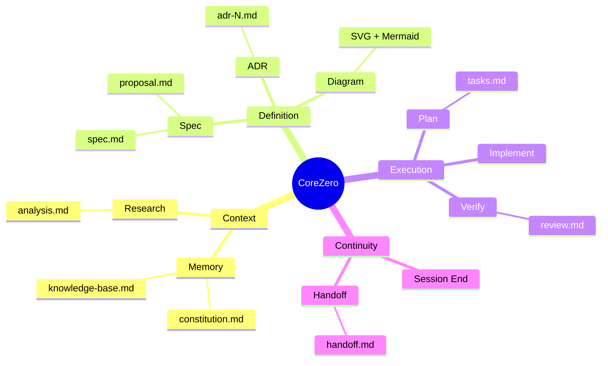

---

### User Journey (Mermaid only, not in SVG skill)

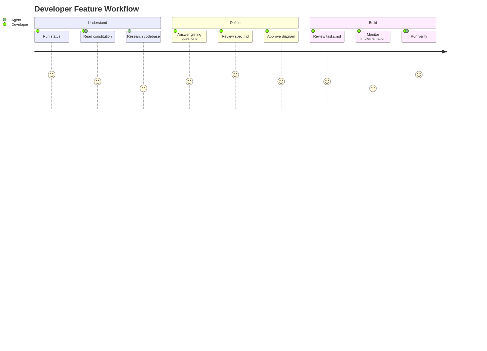

---

### Gantt / Timeline (Mermaid only, not in SVG skill yet)

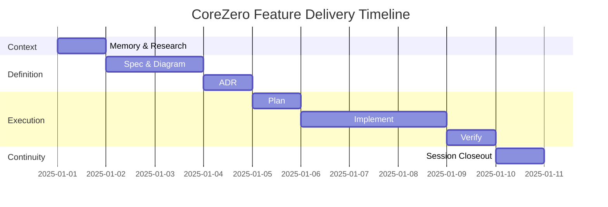

---

## PlantUML Syntax by Diagram Type

PlantUML handles UML diagrams better than Mermaid. Use for sequence diagrams with complex logic, class diagrams with many relationships, and activity diagrams.

### Sequence Diagram (PlantUML)

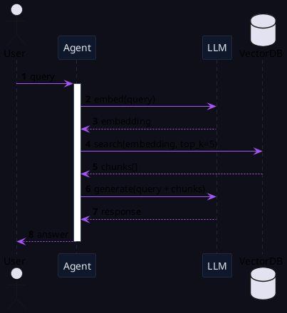

### Class Diagram (PlantUML)

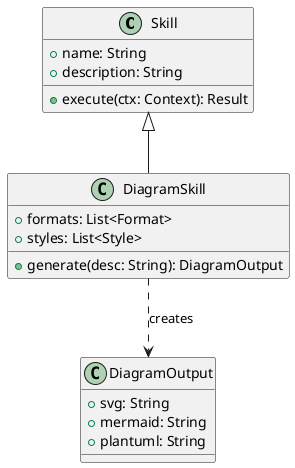

### Activity Diagram / Flowchart (PlantUML)

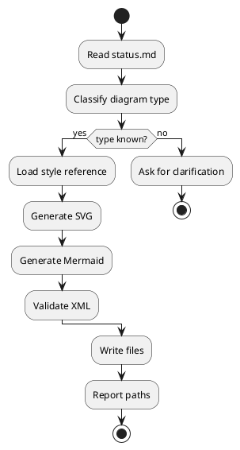

---

## draw.io XML (diagrams.net)

Use when the user needs to edit the diagram graphically. Output the XML inside a code block; user saves as `.drawio` and opens in https://app.diagrams.net.

### Minimal draw.io Template

```xml
<mxfile>
  <diagram name="Page-1">
    <mxGraphModel dx="1422" dy="762" grid="1" gridSize="10" guides="1" tooltips="1"
                  connect="1" arrows="1" fold="1" page="1" pageScale="1"
                  pageWidth="1169" pageHeight="827" math="0" shadow="0">
      <root>
        <mxCell id="0"/>
        <mxCell id="1" parent="0"/>

        <!-- Node example -->
        <mxCell id="2" value="Component A" style="rounded=1;whiteSpace=wrap;html=1;fillColor=#dae8fc;strokeColor=#6c8ebf;" vertex="1" parent="1">
          <mxGeometry x="100" y="100" width="160" height="60" as="geometry"/>
        </mxCell>

        <!-- Node example -->
        <mxCell id="3" value="Component B" style="rounded=1;whiteSpace=wrap;html=1;fillColor=#d5e8d4;strokeColor=#82b366;" vertex="1" parent="1">
          <mxGeometry x="340" y="100" width="160" height="60" as="geometry"/>
        </mxCell>

        <!-- Arrow -->
        <mxCell id="4" value="calls" style="edgeStyle=orthogonalEdgeStyle;" edge="1" source="2" target="3" parent="1">
          <mxGeometry relative="1" as="geometry"/>
        </mxCell>
      </root>
    </mxGraphModel>
  </diagram>
</mxfile>
```

---

## Output Rules (Multi-Format)

When generating a diagram, produce outputs in this priority order:

1. **SVG** — always (main output, polished visual)
2. **Mermaid** — when the diagram type is supported by Mermaid syntax
3. **PlantUML** — for UML types (Class, Sequence, State, Activity, Use Case) when user requests editable UML
4. **draw.io XML** — only when user explicitly asks for "editable" or "draw.io"

Never force all formats simultaneously — match the user's goal.

### File Naming Convention

```
my-diagram.svg          # SVG output (always)
my-diagram.mmd          # Mermaid source (when applicable)
my-diagram.puml         # PlantUML source (when applicable)
my-diagram.drawio       # draw.io XML (when requested)
```

### Embed in Markdown

**Mermaid in markdown:**
````markdown

````

**SVG inline in markdown:**
```markdown

```

**PlantUML** — requires a server or plugin:
```markdown
<!-- in systems with PlantUML support -->
@startuml
A -> B
@enduml
```
